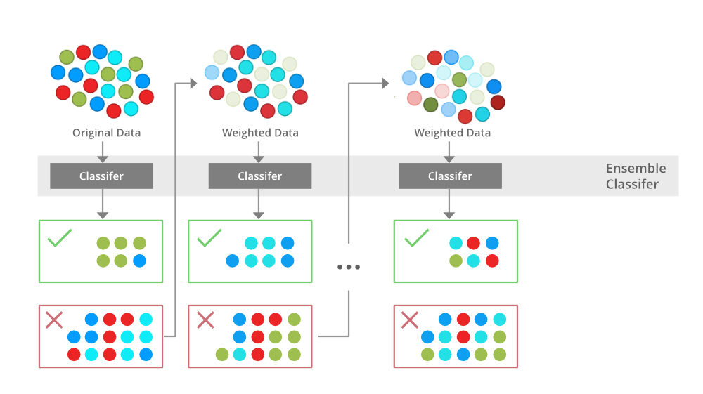

# **Boosting in Machine Learning | Boosting and AdaBoost**

In machine learning a single model may not be sufficient to solve complex problems as it can be too weak to solve it independently. To enhance its predictive accuracy we combine multiple weak models to build a more powerful and robust model. This process of combining multiple weak learners to form a strong learner is known as **Boosting**.

## **What is Boosting?**

Boosting is an **ensemble learning technique** that sequentially combines multiple weak classifiers to create a strong classifier.

It is done by training a model using training data and is then evaluated. Next model is built on that which tries to correct the errors present in the first model. This procedure is continued and models are added until either the complete training dataset is predicted correctly or predefined number of iterations is reached.

### **Adaboost and its working**

To understand boosting and its working, we will be using **AdaBoost** boosting technique.

> **AdaBoost (Adaptive Boosting)** is an ensemble learning algorithm that improves classification accuracy by combining multiple decision trees. It assigns equal weights to all training samples initially and iteratively adjusts these weights by focusing more on misclassified datapoints for next model. It effectively reduces bias and variance making it useful for classification tasks but it can be sensitive to noisy data and outliers.

The above diagram explains the AdaBoost algorithm in a very simple way. Let’s try to understand it in a stepwise process:
**Step 1: Initial model (B1)**

- The dataset consists of multiple data points (red, blue and green circles).
- Equal weight is assigned to each data point.
- The first weak classifier attempts to create a decision boundary.
- 8 data points are wrongly classified.

**Step 2: Adjusting weights (B2)**

- The misclassified points from B1 are assigned higher weights (shown as darker points in the next step).
- A new classifier is trained with a refined decision boundary focusing more on the previously misclassified points.
- Some previously misclassified points are now correctly classified.
- 6 data points are wrongly classified.

**Step 3: Further adjustment (B3)**

- The newly misclassified points from B2 receive higher weights to ensure better classification.
- The classifier adjusts again using an improved decision boundary and 4 data points remain misclassified.

**Step 4: Final strong model (B4 - Ensemble Model)**

- The final ensemble classifier combines B1, B2 and B3 to get strengths of all weak classifier.
- By aggregating multiple models the ensemble model achieves higher accuracy than any individual weak model.

### **The different types of Boosting Algorithms**

There are several types of boosting algorithm. Some of the most famous and useful models are as:

1. **Gradient Boosting** - It constructs models in a sequential manner where each weak learner minimizes the residual error of the previous one using gradient descent. Instead of adjusting sample weights like *AdaBoost*, Gradient Boosting reduces error directly by optimizing a loss function.

2. **XGBoost** - It is an optimized implementation of Gradient Boosting that uses **regularization** to prevent overfitting. It is faster and more efficient than standard Gradient Boosting and supports handling both numerical and categorical variables.

3. **CatBoost** - It is particularly effective for datasets with categorical features. It employs symmetric decision trees and a unique encoding method that considers target values, making it superior in handling categorical data without preprocessing.

### **Advantages of Boosting**

- **Improved accuracy** - By combining multiple weak learners, it enhances predictive accuracy for both classification and regression tasks.
- **Robustness to overfitting** - Unlike traditional models, it dynamically adjusts weights to prevent overfitting.
- **Handle imbalanced data well** - It priorities misclassified points, making it effective for imbalanced datasets.
- **Better interpretability** - The sequential nature of helps break down decision-making and making the model more interpretable.
