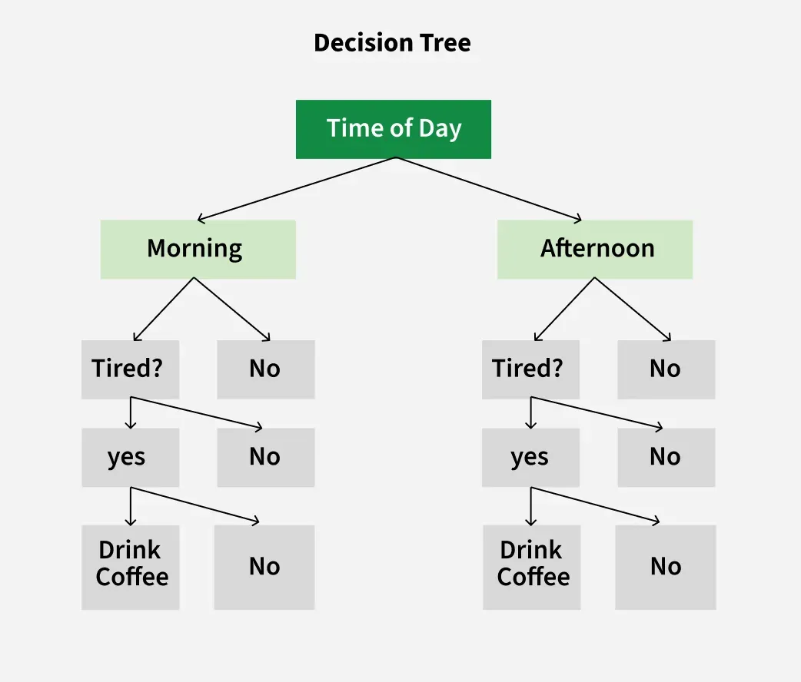
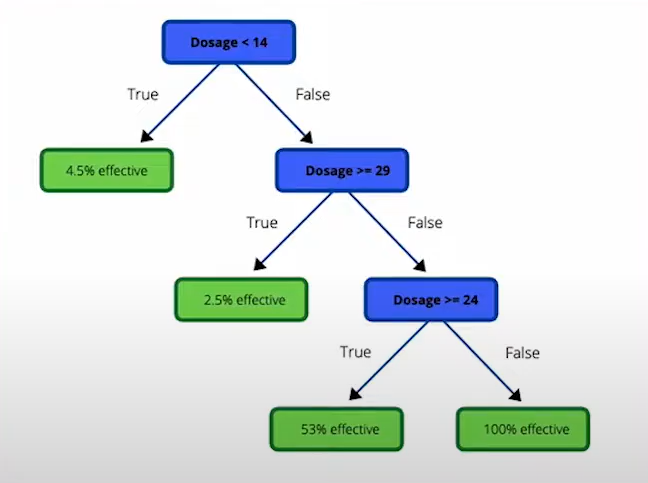
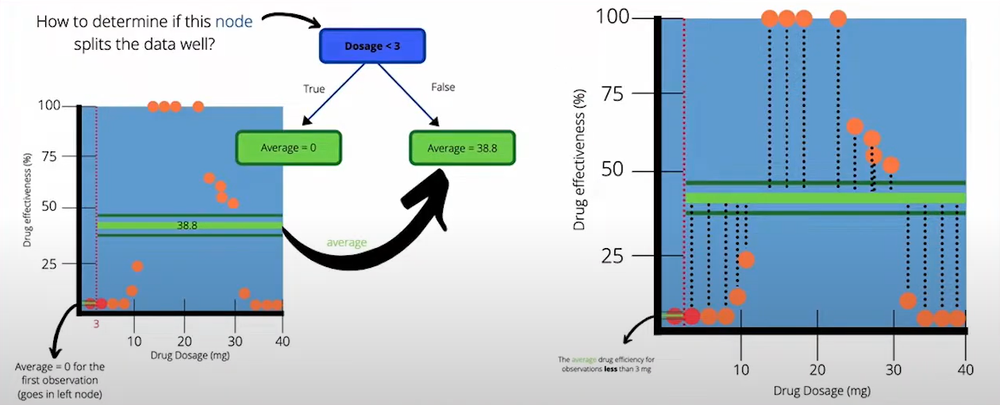
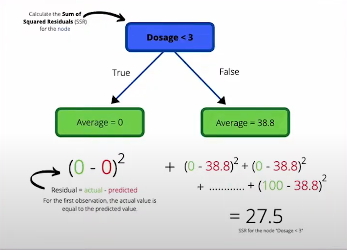
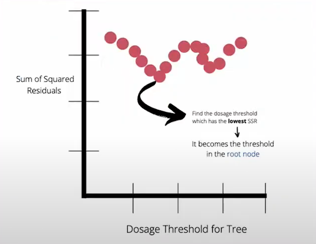

# **Decision Tree**

A *Decision Tree* is a supervised ML algorithm used in both classification and regression tasks. It mimics human decision-making, making it intuitive and easy to understand.

<center>



</center>

## **Structure**

- **Nodes**: Points where the tree splits based on the value of an attribute/feature.
  - **Root**: The first node where splitting begins.
  - **Leaves**: Terminal nodes that predict the outcome.
- **Edges**: Direct the outcome of a split to the next node.

## **Decision Tree Types**

### **Classification Tree**

The key task is selecting the best attribute from the dataset’s features for the root and sub-nodes. This is done using *Attribute Selection Measures (ASM)*.

#### **Methods**

1. **Information Gain (ID3)**  

   - Measures reduction in uncertainty (entropy) after a split.  
   - **Entropy**: Measures impurity in a dataset:  
     $$
     H(S) = -P_{\text{yes}} \log_2(P_{\text{yes}}) - P_{\text{no}} \log_2(P_{\text{no}})
     $$
     - \(P_{\text{yes}}\), \(P_{\text{no}}\): Proportions of "yes" and "no" classes.
     - Entropy = 1 (max uncertainty, 50/50 split); Entropy = 0 (pure node).  
   - **Information Gain**:  
     $$
     IG(S, A) = H(S) - \sum_{v \in \text{values}(A)} \frac{|S_v|}{|S|} H(S_v)
     $$
     - Choose the attribute with the highest IG for the split.

2. **GINI**  
   - Measures the probability of misclassifying a random element.  
   - **GINI Impurity for a Node**:  
     $$
     GINI = 1 - (P_{\text{yes}})^2 - (P_{\text{no}})^2
     $$
     - Pure node: \(GINI = 0\); Even split: \(GINI = 0.5\).  
   - **Steps**:  
     1. Calculate *GINI impurity for leaf Yes A*:  
        $$
        1 - P_{\text{yes}}(\text{yes}_A)^2 - P_{\text{yes}}(\text{no}_A)^2
        $$
        And for *leaf No A*:  
        $$
        1 - P_{\text{no}}(\text{yes}_A)^2 - P_{\text{no}}(\text{no}_A)^2
        $$
     2. Calculate *GINI impurity for attribute B* (weighted average):  
        $$
        GINI_{\text{attribute}} = P(\text{yes}_B) \cdot GINI(\text{leaf Yes}) + P(\text{no}_B) \cdot GINI(\text{leaf No})
        $$
     3. Repeat for all attributes.  
     4. Choose the attribute with the minimum *GINI impurity* for root/sub-node.  
     5. After splitting, repeat from step 1 on remaining features.  
     6. If *GINI* of the current node is lower than the next split’s GINI, stop splitting and move to another node.

#### **Feature Types**

- **Continuous Numerical Feature**:  

  - Sort values, take the average of adjacent pairs (e.g., \(a_{\text{avg}}\)).  
  - Split: \(\text{Is } \leq a_{\text{avg}}\) (Yes) or \(\text{Is } > a_{\text{avg}}\) (No).  
- **Ordinal Numerical Feature**:  
  - Same as continuous, but no need to calculate GINI for extreme values (e.g., 1/5 in a 1-5 scale).  
- **Nominal Feature**:  
  - E.g., *Skin Color* (White, Black, Brown). Calculate GINI for all combinations: White, Black, Brown, White or Brown, etc.

### **Regression Tree**

Predicts continuous values (e.g., house prices) instead of classes. Uses **variance reduction** or **mean squared error (MSE)** for splitting:  

- **Variance**:  
  $$
  \text{Var} = \frac{1}{n} \sum (y_i - \bar{y})^2
  $$
  - Split reduces variance:  
    $$
    \text{Variance Reduction} = \text{Var(parent)} - \left( \frac{|S_{\text{left}}|}{|S|} \text{Var}(S_{\text{left}}) + \frac{|S_{\text{right}}|}{|S|} \text{Var}(S_{\text{right}}) \right)
    $$
- **MSE**: Average squared difference between actual and predicted values (node mean).

<center>

  
  
  


</center>

## **Pros and Cons**

Advantages

- **Easy to visualize and interpret**: Graphical representation is intuitive, no statistical knowledge needed.  
- **Useful in data exploration**: Identifies significant variables and relationships, aids feature engineering.  
- **Less data cleaning required**: Robust to outliers and missing values (e.g., uses surrogate splits or majority branch).  
- **Data type agnostic**: Handles categorical and numerical data.

Disadvantages

- **Overfitting**: Tends to overfit noisy data or small variations.  
  - **Fixes**:  
    1. **Pre-Pruning**: Set constraints (e.g., min samples per split, max depth).  
    2. **Post-Pruning**: Grow full tree, then remove weak branches (e.g., cost-complexity pruning).  
    3. **Constraints**:  
       - Min samples for a node split.  
       - Min samples for a leaf node.  
       - Max depth of the tree.  
       - Max number of leaf nodes.  
       - Max features to consider for a split (e.g., \(\sqrt{\text{total features}}\), test 30-40%).  
- **Not ideal for continuous data**: Loses information when categorizing numerical variables.  
- **Unstable**: Small data changes can lead to different trees (fix with bagging/boosting, e.g., Random Forests, Gradient Boosting).  
- **Biased with imbalanced data**: Balance dataset before training.

Additional Notes

- **Handling Missing Values**: Uses surrogate splits or assigns to the majority branch.  
- **Greedy Approach**: May not find the globally optimal tree.

### **Classification Tree Sample Code**

```python
from sklearn.datasets import load_iris
from sklearn.tree import DecisionTreeClassifier
from sklearn.model_selection import train_test_split
from sklearn.metrics import accuracy_score

# Load dataset
iris = load_iris()
X, y = iris.data, iris.target

# Split data
X_train, X_test, y_train, y_test = train_test_split(X, y, test_size=0.3, random_state=42)

# Train model
clf = DecisionTreeClassifier(criterion="gini", max_depth=3, random_state=42)
clf.fit(X_train, y_train)

# Predict and evaluate
y_pred = clf.predict(X_test)
print(f"Accuracy: {accuracy_score(y_test, y_pred):.2f}")
```

### **Regression Tree Sample Code**

```python

from sklearn.datasets import fetch_california_housing
from sklearn.tree import DecisionTreeRegressor
from sklearn.model_selection import train_test_split
from sklearn.metrics import mean_squared_error

# Load dataset
housing = fetch_california_housing()
X, y = housing.data, housing.target

# Split data
X_train, X_test, y_train, y_test = train_test_split(X, y, test_size=0.3, random_state=42)

# Train model
reg = DecisionTreeRegressor(max_depth=5, random_state=42)
reg.fit(X_train, y_train)

# Predict and evaluate
y_pred = reg.predict(X_test)
print(f"MSE: {mean_squared_error(y_test, y_pred):.2f}")

```