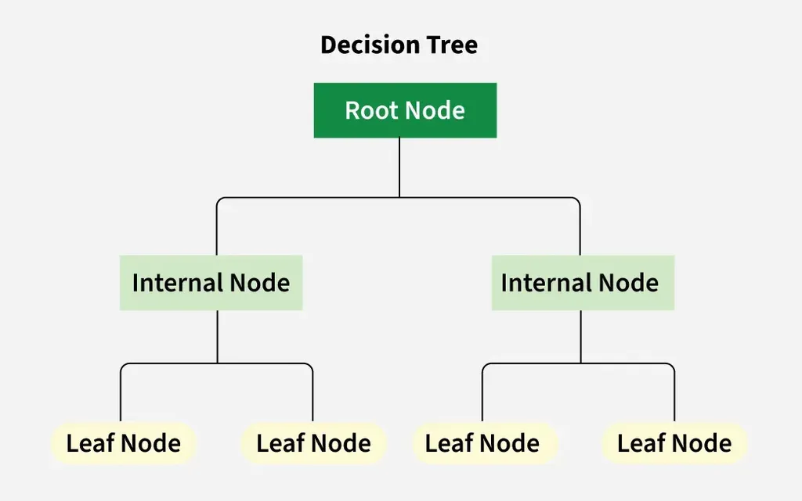

# **Decision Tree**

A *Decision Tree* is a supervised ML algorithm used in both classification and regression tasks. It mimics human decision-making, making it intuitive and easy to understand.

A *Decision Tree* is a tree shaped diagram used to determine a course of action. Each branch of the tree represents a possible decision, occurrence or reaction.

<div align='center'>




</div>

## **Structure**

- **Nodes**: Points where the tree splits based on the value of an attribute/feature.
  - **Root**: The first node where splitting begins.
  - **Leaves**: Terminal nodes that predict the outcome or carries the classification of the decision.
- **Edges**: Direct the outcome of a split to the next node.

## **Decision Tree Types**

### **Classification Tree**

The key task is selecting the best attribute from the dataset’s features for the root and sub-nodes. This is done using *Attribute Selection Measures (ASM)*.

#### **Methods**

##### **Information Gain** 

**Information Gain** used by UD3, C4.5 and C5.0 tree-generation algorithms. It is based on the concept of entropy and information content from information theory.

**Entropy** *is the measure of randomness or unpredictability in the dataset* - measures impurity in a dataset and is defined as:

$$H(T) = I_E(p_1, p_2, ... , p_J) = - \sum^J_{i=1}p_i \log_2 p_i$$

where $p_1, p_2, ...$ are fractions that add up to 1 and represent the percentage of each class present in the child node that results from a split in the tree. If entropy = 1 is max uncertainty, 50/50 split and entropy = 0 is pure node.

$$IG(T, a) = H(T) - H(T | a) = - \sum^J_{i=1}p_i \log_2 p_i - \sum^J_{i=1}-Pr(i | a)\log_2Pr(i | a)$$

or

$$
IG(T, A) = H(T) - \sum_{v \in \text{values}(A)} \frac{|T_v|}{|T|} H(T_v)
$$

where

- $IG(T,a)$ is information gain
- $H(T)$ is entropy (parent)
- $H(T | a)$ is sum of entropies (children)

Averaging over the possible values of $A$ will get **Mutual Information**

$$E_A(IG(T, a)) = I(T; A) = H(T) - H(T|a) = - \sum^J_{i=1}p_i \log_2 p_i - \sum_a p(a)\sum^J_{i=1}-Pr(i|a)\log_2Pr(i | a)$$

where

- $E_A(IG(T, a))$ is expected information gain
- $I(T;A)$ is mutual information between T and A
- $H(T)$ is entropy (parent)
- $H(T | a)$ is weighted sum of entropies (children)

That is, the expected information gain is the mutual information, meaning that on average, the reduction in the entropy of $T$ is the mutual information.

$\Rightarrow$ **Information Gain** *is the measure of decrease in entropy after dataset is split* - measures reduction in uncertainty (entropy) after a split.

Choose the attribute with the highest IG for the split.

> Information gain is used to decide which feature to split on at each step in building the tree. Simplicity is best to keep the tree small, to do so, at each step, we should choose the split that results in most consistent child nodes. 
>
> A commonly used measure of consistency is called *information* which is measured in *bits*. For each node of the tree, the information value represents the expected amount of information that would be needed to specify whether a new instance should be classified yes or no, given that the example reached that node.

Consider an example dataset with 4 attributes:

- outlook (sunny, overcast, rainy)
- temperature (hot, mild, cold)
- humidity (high, normal)
- windy (true, false)
- a binary target variable, play (yes, no)

and 14 data points.

To construct a decision tree on this data, we need to compare the information gain of each of four trees, each split on one of the four features.

The split with the highest information gain will be taken as the first split and the process will continue until all children nodes each have consistent data or until the information gain is 0.

To find the information gain of the split using *windy*, we must first calculate the information in the dataset before the split.

The original data contained 9 yes's and 5 no's

$$H(T) = I_E([9, 5]) = -\frac{9}{14}\log_2\frac{9}{14} - \frac{5}{14}\log_2\frac{5}{14} = 0.94$$

The split using the feature *windy* results in two children nodes, one for a *windy* value of true and and one or a *windy* value of false.

In this dataset, there are 6 data ponints with a true *windy* value, 3 of which have a *play* (where *play* is the target variable) value of yes and 3 with a play value of no.

The 8 remaining data points with a *windy* value of false contain 2 no's and 6 yes's. 

The information of the *windy=true* node is calculated using the entropy equation. Since there is an equal number of yes's and no's in this node, we have

$$H(\text{Play} | \text{Windy} = \text{True}) = -\frac{3}{6}\log_2\frac{3}{6} -\frac{3}{6}\log_2\frac{3}{6} = 1$$

For the node where *windy=false* node, there were 8 data points, 6 yes's and 2 no's. Thus we have

$$H(\text{Play} | \text{Windy} = \text{False}) = -\frac{6}{8}\log_2\frac{6}{8} -\frac{2}{8}\log_2\frac{2}{8} = 0.81$$

To find the information of the split, we take the weighted average of these two numbers based on how many observations fell into which node

$$I_E([3, 3], [6, 2]) = I_E(\text{windy or not}) = \frac{6}{14}\times 1 + \frac{8}{14} \times 0.81 = 0.89$$

Now we can calculate the information gain achieved by splitting on the *windy* feature

$$IG(\text{windy}) = I_E([9, 5]) - I_E([3,3], [6,2]) = 0.94 - 0.89 = 0.05$$

To build the tree, the information gain of each possible first split would need to be calculated. The best first split is the one that provides the most information gain. This process is repeated for each impure node until the tree is complete. 

##### **Gini impurity**

**Gini impurity** used by the CART (Classification and Regression tree) algorithm for classification trees and measures the probability of misclassifying a random element.  

For a set of items with $J$ classes and relative frequencies $p_i$, $i \in \{1, 2, ... , J\}$, the probability of choosing an item with label $i$ is $p_i$ and the probability of miscategorizing that item is $\sum_{k \neq i}p_k = 1 - p_i$. The **Gini impurity** is computed by summing pairwise products of these probabilities for each class label:

$$I_G(p) = \sum^{J}\_{i=1}\left( p_i \sum_{k \neq i}p_k \right) = \sum_{i=1}^J p_i(1-p_i) = \sum^J_{i=1}(p_i - p_i^2) = \sum_{i=1}^Jp_i - \sum_{i=1}^Jp_i^2 = 1 - \sum_{i=1}^Jp_i^2$$

where $p_i$ represents the percentage of class $i$ present in the child node that results from a split in the tree.

#### **Feature Types**

- **Continuous Numerical Feature**:  

  - Sort values, take the average of adjacent pairs (e.g., \(a_{\text{avg}}\)).  
  - Split: \(\text{Is } \leq a_{\text{avg}}\) (Yes) or \(\text{Is } > a_{\text{avg}}\) (No).  
- **Ordinal Numerical Feature**:  
  - Same as continuous, but no need to calculate GINI for extreme values (e.g., 1/5 in a 1-5 scale).  
- **Nominal Feature**:  
  - E.g., *Skin Color* (White, Black, Brown). Calculate GINI for all combinations: White, Black, Brown, White or Brown, etc.

### **Regression Tree**

Predicts continuous values (e.g., house prices) instead of classes. Uses **variance reduction** or **mean squared error (MSE)** for splitting:  

- **Variance**:
  
$$\text{Var} = \frac{1}{n} \sum (y_i - \bar{y})^2$$

$\rightarrow$ Split reduces variance:
    
$$\text{Variance Reduction} = \text{Var(parent)} - \left( \frac{|S_{\text{left}}|}{|S|} \text{Var}(S_{\text{left}}) + \frac{|S_{\text{right}}|}{|S|} \text{Var}(S_{\text{right}}) \right)$$
    
- **MSE**: Average squared difference between actual and predicted values (node mean).

<div align='center'>

  
  
  


</div>

## **Pros and Cons**

Advantages

- **Easy to visualize and interpret**: Graphical representation is intuitive, no statistical knowledge needed.  
- **Useful in data exploration**: Identifies significant variables and relationships, aids feature engineering.  
- **Less data cleaning required**: Robust to outliers and missing values (e.g., uses surrogate splits or majority branch).  
- **Data type agnostic**: Handles categorical and numerical data.

Disadvantages

- **Overfitting**: Tends to overfit noisy data or small variations.  
  - **Fixes**:  
    1. **Pre-Pruning**: Set constraints (e.g., min samples per split, max depth).  
    2. **Post-Pruning**: Grow full tree, then remove weak branches (e.g., cost-complexity pruning).  
    3. **Constraints**:  
       - Min samples for a node split.  
       - Min samples for a leaf node.  
       - Max depth of the tree.  
       - Max number of leaf nodes.  
       - Max features to consider for a split (e.g., \(\sqrt{\text{total features}}\), test 30-40%).  
- **Not ideal for continuous data**: Loses information when categorizing numerical variables.  
- **Unstable**: Small data changes can lead to different trees (fix with bagging/boosting, e.g., Random Forests, Gradient Boosting).  
- **Biased with imbalanced data**: Balance dataset before training.

Additional Notes

- **Handling Missing Values**: Uses surrogate splits or assigns to the majority branch.  
- **Greedy Approach**: May not find the globally optimal tree.

### **Classification Tree Sample Code**

```python
from sklearn.datasets import load_iris
from sklearn.tree import DecisionTreeClassifier
from sklearn.model_selection import train_test_split
from sklearn.metrics import accuracy_score

# Load dataset
iris = load_iris()
X, y = iris.data, iris.target

# Split data
X_train, X_test, y_train, y_test = train_test_split(X, y, test_size=0.3, random_state=42)

# Train model
clf = DecisionTreeClassifier(criterion="gini", max_depth=3, random_state=42)
clf.fit(X_train, y_train)

# Predict and evaluate
y_pred = clf.predict(X_test)
print(f"Accuracy: {accuracy_score(y_test, y_pred):.2f}")
```

### **Regression Tree Sample Code**

```python

from sklearn.datasets import fetch_california_housing
from sklearn.tree import DecisionTreeRegressor
from sklearn.model_selection import train_test_split
from sklearn.metrics import mean_squared_error

# Load dataset
housing = fetch_california_housing()
X, y = housing.data, housing.target

# Split data
X_train, X_test, y_train, y_test = train_test_split(X, y, test_size=0.3, random_state=42)

# Train model
reg = DecisionTreeRegressor(max_depth=5, random_state=42)
reg.fit(X_train, y_train)

# Predict and evaluate
y_pred = reg.predict(X_test)
print(f"MSE: {mean_squared_error(y_test, y_pred):.2f}")

```
