<h1 algin='center'>Introduction to Frequent Itemset Mining</h1>

- *FIsM* $\rightarrow$ Frequent itemset mining
- *FIs* $\rightarrow$ Frequent itemset
- *DM* $\rightarrow$ Data mining
- *T* $\rightarrow$ Transaction
- *TID* $\rightarrow$ Transaction ID
- *Tids* $\rightarrow$ Transaction ID set / Tidset
- *I* $\rightarrow$ Item
- *Is* $\rightarrow$ Itemset
- *CIs* $\rightarrow$ Closed itemset
- *CFIs* $\rightarrow$ Closed frequent itemset
- *CIsM* $\rightarrow$ Closed itemset mining
- *CO* $\rightarrow$ Closure operator
- *MIs* $\rightarrow$ Maximal itemset
- *MFIs* $\rightarrow$ Maximal frequent itemset
- *Sp* $\rightarrow$ Support
- *db* $\rightarrow$ Database
- *A* $\rightarrow$ Apriori
- *AA* $\rightarrow$ Apriori algorithm
- *CA* $\rightarrow$ Charm algorithm
- *#* $\rightarrow$ number

*FIsM* is a cornerstone of *DM*, aimed at discovering sets of items that frequently co-occur in a transactional database. It is widely used in applications such as *market basket analysis* (e.g., identifying items frequently purchased together), *recommendation systems*, *bioinformatics* (e.g., finding co-occurring genes) and *web usage mining* (e.g., analyzing navigation patterns).

## **Basic Concepts**

### **Fundamental definitions**

Definition of items, itemsets, support and types of itemsets (frequent, closed, maximal)

**Item** $\rightarrow$ an *I* is a binary attribute in a *T* database, representing a single entity. For example, in a retail context, *I* could be products like *milk*, *bread* or *butter*. 

The set of all items is denoted:

$$I = \{ I_1, I_2, ... , I_m\}$$

where $m$ is the number of distinct items 

**Itemset** $\rightarrow$ an *Is* is a subset of items, $X \subset I$. For example, $X = \{ \text{milk}, \text{bread}\}$ is an *Is*. The power set $P(I)$ contains all possible *Is* with $|P(I)| = 2^m$

**Transactional database** $\rightarrow$ a *T* database *D* is a collection of *T* where each *T* is an itemset associated with a unique transaction ID (*TID*)

Formally:

$$D = \{  (t_1, X_1), (t_2, X_2), ... , (t_n, X_n) \}$$

where $t_i$ is the *TID* and $X_i \subset I$ is the itemset

The example database

<center>

| **TID** | **Items** |
| --- | --- | 
| 1 | A, C, T, W |
| 2 | C, D, W |
| 3 | A, C, T, W |
| 4 | A, C, D, W | 
| 5 | A, C, D, T, W |
| 6 | C, D, T |

</center>


Here, $n = 6$ (# of transactions) and the *I* are $I = \{ A, C, D, T, W \}$ so $m = 5$

**Support** $\rightarrow$ The *Sp* of an *Is* $X$, denoted $\sup (X)$, measures how frequently $X$ appears in $D$. It is defined as 

$$\sup(X) = \left( \frac{|\{  t_i \in D | X \subset X_i   \}|}{|D|}  \right) \times 100$$

where
- $| \{ t_i \in D | X \subset X_i   \} |$ $\rightarrow$ the # of *T* containing $X$
- $D$ $\rightarrow$ the total # of *T*

The *Sp* count is 

$$\sup\_\text{count}(X) = | \{ t_i \in D | X \subset X_i  \} | $$


For examples:

For $X = \{ A \}$

- Appears in *TID*s 1, 3, 4, 5 $\rightarrow \sup\_\text{count}  = 4$
- $\sup(A) = \frac{4}{6} \times 100 = 66.67\%$

For $X = \{ A, C, D \}$
- Appears in *TID*s 4, 5 $\rightarrow \sup\_\text{count} = 2$
- $\sup(A, C, D) = \frac{2}{6} \times 100 = 33.33\%$ 


**Frequent itemset** $\rightarrow$ an *Is* $X$ is frequent if its *Sp* meets or exceeds a user-defined minimum *Sp* threshold $\text{minsup}$

$$\sup(X) \geq \text{minsup} $$

or equivalently

$$\text{sup \_ count}(X) \geq \text{minsup} \times |D|$$

Example with $\text{minsup} = 70\%$

- $\sup(A) = 66.67\% < 70\% \rightarrow$ A is not frequent
- $\sup(C) = \frac{6}{6} \times 100 = 100\% \geq 70\%  \rightarrow$ C is frequent

### **Closed Itemsets**

**Closed Itemsets** $\rightarrow$ are a compact representation of *FIs*, capturing all *FIs* and their *Sp* without redundancy

**Galois connection** $\rightarrow$ a formal framework using a **Galois connection** to define *CIs*. Let:

- $I \rightarrow$ set of items
- $T \rightarrow$ set of transaction IDs
- $\phi \subset I \times T$ $\rightarrow$ a binary relation where $(x, y) \in \phi$ means item $x$ appears in transaction $y$. 

Two mappings are defined

1 _ $t: P(I) \to P(T)$

$$t(X) = \{  y \in T \space | \space \forall x \in X, (x, y) \in \phi \}$$

This returns the *TIDs* of transactions containing all items in $X$

2 _ $i: P(T) \to P(I)$

$$t(Y) = \{  x \in I \space | \space \forall y \in Y, (x, y) \in \phi \}$$

This returns the items present in all transactions in $Y$

**Closure Operator** $\rightarrow$ The closure of an *Is* $X$ is 

$$c(X) = i(t(X))$$

An *Is* $X$ is closed if 

$$c(X) = X$$

This means $X$ contains all items common to transactions that contain $X$

**Closed Frequent Itemset** $\rightarrow$ an *Is* is a *CFIs* if it is both closed ($c(X) = X$) 
and frequent ($\sup(X) \geq \text{minsup}$)

For example with $\text{minsup} = 30\%$

For $X = \{A, W \}$

**Proved it's closed**

- $t(A, W) = \{1, 3, 4, 5\}$ (*TID*s where both $A$ and $W$ appear)
- $i(t(A, W)) = i(\{1, 3, 4, 5 \}) = {A, C, W}$ (*Is* common to *TIDs* 1, 3, 4, 5)
- $c(A, W) = \{A, C, W \} \neq \{A, W\} \rightarrow (A, W)$ is not closed   

For $X = \{C, D\}$

**Proved it's closed**

- $t(C, D) = \{2, 4, 5, 6\}$ (*TIDs* where both $C$ and $D$ appear)
- $i(t(C, D)) = i(\{ 2, 4, 5, 6\}) = \{C, D\}$ (*Is* common to *TIDs* 2, 4, 5, 6)
- $c(C, D) = \{C, D \} = \{C, D \} \rightarrow$ $(C, D)$ is closed


**Proved it's frequent**
- $\sup(C, D) = \frac{4}{6} \times 100 = 66.67\% \geq 30\% \rightarrow$ $(C, D)$ is a closed frequent items *CFIs*

**Formal definition** - A *CFIs* is a *FIs* $X$ such that there exists no superset $Y \supset X$ with the same *Sp*

$$C = \{ X | X \in F \text{ and } \nexists Y \supset X \text{ such that } \sup(X) = \sup(Y)\}$$

where $F = \{X \subset I | \sup(X) \geq \text{minsup}\}$ $\rightarrow$ the set of all *FIs*


### **Maximal Itemsets**

**Maximal Itemsets** $\rightarrow$ are the largest *FIs* providing the most compact representation

An *Is* $X$ is a *MFIs* if it's frequent and has no frequent superset

$$M = \{  X |  X \in F \text{ and } \nexists Y \supset X \text{ such that } Y \in F \}$$

Given *FIs* $\{A, B \}, \{A, C \}, \{A, B, D\}$

- $\{A, C\}$ is maximal if no superset (e.g., $\{A, C, D\}$) is frequent 
- $\{A, B, D\}$ is maximal if not superset (e.g., $\{A, B, D, E\}$) is frequent
- $\{A, B \}$ is not maximal because it is a subset of the frequent items $\{A, B, D\}$ (larger *FIs*)


### **Comparison of itemset types**

The document compares three types of *Is*

- *FIs* **(F)** $\rightarrow$ all *Is* with $\sup(X) \geq \text{minsup}$
- *CFIs* **(C)** $\rightarrow$ *FIs* with no superset of equal ***Sp***
- *MFIs* **(M)** $\rightarrow$ *FIs* with no frequent superset

The relationship is 

$$M \subset C \subset F$$

***FIs*** $\rightarrow$ the largest set including all *Is* meeting or exceeding *Sp* threshold. For the large dataset, this set can be massive due to the combinatorial explosion of *Is* ($2^m$)

**CIs** $\rightarrow$ A subset of the *FIs*, reducing redundancy by excluding *Is* that have supersets with the same *Sp*. They retain all information about *FIs* and their *Sp*
**MIs** $\rightarrow$ The smallest set, containing only the largest *FIs*. They are subset of closed itemsets but may lose *Sp* information for subsets

**Visual representation (described)**

Imagine a lattice where each node is an *Is* and edges connect subsets to supersets

**Bottom node** $\empty$

**Level 1** $\{ A\}, \{ C\}, \{ D\}, \{ T\}, \{ W\}$

**Level 2** $\{ A, C\}, \{ A, D\}, \{ A, T\}, \{ A, W \}, \{C, D\}, ...$

**Level 3** $\{ A, C, D\}, \{ A, C, T\}, \{ A, C, W\}, ...$

**Top node** $\{A, C, D, T, W \}$

**F** All nodes with $\text{support} \geq \text{minsup}$ 

**C** Nodes where no parent (superset) has the same *Sp*

**M** The highest nodes in the lattice that are frequent

## **Frequent itemset mining (FIsM)**

Techniques and algorithms like Apriori

### **Problem definition**

The goal is to find all *Is* in $D$ with $\text{support} \geq \text{minsup}$

**Input** 
- *T db* $D$
- Set of items $I$
- Minimum *Sp* threshold $\text{minsup}$ (as a percentage or count)

**Output**

All *Is* $X \subset I$ such that $\sup(X) \geq \text{minsup}$

**Parameters**

$N = |D|$ $\rightarrow$ # of *T*

$d = |I| \rightarrow$ # of distinct *I*

$w$ $\rightarrow$ maximum # of $I$ in a $T$


**Challenges**

**Combinatorial explosion** $\rightarrow$ the # of possible *Is* $2^{|i|} - 1$. For $|I| = 100$, this is $2^{100} - 1 \approx 10^{30}$

**Scalability** $\rightarrow$ real-world datasets (e.g., Walmart with 100000 *I*, billions of $T$) require efficient algorithms

**Memory abd I/O** $\rightarrow$ storing and scanning large *db* is resource-intensive

### **The Apiori principle**

The **Apriori principle** 

The **Apriori principle** is a key optimization to reduce the search space:

- **Positive rule** - if an *Is* $X$ is frequent, all its subsets are frequent
- **Negative rule** - if an *Is* $X$ is not frequent, none of its supersets can be frequent

Mathematically,

$$\forall X, Y : (X \subset Y) \Longrightarrow \sup(X) \geq \sup(Y)$$

This follows because adding items to an *Is* can only reduce the # of *T* containing it.

**Implication**

- When generating candidate $k$-itemsets (*parent*), only consider combinations of frequent ($k- 1$)-itemsets (*child*)
- Prune candidates whose subsets are not frequent, avoiding unnecessary *sp* counting

### **Apriori algorithm**

The *AA* is a level-wise (breadth-first) algorithm for mining *FIs*. It iteratively generates and tests candidate *Is*

**Algorithm overview**

1. **Find frequent 1-itemsets ($L_1$)** $\rightarrow$ scan $D$ to count the $sp$ of each item
2. **Iterate for $k = 2, 3, ...$**
    - Generate candidate $k$-itemsets ($C_k$) from frequent ($k-1$)-itemsets (**$L_{k-1}$**) 
    - Scan $D$ to count the *sp* of each candidate
    - Keep candidates with $\text{support} \geq \text{minsup}$ as $L_k$


3. Stop when $L_k = \empty$

4. Output $L = \bigcup_k L_k$

**Pseudocode**

``` python
Input: D (transactional database), minsup (minimum support threshold)
Output: L (all frequent itemsets)

1. L_1 = {1-itemsets in D with support ≥ minsup}
2. for (k = 2; L_{k-1} ≠ ∅; k++) {
3.     C_k = apriori_gen(L_{k-1})  // Generate candidate k-itemsets
4.     for each transaction t in D {
5.         C_t = subset(C_k, t)  // Candidates in C_k contained in t
6.         for each c in C_t {
7.             c.count++  // Increment support count
8.         }
9.     }
10.    L_k = {c in C_k | c.count ≥ minsup}
11. }
12. return L = ∪_k L_k

```

**`apriori_gen`** function

The **`apriori_gen`** function generates $C_k$ from $L_{k-1}$

1. **Join step** $\rightarrow$ combine pair of *Is* in $L_{k-1}$ that share the **first** $k-2$ items. For example, $\{A, C\}$ and $\{A, D\}$ generate $\{A, C, D\}$

2. **Prune step** $\rightarrow$ remove candidates whose ($k-1$)-subsets are not in $L_{k-1}$. For $\{A, C, D\}$ check if $\{A, C\}$, $\{A, D\}$, $\{C, D\} \in L_{k-1}$ 

**Detailed Example**

Using the document's *db* with $\text{minsup} = 50\%$ (*sp* count $\geq 3$)

<center>

| TID | Items         |
|-----|---------------|
| 1   | A, C, T, W    |
| 2   | C, D, W       |
| 3   | A, C, T, W    |
| 4   | A, C, D, W    |
| 5   | A, C, D, T, W |
| 6   | C, D, T       |

</center>

---

**Step 1** - Compute $L_1$ - Scan *D* to count each item's *sp*

<center>

| Item | TIDs         | Support Count | Support % |
|------|--------------|---------------|-----------|
| A    | 1, 3, 4, 5   | 4             | 66.67%    |
| C    | 1, 2, 3, 4, 5, 6 | 6         | 100%      |
| D    | 2, 4, 5, 6   | 4             | 66.67%    |
| T    | 1, 3, 5, 6   | 4             | 66.67%    |
| W    | 1, 2, 3, 4, 5 | 5            | 83.33%    |

</center>

All items have $\text{sup \_ count} \geq 3$, so:

$$L_1 = \{\{A\}, \{C\}, \{D\}, \{T\}, \{W\}  \}$$

---

**Step 2** - Compute $C_2$ and $L_2$

**Join** - Combine pair of $L_1$

$$C_2 = \{ \{A, C \}, \{A, D \}, \{A, T \}, \{A, W \}, \{C, D \}, \{C, T \}, \{C, W \}, \{D, T \}, \{D, W \}, \{T, W \}\}$$

**Count sp** - Scan D

<center>

| C_2   | TIDs         | Support Count | Support % |
|-------|--------------|---------------|-----------|
| A, C  | 1, 3, 4, 5   | 4             | 66.67%    |
| A, D  | 4, 5         | 2             | 33.33%    |
| A, T  | 1, 3, 5      | 3             | 50%       |
| A, W  | 1, 3, 4, 5   | 4             | 66.67%    |
| C, D  | 2, 4, 5, 6   | 4             | 66.67%    |
| C, T  | 1, 3, 5, 6   | 4             | 66.67%    |
| C, W  | 1, 2, 3, 4, 5 | 5            | 83.33%    |
| D, T  | 5, 6         | 2             | 33.33%    |
| D, W  | 2, 4, 5      | 3             | 50%       |
| T, W  | 1, 3, 5      | 3             | 50%       |

</center>

**Prune** - Keep *Is* with $\text{sup \_ count} \geq 3$

$$L_2 = \{ \{A, C \}, \{A, T \}, \{A, W \}, \{C, D \}, \{C, T \}, \{C, W \}, \{D, W \}, \{T, W \}\}$$

and 2 subsets are eliminated $\{A, D\}$ and $\{D, T\}$

---

**Step 3** - Compute $C_3$ and $L_3$

**Join** - Combine pairs in $L_2$ *sharing* the **first item** ($k-2 = 3 - 2 = 1$) (e.g., $\{A, C\}$ and $\{A, T\} \rightarrow \{A, C, T\}$)

$\Rightarrow C_3 = \{\{A, C, T\}, \{A, C, W\}, \{A, T, W\}, \{C, D, W\}, \{C, T, W\}, \{C, D, T\}\}$


**Prune** - Check if all ($k-1$)-subsets are in $L_2$

- For $\{A, C, T\} \rightarrow$ subsets $\{A, C\}, \{A, T\}, \{C, T\} \in L_2$
- For $\{A, C, W\} \rightarrow$ subsets $\{A, C\}, \{A, W\}, \{C, W\} \in L_2$
- For $\{A, T, W\} \rightarrow$ subsets $\{A, T\}, \{A, W\}, \{T, W\} \in L_2$ 
- For $\{C, D, W\} \rightarrow$ subsets $\{C, D\}, \{C, W\}, \{D, W\} \in L_2$ 
- For $\{C, T, W\} \rightarrow$ subsets $\{C, T\}, \{C, W\}, \{T, W\} \in L_2$ 
- For $\{C, D, T\} \rightarrow$ subsets $\{C, D\}, \{C, T\} \in L_2$ but , $\{D, T\} \notin L_2$

**Remove** $\{C, D, T\}$ candidate and all remaining candidates are valid

**Count sp** - Scan *D*

<center>

| C_3   | TIDs         | Support Count | Support % |
|-------|--------------|---------------|-----------|
| A, C, T | 1, 3, 5    | 3             | 50%       |
| A, C, W | 1, 3, 4, 5 | 4             | 66.67%    |
| A, T, W | 1, 3, 5    | 3             | 50%       |
| C, D, W | 2, 4, 5    | 3             | 50%       |
| C, T, W | 1, 3, 5    | 3             | 50%       |

</center>

**Prune** - Keep *Is* with $\text{sup \_ count} \geq 3$

$L_3 = \{\{A, C, T\}, \{A, C, W\}, \{A, T, W\}, \{C, D, W\}, \{C, T, W\} \}$

--- 

**Step 4** - Compute $C_4$ and $L_4$

**Join** - Combine pairs in $L_3$ *sharing* the **two first items** ($k-2 = 4 -2 = 2$) 

$\Rightarrow C_4 = \{A, C, T, W\}$ (combine $\{A, C, T\}$ and $\{A, C, W\}$)

**Prune** - Check if all ($k-1$)-subsets are in $L_3$

- For $\{A, C, T, W\} \rightarrow$ subsets $\{A, C, T\}, \{A, C, W\}, \{ A, T, W \} ,\{C, T, W\} \in L_3$ 

**Count sp** - Scan *D*

<center>

| C_4     | TIDs       | Support Count | Support % |
|---------|------------|---------------|-----------|
| A, C, T, W | 1, 3, 5 | 3             | 50%       |

</center>

**Prune** - Keep *Is* with $\text{sup \_ count} \geq 3$

$L_4 = \{\{A, C, T, W\}\}$

---

**Step 5** - Compute $C_5$ and $L_5$

No pair in $L_4$ share **three first items** ($k-2 = 5 - 2 = 3$) so $C_5 = \empty$ and $L_5 = \empty$

**Output**

$$L = L_1 \cup L_2 \cup L_3 \cup L_4 = \{ \{A\}, \{C\}, \{D\}, \{T\}, \{W\}, \{A, C \}, \{A, T \}, \{A, W \}, \{C, D \}, \{C, T \}, \{C, W \}, \{D, W \}, \{T, W \}, \{A, C, T\}, \{A, C, W\}, \{A, T, W\}, \{C, D, W\}, \{C, T, W\},  \{A, C, T, W\} \}$$

$\Rightarrow$ **Total 19 FIs**

### **Visualization (Apriori)**

<div align='center'>

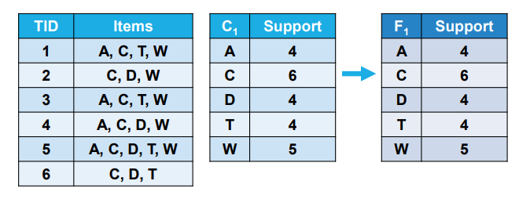

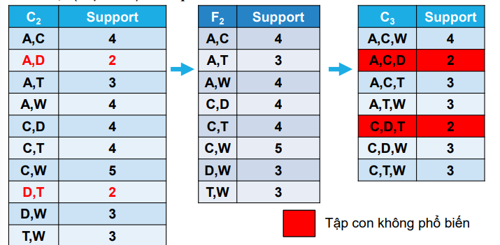

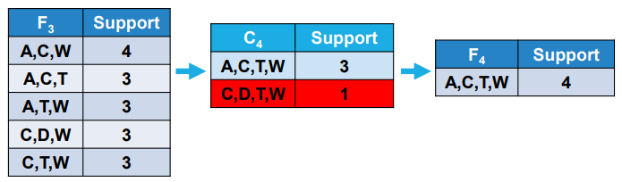

</div>


### **Lattice representation**

The search space is represented as a **lattice**
- **Nodes** - all possible *Is* ($2^{[I]}$)
- **Edges** - subset-superset relationships
- **Levels** - *Is* of size $k$ (e.g., level 1: 1-itemsets, level 2: 2-itemsets)

<center>

              ∅
             /|\
           A  C  D  T  W
          /|\/|\ /|\ /|\
        AC (AD) AT AW CD CT CW (DT) DW TW
       /|\
      ACT ACW ATW CDW CTW
       |
     ACTW

</center>

***The AA traverses this lattice level-wise, pruning non-frequent itemsets***

### **Implementation considerations**

**Data Structures**

- Use a hash table or trie to store candidate *Is* and their counts
- Represent *T* as bitsets for efficient subset checking

**Optimizations**

- **Transaction reduction** - remove *T* that can not contribute to new candidates

- **Prefix Trees**  - store candidates in a prefix tree to reduce memory usage

**Bottlenecks**
- Multiple *db* scans (one per level)
- Generating and pruning candidates can be costly for large $k$

## **Closed itemset mining (CIsM)**

### **Motivation**

*FIs* can be numerous, esp in dense datasets. *CIs* reduce redundancy while preserving all information about *FIs* and their *sp*

### **Charm algorithm**

The *CA* efficiently mines *CFIs* using a vertical data representation (tidsets) and tree-based search

**Tidset** (*Tids*) - for an *Is* $X$, $t(X)$ is the set of TIDs containing $X$. The *sp* is 

$$\text{sup \_ count}(X) = |t(X)|$$

For example, $t(\{A, C\}) = \{1, 3, 4, 5\} \rightarrow \text{sup \_ count}(AC) = 4$

**Charm process**

1. **Initialize** - Start with a root node containing all 1-itemsets and their *Tids*
2. **Combine items** - for each *Is*, combine it with other *I* to form larger *Is*, computing *Tids* via intersection

$$t(X \cup Y) = t(X) \cap t(Y)$$

3. **Check closure** - for an *Is* $X$, compute $c(X) = i(t(X))$. If $c(X) = X$, $X$ is closed

4. **Prune**

- If $t(X) = t(Y)$ for some $Y$, merge $X$ into $Y$ (since $X$ is not closed)
- If $|t(X)| < \text{minsup}$, prune the branch

5. **Output** - collect all closed frequent itemsets *CFIs*

**Example** with $\text{minsup} = 50\% \rightarrow \text{support count} \geq 3$

Initial *Tids*

```python
A: {1, 3, 4, 5}
C: {1, 2, 3, 4, 5, 6}
D: {2, 4, 5, 6}
T: {1, 3, 5, 6}
W: {1, 2, 3, 4, 5}
```

**Combine**, e.g., $t(A, C) = t(A) \cap t(C) = \{1, 3, 4, 5\}$

**Check closure**

For $AC$ $\Rightarrow t(A, C) = \{1, 3, 4 , 5\}, \space i(\{1, 3, 4, 5\}) = \{A, C, W\}$

$\Rightarrow c(A, C) = ACW \neq AC \rightarrow$ **not closed**

For $ACW$ $\Rightarrow t(A, C, W) = \{1, 3, 4, 5\}, \space i(\{1, 3, 4, 5 \}) = \{A, C, W\} $

$\Rightarrow c(A, C, W) = ACW \rightarrow$ **closed**

**Result** 7 *CFIs*

```python
C × {1, 2, 3, 4, 5, 6}
ACT × {1, 3, 5}
ACW × {1, 3, 4, 5}
ATW × {1, 3, 5}
CDW × {2, 4, 5}
CTW × {1, 3, 5}
ACTW × {1, 3, 5}
```

### **Visualization (Charm)**

<div align='center'>

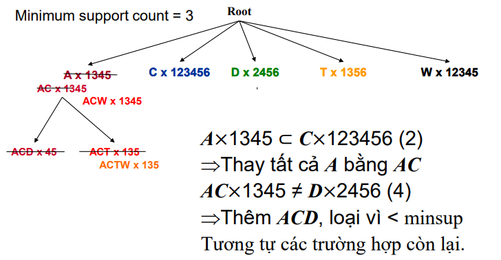

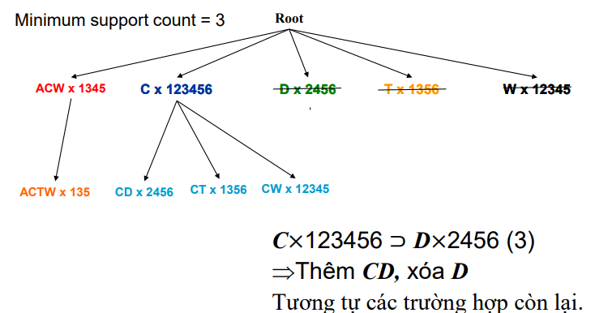

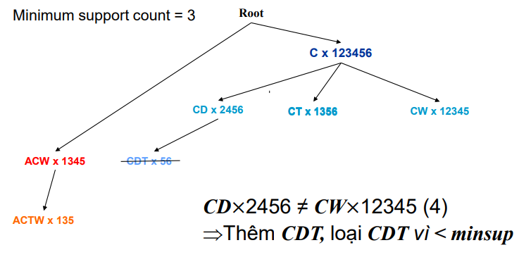

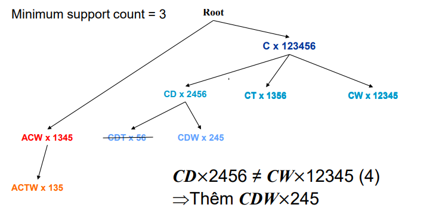

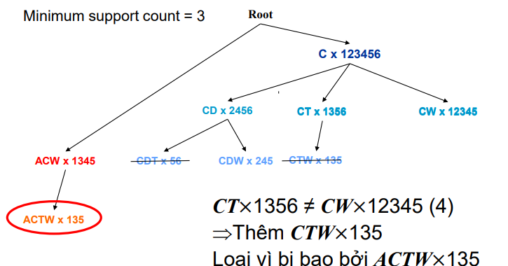

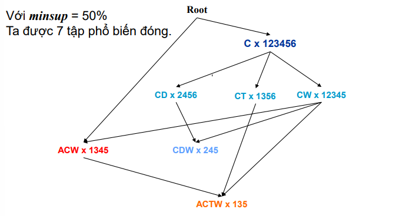

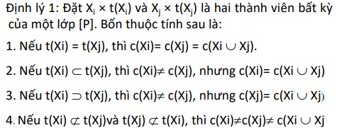

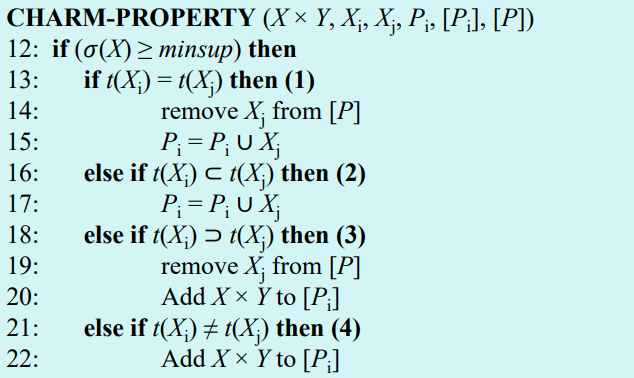

</div>

### **Advantages**

**Compactness** - fewer *Is* than *FIs*

**Lossless** - retains all *sp* information

**Efficient rules** - association rules from *CFIs* are non-redundant

### **Implementation notes**

**Vertical format** - store *Tids* as bitsets or lists for fast intersection

**Diffsets** - optimize by storing differences between *Tids* to reduce memory

**Challenges** - dense datasets may produce many *CFIs*, requiring pruning strategies

## **Maximal itemset mining**

### **Motivation**

Maximal itemsets are the most compact representation, ideal for dense datasets where even closed itemsets are numerous

### **GenMax algorithm**

The **GenMax algorithm** mines *MFIs* using backtracking and *Tids*

**Algorithm overview**

- **Approach** $\rightarrow$ depth-first search with backtracking
- **Data structure** $\rightarrow$ *Tids* for *sp* counting
- **Pruning** $\rightarrow$ eliminates branches leading to non-*MIs*

**Pseudocode (MFI-backtrack)**

```python
Input: I_l (current itemset), C_l (combinable items), l (length)
Output: MFI (maximal frequent itemsets)

MFI-backtrack(I_l, C_l, l):
1. for each x in C_l:
2.     I_{l+1} = I_l ∪ {x}
3.     P_{l+1} = {y in C_l | y > x}  // Items after x (lexicographic order)
4.     if I_{l+1} ∪ P_{l+1} has a superset in MFI:
5.         return  // Prune branch
6.     C_{l+1} = FI-combine(I_{l+1}, P_{l+1})
7.     if C_{l+1} is empty:
8.         if I_{l+1} has no superset in MFI:
9.             MFI = MFI ∪ I_{l+1}
10.    else:
11.        MFI-backtrack(I_{l+1}, C_{l+1}, l+1)
```
**FI-combine function**

```python
FI-combine(I_{l+1}, P_{l+1}):
1. C = ∅
2. for each y in P_{l+1}:
3.     if sup(I_{l+1} ∪ {y}) ≥ minsup:
4.         C = C ∪ {y}
5. return C
```

**Detailed example (with $\text{minsup} = 50\%$)**

**Initial Tidsets**

```python
A: {1, 3, 4, 5}
C: {1, 2, 3, 4, 5, 6}
D: {2, 4, 5, 6}
T: {1, 3, 5, 6}
W: {1, 2, 3, 4, 5}
```

Start with $A$
- Combinable items $C_1 = \{C, T, W\}$
- Generate $AC \rightarrow t(AC) = \{1, 3, 4, 5\}, \text{sup \_ count} = 4 \geq 3$
- Generate $AT \rightarrow t(AT) = \{1, 3, 5\}, \text{sup \_ count} = 3 \geq 3$
- Generate $AW \rightarrow t(AW) = \{1, 3, 4 ,5\}, \text{sup \_ count} = 4 \geq 3$

$\Rightarrow C_2 = \{AC, AT, AW \}$ 

For **$AC$**
- Combinable items $P_2 = \{T, W\}$
- Generate $ACT \rightarrow t(ACT) = \{1, 3 , 5\}, \text{sup \_ count} = 3 \geq 3$
- Generate $ACW \rightarrow t(ACW) = \{1, 3, 4 , 5\}, \text{sup \_ count} = 4 \geq 3$

$\Rightarrow C_3 = \{ACT, ACW \}$ 

For **$ACT$**
- Combinable items $P_3 = \{W\}$
- Generate $ACTW \rightarrow t(ACTW) = \{1, 3 , 5\}, \text{sup \_ count} = 3 \geq 3$

$\Rightarrow C_4 = \{ACTW\}$ 

For **$ACTW$**
- No combinable items $C_5 = \empty$
- Check maximality $\rightarrow$ no superset in *MFIs* yet so add $ACTW$

Backtract to $ACW$
- Superset $ACTW$ exists so prune $ACW$

**Result** 2 *MFIs*

```python
ACTW × {1, 3, 5}
CDW × {2, 4, 5}
```
### **Advantages**

- **Minimal output** $\rightarrow$ Only the largest frequent itemsets
- **Efficent for dense data** $\rightarrow$ Reduces output size significantly

### **Implementation notes**

- **Tidset Intersection** $\rightarrow$ use bitsets for fast computation.
- **Pruning** $\rightarrow$ maintain a set of maximal itemsets to check for supersets.
- **Challenges** $\rightarrow$ ensuring no maximal itemset is missed requires careful pruning.

## **Observations and comparisons**

**Hierarchy** $M \subset C \subset F$

**Closed itemsets**
- Lossless representation of all frequent itemsets
- Ideal for generating concise association rules

**Maximal itemsets**
- Most compact but loss *sp* information for subsets
- Best for dense datasets with many *CIs*

**Trade-offs**

- **F** $\rightarrow$ Comprehensive but redundant and large.
- **C** $\rightarrow$ Balances compactness and information.
- **M** $\rightarrow$ Minimal but may require reconstruction of subsets.

**Practical applications**

- **Market Basket Analysis** $\rightarrow$ place frequently co-purchased items together or offer bundles.
- **Recommendation Systems** $\rightarrow$ suggest items based on frequent patterns.
- **Bioinformatics** $\rightarrow$ identify co-occurring genes or proteins.
Web Mining: Analyze common navigation paths.

## **Advanced Topics and Extensions**

### **Other algorithms**

**FP-Growth**

- Uses a Frequent Pattern tree (FP-tree) to avoid candidate generation
- More efficient than Apriori for large, sparse datasets

**Eclat**
- Vertical data format with *Tids*
- Depth-first search, similar to **Charm** and **GenMax**

**LCM (Linear time Closed itemset Miner)**
- Optimized for closed itemset mining, faster than **Charm** in some cases

### **Dense vs Sparse datasets**

- **Sparse datasets** $\rightarrow$ few items per transactions (e.g., retail). Many *FIs* but **Apriori** or **FP-Growth** works well
- **Dense datasets** $\rightarrow$ many items per transaction (e.g., bioinformatics). Fewer but larger itemsets, **Charm** or **GenMax** is preferred 