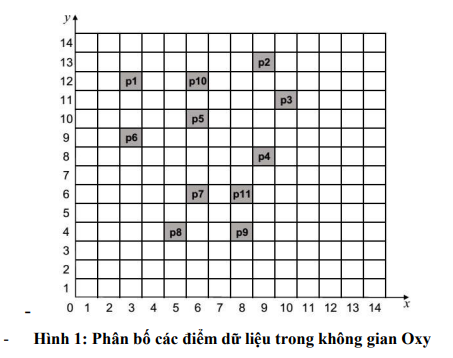

**Câu 1** - Cho CSDL sau và ***minsup = 60%*** và ***minconf = 100%***

<center>

| TID  | Items |
| --- | --- |
| 10 | D, H, C, A, B, K, M |
| 20 | E, H, D, G, P, I |
| 30 | B, C, D, G, H, K |
| 40 | E, A, C, B, P, I |
| 50 | K, B, M, F, H, D |

</center>

a. Liệt kê các **tập phổ biến tối đại** và **tập phổ biến đóng** thỏa mãn ngưỡng minsup đã cho sử dụng **thuật toán Apriori**

***minsup = 60%*** $\rightarrow$ count = 3

**First Combination**

<center>

| Items | TID | Count | Result |
| --- | --- | --- | --- |
| A | 10, 40 | 2 | No |
| B | 10, 30, 40, 50 | 4 | Yes |
| C | 10, 30, 40 | 3 | Yes |
| D | 10, 20, 30, 50 | 4 | Yes |
| E | 20, 40 | 2 |No |
| F | 50 | 1 | No |
| G | 20, 30 | 2 |No
| H | 10, 20, 30, 50 | 4 | Yes | 
| I | 20, 40 | 2 | No |
| K | 10, 30, 50 | 3 | Yes |
| P | 20, 40 | 2 | No |
| M | 10, 50 | 2 | No |

</center>

$C_1 = \{A, B, C, D, E, F, G, H, I, K, P, M\}$

<center>

| Items | TID | Count | Result |
| --- | --- | --- | --- |
| B | 10, 30, 40, 50 | 4 | Yes |
| C | 10, 30, 40 | 3 | Yes |
| D | 10, 20, 30, 50 | 4 | Yes |
| H | 10, 20, 30, 50 | 4 | Yes | 
| K | 10, 30, 50 | 3 | Yes |

</center>

$\Rightarrow L_1 = \{B, C, D, H, K\}$

--

**Second combination**

<center>

| Itemsets | TID | Count | Result |
| --- | --- | --- | --- |
| BC | 10, 30, 40 | 3 | Yes |
| BD | 10, 30, 50 | 3 | Yes | 
| BH | 10, 30, 50 | 3 | Yes |
| BK | 10, 30, 50 | 3 | Yes |
| CD | 10, 30 | 2 | No |
| CH | 10, 30 | 2 | No | 
| CK | 10, 30 | 2 | No | 
| DH | 10, 20, 30, 50 | 4 | Yes |
| DK | 10, 30, 50 | 3 | Yes |
| HK | 10, 30, 50 | 3 | Yes |

</center>

$C_2 = \{BC, BD, BH, BK, CD, CH, CK, DH, DK, HK \}$

<center>

| Itemsets | TID | Count | Result |
| --- | --- | --- | --- |
| BC | 10, 30, 40 | 3 | Yes |
| BD | 10, 30, 50 | 3 | Yes | 
| BH | 10, 30, 50 | 3 | Yes |
| BK | 10, 30, 50 | 3 | Yes |
| DH | 10, 20, 30, 50 | 4 | Yes |
| DK | 10, 30, 50 | 3 | Yes |
| HK | 10, 30, 50 | 3 | Yes |

</center>

$\Rightarrow L_2 = \{BC, BD, BH, BK, DH, DK, HK\}$

--

**Third combination**

<center>

| Itemsets | TID | Count | Result |
| --- | --- | --- | --- |
| BCD | ... | ... | No |
| BCH | ... | ... | No |
| BCK | ... | ... | No |
| BDK | 10, 30, 50 | 3 | Yes |
| BDH | 10, 30, 50 | 3 | Yes |
| BHK | 10, 30, 50 | 3 | Yes | 
| DHK | 10, 30, 50 | 3 | Yes |

</center>

$C_3 = \{BDK, BDH, BHK, DHK\}$

Remove *BCD*, *BCH*, *BCK* because *CD*, *CH*, *CK* does not exist in $L_2$

<center>

| Itemsets | TID | Count | Result |
| --- | --- | --- | --- |
| BDK | 10, 30, 50 | 3 | Yes |
| BDH | 10, 30, 50 | 3 | Yes |
| BHK | 10, 30, 50 | 3 | Yes | 
| DHK | 10, 30, 50 | 3 | Yes |

</center>

$\Rightarrow L_3 = \{BDK, BDH, BHK, DHK\}$

--

**Forth combination**

<center>

| Itemsets | TID | Count | Result |
| --- | --- | --- | --- |
| BDKH | 10, 30, 50 | 3 | Yes |

</center>

$\Rightarrow L_4 = \{BDKH\}$

**BDHK** has 4 items, no 5-itemset is possible since no 5-item subset of $L_4$ exists.

$\Rightarrow$ Apriori stops here.

Do not have any combinations with *BHK* and *DHK*

```
             Root 
        /   |   |     |   \
      B     C   D     H    K
    / | | \    / \    |
  BC BD BH BK DH DK   HK
    / |    |    |
 BDK  BDH  BHK  DHK
     |
    BDKH

```

**Tập phổ biến tối đại** là *BDKH*, *BC*

**Tập phổ biến đóng** là *BDKH*, *DH*, *BC*, *B*

b. Tìm các luật kết hợp có dạng sau và thỏa mãn ngưỡng ***minsup***, ***minconf*** đã cho sử dụng thuật toán Apriori
- **item 1 & item2** -> **item 3 & item 4** (vế trái và phải của luật đều có 2 hạng mục)
- **D** -> **item** (vế phải có một hạng mục khác với hạng mục D)

Yêu cầu trình bày chi tiết các bước (không chỉ liệt kê tập luật tìm được)

The confidence of a rule $X \rightarrow Y$ is calculated as

$$\text{conf}(X \rightarrow Y) = \frac{\text{support}(X \cup Y)}{\text{support}(X)} = \frac{text{count}(X \cup Y)}{\text{count}(X)}$$

Since ***minconf = 100%***, we need $\text{count}(X \cup Y) = \text{count}(X)$, meaning all transactions containing the antecedent $X$ must also contain the consequent $Y$

--

**Generate rules of the form item 1 & item2** -> **item 3 & item 4**

This rule form requires:

- **Antecedent** $\rightarrow$ **A 2-itemset** (e.g., {item 1, item 2})
- **Consequent** $\rightarrow$ **A 2-itemset** (e.g., {item 3, item 4})

**The union of antecedent and consequent** is a **4-itemset** (since {item 1, item 2} $\cup$ {item 3, item 4})

The rule must satisfy:

**Support**: The support of the 4-itemset {item 1, item 2, item 3, item 4} must be $\geq$ 3

**Confidence**: conf({item 1, item 2}$\rightarrow$ {item 3, item 4}) = 100% $\rightarrow$ count({item 1, item 2, item 3, item 4}) = count({item 1, item 2})

**Identify relevant itemsets**

Since the rule's union is a 4-itemset $\rightarrow$ start with the frequent 4-itemset from $L_4$

- **BDKH** (support count =3)

We need to generate rules where the antecedent is a 2-itemset and the consequent is a 2-itemset and their union is **BDKH**. The possible 2-itemset antecedents from **BDKH** are the item subsets that are frequent in $L_2$

Subset of **BDKH** 

$\rightarrow$ {BD, BH, BK, DH, DK, HK}

$\rightarrow$ Check which are in $L_2 \rightarrow$ All are frequent 


For each 2-itemset antecedent $X$, the consequent is **BDKH \ X**, which is also a 2-itemset. We then compute the confidence

**Generate and Evaluate Rules**

<center>

| Antecedent | Consequent | Rule | Confidence | Valid rule | 
| --- | --- | --- | --- | --- | 
| BD | BDKH \ BD = KH | BD $\rightarrow$ KH | conf(BD $\rightarrow$ KH) = $\frac{\text{count}(BDKH)}{\text{count}(BD)}$ = $\frac{3}{3} = 100\%$ | Yes | 
| BH |  BDKH \ BH = DK | BH $\rightarrow$ DK | conf(BH $\rightarrow$ DK) = $\frac{\text{count}(BDKH)}{\text{count}(BH)}$ = $\frac{3}{3} = 100\%$ | Yes |
| BK |  BDKH \ BK = DH | BK $\rightarrow$ DH | conf(BK $\rightarrow$ DH) = $\frac{\text{count}(BDKH)}{\text{count}(BK)}$ = $\frac{3}{3} = 100\%$ | Yes |
| DH |  BDKH \ DH = BK | DH $\rightarrow$ BK | conf(DH $\rightarrow$ BK) = $\frac{\text{count}(BDKH)}{\text{count}(DH)}$ = $\frac{3}{4} = 75\%$ | No |
| DK |  BDKH \ DK = BH | DK $\rightarrow$ BH | conf(DK $\rightarrow$ BH) = $\frac{\text{count}(BDKH)}{\text{count}(DK)}$ = $\frac{3}{3} = 100\%$ | Yes |
| HK |  BDKH \ HK = BD | HK $\rightarrow$ BD | conf(HK $\rightarrow$ BD) = $\frac{\text{count}(BDKH)}{\text{count}(HK)}$ = $\frac{3}{3} = 100\%$ | Yes |

</center>

Since $L_4$ contains only **BDKH**, no other 4-itemsets are frequent. Thus, no other rules of this form are possible

**Rules for form 1**

The valid rules are:

- $BD \rightarrow KH$ (support = 3, confidence = 100%)
- $BH \rightarrow DK$ (support = 3, confidence = 100%)
- $BK \rightarrow DH$ (support = 3, confidence = 100%)
- $DK \rightarrow BH$ (support = 3, confidence = 100%)
- $HK \rightarrow BD$ (support = 3, confidence = 100%)

--

**Generate rules of the form D** -> **item**

This rule form requires:
- **Antecedent** $\rightarrow$ D
- **Consequent** $\rightarrow$ a single item {item}, where \item $\neq$ D

The union is a 2-itemset {D, item}

The rule must satisfy

**Support** $\rightarrow$ the support of {D, item} must be $\geq$ 3

**Confidence** $\rightarrow$ conf(D $\rightarrow$ item) = 100% i.e., count({D, item}) = count(D)

**Identify relevant itemsets**

The antecedent is D, which is frequent (count(D) = 4). We need 2-itemsets containing D that are frequent from $L_2$

From $L_2$, the 2-itemsets containing D are:
- DH (4)
- DK (3)
- BD (3)

Possible consequents (single item $\neq$ D) from these itemsets: B, H, K

**Generate and evaluate rules**

| Antecedent | Consequent | Rule | Confidence | Valid rule | 
| --- | --- | --- | --- | --- | 
| D | BD \ D = B | D $\rightarrow$ B | conf(D $\rightarrow$ B) = $\frac{\text{count}(BD)}{\text{count}(D)}$ = $\frac{3}{4} = 75\%$ | No |
| D | DK \ D = K | D $\rightarrow$ K | conf(D $\rightarrow$ K) = $\frac{\text{count}(DK)}{\text{count}(D)}$ = $\frac{3}{4} = 75\%$ | No |
| D | DH \ D = H | D $\rightarrow$ H | conf(D $\rightarrow$ H) = $\frac{\text{count}(DH)}{\text{count}(D)}$ = $\frac{4}{4} = 100\%$ | Yes |

**Check other items**

Consider all possible items (except D) that could form a frequent 2-itemset with D. From $L_1$, the frequent items are {B, C, D, H, K}. We already checked B, H, K:

- **C** {D, C} has support = 2 $\rightarrow$ not in $L_2 \rightarrow$ not frequent, so D $\rightarrow$ C is not possible
- Other items (A, E, F, G, I, M, P) are not frequent in $L_2$ so {D, item} can not be frequent 

Thus, no other items yield frequent 2-itemsets with D

**Rule for form 2**

The valid rule is:
- D $\rightarrow$ H (support = 4, confidence = 100%)

**Summarize all association rules**

Combining both forms, the association rules that satisfy ***minsup*** and ***minconf*** are:

Form 1: item 1, item 2 $\rightarrow$ item 3, item 4

- $BD \rightarrow KH$ (support = 3, confidence = 100%)
- $BH \rightarrow DK$ (support = 3, confidence = 100%)
- $BK \rightarrow DH$ (support = 3, confidence = 100%)
- $DK \rightarrow BH$ (support = 3, confidence = 100%)
- $HK \rightarrow BD$ (support = 3, confidence = 100%)

Form 2: D $\rightarrow$ item
- D $\rightarrow$ H (support = 4, confidence = 100%)


--- 

**Câu 3**: Sử dụng phương pháp cây quyết định để tìm các luật phân lớp từ bảng dữ liệu sau. Giả sử thuộc tính *kết quả* là thuộc tính phân lớp

<center>

| Đối tượng | Mây | Áp suất | Gió | Kết quả |
| --- | --- | --- | --- | --- | 
| 1 | ít | cao | bắc | ko mưa |
| 2 | nhiều | cao | nam | mưa |
| 3 | nhiều | trung bình | bắc | mưa |
| 4 | ít | thấp | bắc | không mưa | 
| 5 | nhiều | thấp | bắc | mưa |
| 6 | nhiều | cao | bắc  | mưa |
| 7 | nhiều | thấp | nam | không mưa | 
| 8 | ít | cao | nam | không mưa |

</center>

Bảng dữ liệu:
- Gồm 8 đối tượng
- Kết quả $\rightarrow$ 4 mưa (+)  4 không mưa (-)
- Mây $\rightarrow$ 3 ít 5 nhiều
- Áp suất $\rightarrow$ 3 thấp 1 trung bình 4 cao
- Gió $\rightarrow$ 5 bắc 3 nam

**B1** - *Calculating the entropy of the entire dataset based on the class label **Kết quả***

$$\text{Entropy}(\text{Kết quả}) = - \frac{4}{8} \log_2 \frac{4}{8} - \frac{4}{8} \log_2 \frac{4}{8} = 1$$


**B2** - *Information gain for root node attributes*

Computing the Information Gain for each attribute (**Mây**, **Áp suất**, **Gió**) to select the root node

**Xét *Mây***

- **ít** $(0 + 3 -) \rightarrow \text{Entropy(Mây = ít)} = 0$
- **nhiều** $(4+, 1-) \rightarrow \text{Entropy(Mây = nhiều)} = - \frac{4}{5} \log_2 \frac{4}{5} - \frac{1}{5} \log_2 \frac{1}{5} = 0.722$

$\Rightarrow \text{Gain}(\text{Kết quả } | \text{ Mây}) = 1 - (\frac{3}{8} \times 0 + \frac{5}{8} \times 0.722) = 0.54875$

--

**Xét *Áp suất***

- **thấp** $(1+ 2-) \rightarrow \text{Entropy(Áp suất = thấp)} = -\frac{1}{3} \log_2 \frac{1}{3} - \frac{2}{3} \log_2 \frac{2}{3} = 0.9183$
- **trung bình** $(1+ 0- ) \rightarrow \text{Entropy(Áp suất = trung bình)} = -\frac{1}{1} \log_2 \frac{1}{1} = 0$
- **cao** $(2+ 2- ) \rightarrow \text{Entropy(Áp suất = cao)} = -\frac{2}{4} \log_2 \frac{2}{4} -\frac{2}{4} \log_2 \frac{2}{4}  = 1$

$\Rightarrow \text{Gain}(\text{Kết quả } | \text{ Áp suất}) = 1 - (\frac{3}{8} \times 0.9183 + \frac{1}{8} \times 0 + \frac{4}{8} \times 1) = 0.1556$

--

**Xét *Gió***

- **bắc** $(3+ 2-) \rightarrow \text{Entropy(Gió = bắc)} = -\frac{3}{5} \log_2 \frac{3}{5} - \frac{2}{5} \log_2 \frac{2}{5} = 0.971$

- **nam** $(1+ 2-) \rightarrow \text{Entropy(Gió = nam)} = -\frac{1}{3} \log_2 \frac{1}{3} - \frac{2}{3} \log_2 \frac{2}{3} = 0.9183$

$\Rightarrow \text{Gain}(\text{Kết quả } | \text{ Gió}) = 1 - (\frac{5}{8} \times 0.971 + \frac{3}{8} \times 0.9183) = 0.0488$

Thuộc tính ***Mây*** có Information Gain lớn nhất  $\rightarrow$ Chọn thuộc tính ***Mây*** làm root node

--

**B3** - Branch ***Mây = ít***

Với *Mây* = **ít** (1, 4, 8)
- All have class *không mưa* (0 mưa, 3 không mưa)

$\Rightarrow$ Entropy = 0 (pure node) 

$\Rightarrow$ No further splitting is needed (leaf node: ko mưa)


--

**B4** - Branch ***Mây = nhiều***

Với *Mây* = **nhiều** (2, 3, 5, 6, 7)

- Classes: 4 mưa, 1 không mưa 

$$\text{Entropy(Mây = nhiều)} = -\frac{4}{5} \log_2\frac{4}{5} - \frac{1}{5} \log_2 \frac{1}{5} = 0.722$$

Xét *Áp suất*

- **thấp**  $(1+ 1-) \rightarrow \text{Entropy(Mây = nhiều \& Áp suất = thấp)} = -\frac{1}{2} \log_2 \frac{1}{2} -\frac{1}{2} \log_2 \frac{1}{2}  = 1$
- **trung bình** $(1+ 0- ) \rightarrow \text{Entropy(Mây = nhiều \& Áp suất = trung bình)} = 0$
- **cao** $(2+ 0- ) \rightarrow \text{Entropy(Mây = nhiều \& Áp suất = cao)}  = 0$

$\Rightarrow \text{Gain}(\text{Kết quả } | \text{ Mây = nhiều \& Áp suất}) = 0.722 - \frac{2}{5} \times 1 = 0.322$

Xét *Gió*

- **bắc** $(3+ 0-) \rightarrow \text{Entropy(Mây = nhiều \& Gió = bắc)} =  0$

- **nam** $(1+ 1-) \rightarrow \text{Entropy(Mây = nhiều \& Gió = nam)} = 1$

$\Rightarrow \text{Gain}(\text{Kết quả } | \text{ Mây = nhiều \& Gió}) = 0.722 - \frac{2}{5} \times 1 = 0.322$

Cả thuộc tính *Áp suất* và *Gió* có cùng Information Gain và lớn nhất $\rightarrow$ Chọn thuộc tính *Áp suất*

```python

                  Mây
            /                \
          ít                nhiều
          |                   |
        ko mưa               Áp suất
                            /   |    \
                         thấp trung  cao
                          |    bình 
                          |     |      | 
                          |    mưa    mưa
                         Gió
                        /  \
                       bắc  nam 
                       |     |
                      mưa   ko mưa
```

---

**Câu 4**: Cho CSDL sau

| TID | A | B | C | D | E | F | G | H | I | 
| --- | --- | --- | --- | --- | --- | --- | --- | --- | --- |
| 10 | 1 | | | 1 | | | 1 | 1 | |
| 20 | | | 1 | | 1 | | | | |
| 30 |  | 1 | 1 | 1 |  | 1 | | | 1 |
| 40 | 1 | | 1 | 1 | 1 | 1 | 1 | | 1 |
| 50 | 1 | | 1 | 1 | | 1 | | 1 | 1 |

a. Hãy sử dụng **một** trong hai thuật toán: **Apriori** hoặc **FP-Growth** để tìm tất các tập phổ biến thỏa mãn ngưỡng ***minsup = 60%***. Liệt kê các tập phổ biến tối đại và tập bao phổ biến 

***minsup = 60%*** $\rightarrow$ **count = 5 * 60% = 3**

**First combination**

| Items | TID | count | result |
| --- | --- | --- | --- |
| A | 10, 40, 50 | 3 | yes |
| B | 30 | 1 | no |
| C | 20, 30, 40, 50 | 4 | yes | 
| D | 10, 30, 40, 50 | 4 | yes |
| E | 20, 40 | 2 | no |
| F | 30, 40, 50 | 3 | yes |
| G | 10, 40 | 2 | no |
| H | 10, 50 | 2 | no |
| I | 30, 40, 50 | 3 | yes |

$C_1 = \{A, B, C, D, E, F, G, H, I\}$

| Items | TID | count | result |
| --- | --- | --- | --- |
| A | 10, 40, 50 | 3 | yes |
| C | 20, 30, 40, 50 | 4 | yes | 
| D | 10, 30, 40, 50 | 4 | yes |
| F | 30, 40, 50 | 3 | yes |
| I | 30, 40, 50 | 3 | yes |

$\Rightarrow L_1 = \{A, C, D, F, I\}$

**Second combination**

| Item | TID | count | result |
| --- | --- | --- | --- |
| AC | 40, 50 | 2 | no |
| AD | 10, 40, 50 | 3 | yes |
| AF | 40, 50 | 2 | no | 
| AI | 40, 50 | 2 | no | 
| CD | 30, 40, 50 | 3 | yes |
| CF | 30, 40, 50 | 3 | yes |
| CI | 30, 40, 50 | 3 | yes |
| DF | 30, 40, 50 | 3 | yes |
| DI | 30, 40, 50 | 3 | yes |
| FI | 30, 40, 50 | 3 | yes |

$C_2 = \{AC, AD, AF, AI, CD, CF, CI, DF, DI, FI \}$

| Item | TID | count | result |
| --- | --- | --- | --- |
| AD | 10, 40, 50 | 3 | yes |
| CD | 30, 40, 50 | 3 | yes |
| CF | 30, 40, 50 | 3 | yes |
| CI | 30, 40, 50 | 3 | yes |
| DF | 30, 40, 50 | 3 | yes |
| DI | 30, 40, 50 | 3 | yes |
| FI | 30, 40, 50 | 3 | yes |

$\Rightarrow L_2 = \{AD, CD, CF, CI, DF, DI, FI \}$

**Third combination**

| Item | TID | count | result |
| --- | --- | --- | --- |
| CDF | 30, 40, 50 | 3 | yes |
| CDI | 30, 40, 50 | 3 | yes | 
| CFI | 30, 40, 50 | 3 | yes |
| DFI | 30, 40, 50 | 3 | yes |

$C_3 = \{CDF, CDI, CFI, DFI \}$

| Item | TID | count | result |
| --- | --- | --- | --- |
| CDF | 30, 40, 50 | 3 | yes |
| CDI | 30, 40, 50 | 3 | yes | 
| CFI | 30, 40, 50 | 3 | yes |
| DFI | 30, 40, 50 | 3 | yes |

$\Rightarrow L_3 = \{CDF, CDI, CFI, DFI \}$

**Fourth combination**

| Item | TID | count | result |
| --- | --- | --- | --- |
| CDFI | 30, 40, 50 | 3 | yes |

$C_4 = \{CDFI \}$

| Item | TID | count | result |
| --- | --- | --- | --- |
| CDFI | 30, 40, 50 | 3 | yes |

$L_4 = \{CDFI \}$

$\Rightarrow$ **Stop**


```
             Root 
      /    |      |   |  \
     A     C      D   F   I
    /     /|\    /\   |
  AD   CD CF CI DF DI FI
        /   |  \   \
       CDF CDI CFI DFI
         |
        CDFI        
```

**Tập phổ biến tối đại** là $CDFI$, $AD$

**Tập phổ biến đóng** là $CDFI$, $AD$, $D$, $C$

All steps (candidate generation, support counting, maximal and closed itemset identification) are correct. The tree diagram accurately represents the Apriori process.

b. Tìm các luật kết hợp được xây dựng từ tập phổ biến tối đại, thỏa mãn ngưỡng **minconf = 80%**

**Objective**

Generate association rules from the maximal frequent itemsets CDFI, AD that satisfy **minconf = 80%**. Each rule must also meet **minsup = 60%** (support count >= 3)

**Step 1: Rule generation from CDFI**

**CDFI** $\rightarrow$ support count = 3

Generate rule $\left( X \rightarrow (CDFI \setminus X) \right)$ where ($X$) is a non-empty subset of {C, D, F, I}

| Antecedents | Consequent | Rule | Confidence | Valid? |
| --- | --- | --- | --- | --- | 
| F | CDFI \ F = CDI | F $\rightarrow$ CDI | $\text{conf}(F \rightarrow CDI) = \frac{\text{count}(CDFI)}{\text{count}(F)} = \frac{3}{3} = 100\%$ | yes |
| I | CDFI \ I = CDF | I $\rightarrow$ CDF | $\text{conf}(I \rightarrow CDF) = \frac{\text{count}(CDFI)}{\text{count}(I)} = \frac{3}{3} = 100\%$ | yes |
| C | CDFI \ C = DFI | C $\rightarrow$ DFI | $\text{conf}(C \rightarrow DFI) = \frac{\text{count}(CDFI)}{\text{count}(C)} = \frac{3}{4} = 75\%$ | no |
| D | CDFI \ D = CFI | D $\rightarrow$ CFI | $\text{conf}(D \rightarrow CFI) = \frac{\text{count}(CDFI)}{\text{count}(D)} = \frac{3}{4} = 75\%$ | no |
| CF | CDFI \ CF = DI | CF $\rightarrow$ DI | $\text{conf}(CF \rightarrow DI) = \frac{\text{count}(CDFI)}{\text{count}(CF)} = \frac{3}{3} = 100\%$ | yes |
| CI | CDFI \ CI = DF | CI $\rightarrow$ DF | $\text{conf}(CI \rightarrow DF) = \frac{\text{count}(CDFI)}{\text{count}(CI)} = \frac{3}{3} = 100\%$ | yes |
| CD | CDFI \ CD = FI | CD $\rightarrow$ FI | $\text{conf}(CD \rightarrow FI) = \frac{\text{count}(CDFI)}{\text{count}(CD)} = \frac{3}{3} = 100\%$ | yes |
| FI | CDFI \ FI = CD | FI $\rightarrow$ CD | $\text{conf}(FI \rightarrow CD) = \frac{\text{count}(CDFI)}{\text{count}(FI)} = \frac{3}{3} = 100\%$ | yes |
| DF | CDFI \ DF = CI | DF $\rightarrow$ CI | $\text{conf}(DF \rightarrow CI) = \frac{\text{count}(CDFI)}{\text{count}(DF)} = \frac{3}{3} = 100\%$ | yes |
| DI | CDFI \ DI = CF | DI $\rightarrow$ CF | $\text{conf}(DI \rightarrow CF) = \frac{\text{count}(CDFI)}{\text{count}(DI)} = \frac{3}{3} = 100\%$ | yes |
| CDF | CDFI \ CDF = I | CDF $\rightarrow$ I | $\text{conf}(CDF \rightarrow I) = \frac{\text{count}(CDFI)}{\text{count}(CDF)} = \frac{3}{3} = 100\%$ | yes |
| CDI | CDFI \ CDI = F | CDI $\rightarrow$ F | $\text{conf}(CDI \rightarrow F) = \frac{\text{count}(CDFI)}{\text{count}(CDI)} = \frac{3}{3} = 100\%$ | yes |
| CFI | CDFI \ CFI = D | CFI $\rightarrow$ D | $\text{conf}(CFI \rightarrow D) = \frac{\text{count}(CDFI)}{\text{count}(CFI)} = \frac{3}{3} = 100\%$ | yes |
| DFI | CDFI \ DFI = C | DFI $\rightarrow$ C | $\text{conf}(DFI \rightarrow C) = \frac{\text{count}(CDFI)}{\text{count}(DFI)} = \frac{3}{3} = 100\%$ | yes |

**Step 2: Rule generation from AD**

**AD** $\rightarrow$ support count = 3 

Generate rules from non-empty subsets of {A, D}

| Antecedents | Consequent | Rule | Confidence | Valid? |
| --- | --- | --- | --- | --- | 
| A | AD \ A = D | A $\rightarrow$ D |  $\text{conf}(A \rightarrow D) = \frac{\text{count}(AD)}{\text{count}(A)} = \frac{3}{3} = 100\%$ | yes |
| D | AD \ D = A | D $\rightarrow$ A |  $\text{conf}(D \rightarrow A) = \frac{\text{count}(AD)}{\text{count}(D)} = \frac{3}{4} = 75\%$ | no | 

**Step 3: Final association rules**

All rules satisfy **minsup = 60%** (support count = 3) and **minconf = 80%**:

From **CDFI**:
- F → CDI (support = 3, confidence = 100%)
- I → CDF (support = 3, confidence = 100%)
- CF → DI (support = 3, confidence = 100%)
- CI → DF (support = 3, confidence = 100%)
- CD → FI (support = 3, confidence = 100%)
- FI → CD (support = 3, confidence = 100%)
- DF → CI (support = 3, confidence = 100%)
- DI → CF (support = 3, confidence = 100%)
- CDF → I (support = 3, confidence = 100%)
- CDI → F (support = 3, confidence = 100%)
- CFI → D (support = 3, confidence = 100%)
- DFI → C (support = 3, confidence = 100%)

From **AD**
- A → D (support = 3, confidence = 100%)

Total 13 rules

---

**Câu 5**: Cho CSDL sau:

<center>

| Đối tượng | Mây | Áp suất | Gió | Kết quả |
| --- | --- | --- | --- | --- | 
| 1 | ít | cao | bắc | ko mưa |
| 2 | nhiều | cao | nam | mưa |
| 3 | ít | thấp | bắc | ko mưa |
| 4 | nhiều | trung bình | bắc | mưa | 
| 5 | nhiều | thấp | nam | ko mưa |
| 6 | nhiều | thấp | bắc  | mưa |
| 7 | ít | cao | nam | ko mưa | 
| 8 | nhiều | cao | bắc | mưa |

</center>

a. Sử dụng **thuật toán ILA** để tìm luật phân lớp với cột **Kết quả** là thuộc tính lớp. Sử dụng bộ luật phân lớp tìm được để xác định lớp cho các đối tượng mới:

| Đối tượng | Mây | Áp suất | Gió | Kết quả |
| --- | --- | --- | --- | --- | 
| 9 | ít | trung bình | bắc | ? |
| 10 | ít | thấp | nam | ? | 
| 11 | nhiều | trung bình | nam | ? |

Chia thành 2 tập $t_1$ (chứa các lớp Mưa), $t_2$ (chứa các lớp Không mưa)

$t_1$

<center>

| Đối tượng | Mây | Áp suất | Gió | Kết quả |
| --- | --- | --- | --- | --- | 
| 2 | nhiều | cao | nam | mưa |
| 4 | nhiều | trung bình | bắc | mưa | 
| 6 | nhiều | thấp | bắc  | mưa |
| 8 | nhiều | cao | bắc | mưa |

</center>

$t_2$

<center>

| Đối tượng | Mây | Áp suất | Gió | Kết quả |
| --- | --- | --- | --- | --- | 
| 1 | ít | cao | bắc | ko mưa |
| 3 | ít | thấp | bắc | ko mưa |
| 5 | nhiều | thấp | nam | ko mưa |
| 7 | ít | cao | nam | ko mưa | 

</center>

Xét bảng $t_1$

**Vòng 1**

Kết hợp các tập 1 thuộc tính: {[Mây]}, {[Áp suất]}, {[Gió]}

- [Mây] = nhiều xuất hiện ở cả 2 bảng $\rightarrow$ count = 0
- [Áp suất] = trung bình chỉ xuất hiện ở $t_1 \rightarrow$ count = 2
- [Áp suất] = cao, thấp xuất hiện ở cả 2 bảng $\rightarrow$ count = 0
- [Gió] = nam, bắc xuất hiện ở cả 2 bảng $\rightarrow$ count = 0

$\rightarrow$ Chọn và thêm luật *[Áp suất] = trung bình* vào bộ luật

Đánh dấu Đối tượng 4

Còn 3 đối tượng chưa được đánh dấu 

**Vòng 2**

Do các luật tìm thấy ở vòng 1 có count = 0 nên ta cần phải kết hợp các tập 2 thuộc tính: {[Mây, Áp suất]}, {Mây, Gió}, {Áp suất, Gió}

- [Mây, Áp suất] = nhiều, cao chỉ xuất hiện ở $t_1 \rightarrow$ count = 2
- [Mây, Áp suất] = nhiều, thấp xuất hiện ở cả 2 bảng $\rightarrow$ count = 0
- [Mây, Gió] = nhiều, bắc chỉ xuất hiện ở $t_1 \rightarrow$ count = 2
- [Mây, Gió] = nhiều, nam xuất hiện ở cả 2 bảng $\rightarrow$ count = 0
- [Áp suất, Gió] = {cao, bắc}, {cao, nam}, {thấp bắc} xuất hiện ở cả 2 bảng $\rightarrow$ count = 0

$\rightarrow$ Chọn và thêm luật *[Mây, Áp suất] = nhiều, cao* vào bộ luật

Đánh dấu Đối tượng 2, 8 

Còn 1 đối tượng chưa được đánh dấu 

**Vòng 3**

Do các luật tìm thấy ở vòng 2 có luật [Mây, Gió] = nhiều, bắc với count = 2 nên ta chọn và thêm luật *[Mây, Gió] = nhiều, bắc* vào bộ luật

Đánh dấu đối tượng 6

Còn 0 đối tượng chưa được đánh dấu $\Rightarrow$ Bảng $t_1$ đã được đánh dấu hết nhưng còn bảng $t_2$ thì chưa được đánh dấu $\Rightarrow$ tiếp tục xét trên bảng $t_2$

---

Xét bảng $t_2$

**Vòng 1**

- [Mây] = ít chỉ xuất hiện ở bảng $t_2 \rightarrow$ count = 3
- [Áp suất] = cao | thấp xuất hiện ở cả 2 bảng $\rightarrow$ count = 0
- [Gió] = bắc | nam xuất hiện ở cả 2 bảng $\rightarrow$ count = 0

$\rightarrow$ Chọn và thêm luật *[Mây] = ít* vào bộ luật

Đánh dấu đối tượng 1, 3, 7

Còn 1 đối tượng chưa được đánh dấu

**Vòng 2**

Do các luật tìm thấy ở vòng 1 có count = 0 nên ta cần phải kết hợp các tập 2 thuộc tính: {[Mây, Áp suất]}, {Mây, Gió}, {Áp suất, Gió}

- [Mây, Áp suất] = nhiều, thấp xuất hiện ở cả 2 bảng $\rightarrow$ count = 0
- [Mây, Gió] = nhiều, nam xuất hiện ở cả 2 bảng $\rightarrow$ count = 0
- [Áp suất, Gió] = thấp, nam chỉ xuất hiện ở bảng $t_ 2\rightarrow$ count = 1

$\rightarrow$ Chọn và thêm luật *[Áp suất, Gió] = thấp, nam* vào bộ luật

Đánh dấu đối tượng 5

Còn 0 đối tượng chưa được đánh dấu $\Rightarrow$ Bảng $t_2$ đã được đánh dấu hết $\Rightarrow$ Không còn bảng để đánh dấu nữa $\rightarrow$ Dừng thuật toán 

**Phát biểu bộ luật**

- IF Áp suất = trung bình THEN Decision = mưa
- IF Mây = nhiều AND Áp suất = cao THEN Decision = mưa
- IF Mây = nhiều AND Gió = bắc THEN Decision = mưa
- IF Mây = ít THEN Decision = ko mưa
- IF Áp suất = thấp AND Gió = nam THEN Decision = ko mưa

Xác định đối tượng mới:

| Đối tượng | Mây | Áp suất | Gió | Kết quả |
| --- | --- | --- | --- | --- | 
| 9 | ít | trung bình | bắc | mưa |
| 10 | ít | thấp | nam | không mưa | 
| 11 | nhiều | trung bình | nam | mưa |

Đối tượng 9 và 11 có kết quả là mưa do Áp suất = trung bình

Đối tượng 10 có kết quả là không mưa do Mây = ít

**Note** - Object 9 also matches rule 4 (Mây = ít), but rule 1 is applied first due to the order. This is correct based on your rule ordering but highlights a potential conflict (discussed in part (b))

b. Sử dụng thuật toán cây quyết định để tìm phân lớp với cột Kết quả là thuộc tính phân lớp. Sử dụng luật phân lớp tìm được để xác định lớp cho các đối tượng mới trên và so sánh kết quả với câu a

CSDL gồm
- 8 đối tượng
- Kết quả: 4 mưa (+), 4 không mưa (-)
- Mây: 3 ít, 5 nhiều
- Áp suất: 3 thấp, 1 trung bình, 4 cao
- Gió: 5 bắc, 3 nam

Tính entropy trên toàn bộ CSDL

$\text{Entropy}(S) = -\frac{4}{8} \log_2 \frac{4}{8} -\frac{4}{8} \log_2 \frac{4}{8} = 1 $

Tính entropy trên các thuộc tính

Xét *Mây* 

$\text{Entropy}(\text{Mây = ít}) = 0$

$\text{Entropy}(\text{Mây = nhiều}) = - \frac{4}{5} \log_2 \frac{4}{5} - \frac{1}{5} \log_2 \frac{1}{5} = 0.7219$

$\Rightarrow \text{Gain}(S, \text{Mây}) = 1 - (\frac{3}{8} \times 0 + \frac{5}{8} \times 0.7219) = 0.5488$

-- 

Xét *Áp suất*

$\text{Entropy}(\text{Áp suất = thấp}) = -\frac{1}{3} \log_2 \frac{1}{3} - \frac{2}{3} \log_2 \frac{2}{3} = 0.9183$

$\text{Entropy}(\text{Áp suất = trung bình}) = 0$

$\text{Entropy}(\text{Áp suất = cao}) = -\frac{2}{4} \log_2 \frac{2}{4} - \frac{2}{4} \log_2 \frac{2}{4} = 1$

$\Rightarrow \text{Gain}(S, \text{Áp suất}) = 1 - (\frac{3}{8} \times 0.9183 + \frac{1}{8} \times 0 + \frac{4}{8} \times 1) = 0.1556$

--

Xét *Gió*

$\text{Entropy}(\text{Gió = bắc}) = -\frac{2}{5} \log_2 \frac{2}{5} - \frac{3}{5} \log_2 \frac{3}{5} = 0.971$

$\text{Entropy}(\text{Gió = nam}) = -\frac{1}{3} \log_2 \frac{1}{3} - \frac{2}{3} \log_2 \frac{2}{3} = 0.9183$

$\Rightarrow \text{Gain}(S, \text{Gió}) = 1 - (\frac{5}{8} \times 0.971 + \frac{3}{8} \times 0.9183) = 0.0488$

Thuộc tính *Mây* có information gain là lớn nhất nên chọn thuộc tính *Mây* làm gốc

--

Xét nhánh *Mây = ít*

- Cả 3 đối tượng có *Mây = ít* đều có kết quả là Không mưa $\Rightarrow$ entropy = 0 (pure node) 

$\Rightarrow$ Với *Mây = ít* thì sẽ cho kết quả Không mưa

--

Xét nhánh *Mây = nhiều*

Tính entropy trên nhánh *Mây = nhiều*

$\text{Entropy}(\text{Mây = nhiều}) = -\frac{4}{5} \log_2 \frac{4}{5} - \frac{1}{5} \log_2 \frac{1}{5} = 0.7219$

-- 

Xét *Áp suất* trên nhánh *Mây = nhiều*

$\text{Entropy}(\text{Áp suất = thấp}) = -\frac{1}{2}\log_2 \frac{1}{2} - \frac{1}{2} \log_2 \frac{1}{2} = 1$

$\text{Entropy}(\text{Áp suất = trung bình}) = 0$

$\text{Entropy}(\text{Áp suất = cao}) = 0$

$\Rightarrow \text{Gain}(\text{Mây = nhiều}, \text{Áp suất}) = 0.7219 - (\frac{2}{5} \times 1 + 1 \times 0 + \frac{2}{5} \times 0) = 0.3219$

-- 

Xét *Gió* trên nhánh *Mây = nhiều*

$\text{Entropy}(\text{Gió = bắc}) = 0$

$\text{Entropy}(\text{Gió = nam}) = \frac{1}{2} \log_2 \frac{1}{2} - \frac{1}{2} \log_2 \frac{1}{2} = 1$

$\Rightarrow \text{Gain}(\text{Mây = nhiều}, \text{Gió}) = 0.7219 - (\frac{3}{5} \times 0  + \frac{2}{5} \times 1) = 0.3219$

Thuộc tính *Áp suất* và *Gió* có information gain là lớn nhất nên chọn thuộc tính *Áp suất* để tiếp tục chia trên nhánh *Mây = nhiều*

```

            Mây
      /           \
     ít          nhiều
     |             |
    ko mưa      Áp suất
              /    |   \
            thấp  trung  cao
             |    bình    |
            Gió     |     |
          /    \   mưa    mưa
        Nam    Bắc
         |      |
      ko mưa   mưa
 
```

**Phát biểu bộ luật từ cây quyết định**

- IF Mây = ít THEN Decision Ko mưa
- IF Mây = nhiều AND Áp suất = trung bình THEN Decision Mưa
- IF Mây = nhiều AND Áp suất = cao THEN Decision Mưa
- IF Mây = nhiều AND Áp suất = thấp AND Gió = Nam THEN Decision Ko mưa
- IF Mây = nhiều AND Áp suất = thấp AND Gió = Bắc THEN Decision Mưa

Xác định đối tượng mới:

| Đối tượng | Mây | Áp suất | Gió | Kết quả |
| --- | --- | --- | --- | --- | 
| 9 | ít | trung bình | bắc | ko mưa |
| 10 | ít | thấp | nam | ko mưa | 
| 11 | nhiều | trung bình | nam | mưa |

Đối tượng 9 và 10 có kết quả là mưa do Mây = ít

Đối tượng 11 có kết quả là mưa do Mây = nhiều và Áp suất = trung bình

**Nhận xét**

Kết quả câu a và b chỉ khác nhau ở việc phân lớp đối tượng 9. Điều kiện IF *Mây = ít* THEN Decision ko mưa có tồn tại trong bộ luật của a và b nhưng do thứ tự các luật trong 2 bộ luật khác nhau nên kết quả phân lớp có sự khác nhau


The difference is due to rule ordering in ILA versus the hierarchical structure of the decision tree.

---

**Câu 6**: Cho CSDL sau

<center>

| Đối tượng | Mây | Áp suất | Gió | Kết quả |
| --- | --- | --- | --- | --- | 
| 1 | ít | cao | bắc | ko mưa |
| 2 | nhiều | cao | bắc | mưa |
| 3 | ít | thấp | bắc | ko mưa |
| 4 | nhiều | thấp | bắc | mưa | 
| 5 | nhiều | trung bình | bắc |  mưa |
| 6 | ít | cao | nam  | ko mưa |
| 7 | nhiều | cao | nam |  mưa | 
| 8 | nhiều | thâp | nam | ko mưa |

</center>

Sử dụng thuật toán Naïve Bayes để xác định lớp cho mẫu mới sau:

| Đối tượng | Mây | Áp suất | Gió | Kết quả |
| --- | --- | --- | --- | --- | 
| 9 | ít |  thấp | nam | ? |
| 10 | ít | trung bình | bắc | ? | 
| 11 | nhiều | cao | bắc | ? |
| 12 | nhiều | trung bình | nam | ? |

Bài làm

- Kết quả: Mưa, Ko mưa
- Mây: ít nhiều
- Áp suất: thấp trung bình cao
- Gió: bắc nam

Tính xác suất của các đối tượng mưa và ko mưa

$$P(\text{Mưa}) = \frac{4}{8} = 0.5, \quad P(\text{Không mưa}) = \frac{4}{8} = 0.5$$

Bảng xác suất có điều kiện của các thuộc tính với Laplace Smoothing

| Thuộc tính | Giá trị | P(. \| Mưa) | P (. \| Ko mưa) |
| --- | --- | --- | --- |
|  Mây | ít | $\frac{0 + 1}{4 + 2} = \frac{1}{6}$ | $\frac{3 + 1}{4 + 2}=\frac{2}{3}$ |
|  | nhiều | $\frac{4 + 1}{4 + 2}=\frac{5}{6}$ | $\frac{1 + 1}{4 + 2}=\frac{1}{3}$ | 
| Áp suất | thấp | $\frac{1 + 1}{4 + 3} = \frac{2}{7}$ | $\frac{2 + 1}{4 + 3} = \frac{3}{7}$| 
| | trung bình |  $\frac{1 + 1}{4 + 3} = \frac{2}{7}$ | $\frac{0 + 1}{4 + 3} = \frac{1}{7}$ |
| | cao |  $\frac{2 + 1}{4 + 3} = \frac{3}{7}$ | $\frac{2 + 1}{4 + 3} = \frac{3}{7}$ |
| Gió | bắc | $\frac{3 + 1}{4 + 2} = \frac{2}{3}$ | $\frac{2 + 1}{4 + 2} = \frac{1}{2}$ |
|  | nam | $\frac{1 + 1}{4 + 2} = \frac{1}{3}$ | $\frac{2 + 1}{4 + 2} = \frac{1}{2}$ |

Xác định lớp cho mẫu mới sau:

| Đối tượng | Mây | Áp suất | Gió | Kết quả |
| --- | --- | --- | --- | --- | 
| 9 | ít |  thấp | nam | ? |
| 10 | ít | trung bình | bắc | ? | 
| 11 | nhiều | cao | bắc | ? |
| 12 | nhiều | trung bình | nam | ? |

Xét đối tượng 9

- Tính lớp Mưa

$$P(\text{Mưa}) \cdot P(9 | \text{Mưa}) = \frac{1}{2} \cdot \left( \frac{1}{6} \cdot \frac{2}{7} \cdot \frac{1}{3} \right) = \frac{1}{126}$$

- Tính lớp Ko mưa

$$P(\text{Ko mưa}) \cdot P(9 | \text{Ko mưa}) = \frac{1}{2} \cdot \left( \frac{2}{3} \cdot \frac{3}{7} \cdot \frac{1}{2} \right) = \frac{1}{14}$$

Do $\frac{1}{126} < \frac{1}{14} \Rightarrow$ Đối tượng 9 có Kết quả là Ko mưa

Xét đối tượng 10 

- Tính lớp Mưa

$$P(\text{Mưa}) \cdot P(10 | \text{Mưa}) = \frac{1}{2} \cdot \left( \frac{1}{6} \cdot \frac{2}{7} \cdot \frac{2}{3} \right) = \frac{1}{63}$$

- Tính lớp Ko mưa

$$P(\text{Ko mưa}) \cdot P(10 | \text{Ko mưa}) = \frac{1}{2} \cdot \left( \frac{2}{3} \cdot \frac{1}{7} \cdot \frac{1}{2} \right) = \frac{1}{42}$$

Do $\frac{1}{63} < \frac{1}{42} \Rightarrow$ Đối tượng 10 có Kết quả là Ko mưa

Xét đối tượng 11

- Tính lớp Mưa

$$P(\text{Mưa}) \cdot P(11 | \text{Mưa}) = \frac{1}{2} \cdot \left( \frac{5}{6} \cdot \frac{3}{7} \cdot \frac{2}{3} \right) = \frac{5}{42}$$

- Tính lớp Ko mưa

$$P(\text{Ko mưa}) \cdot P(11 | \text{Ko mưa}) = \frac{1}{2} \cdot \left( \frac{1}{3} \cdot \frac{3}{7} \cdot \frac{1}{2} \right) = \frac{1}{28}$$

Do $\frac{5}{42} > \frac{1}{28} \Rightarrow$ Đối tượng 11 có Kết quả là Mưa

Xét đối tượng 12

- Tính lớp Mưa

$$P(\text{Mưa}) \cdot P(12 | \text{Mưa}) = \frac{1}{2} \cdot \left( \frac{5}{6} \cdot \frac{2}{7} \cdot \frac{1}{3} \right) = \frac{5}{126}$$

- Tính lớp Ko mưa

$$P(\text{Ko mưa}) \cdot P(12 | \text{Ko mưa}) = \frac{1}{2} \cdot \left( \frac{1}{3} \cdot \frac{1}{7} \cdot \frac{1}{2} \right) = \frac{1}{84}$$

Do $\frac{5}{126} > \frac{1}{84} \Rightarrow$ Đối tượng 12 có Kết quả là Mưa

Vậy

| Đối tượng | Mây | Áp suất | Gió | Kết quả |
| --- | --- | --- | --- | --- | 
| 9 | ít |  thấp | nam | ko mưa |
| 10 | ít | trung bình | bắc | ko mưa | 
| 11 | nhiều | cao | bắc | mưa |
| 12 | nhiều | trung bình | nam | mưa |

---

**Câu 7**: Cho bảng dữ liệu thống kê kết quả của một thuật toán phân lớp số khách hàng đến siêu thị
có mua hay không mua sản phẩm trong 1 tháng:

<center>

Lớp dự đoán 

| Lớp | Mua | Không mua |
| --- | --- | --- | 
| Mua | 8986 | 1009 |
| Không Mua | 1358 | 2547 | 

</center>

- Lâp ma trận sai số (confusion matrix)

- Tính các độ đo accuracy, error rate, sensitivity, specificity, precision

$\text{accuracy} = \frac{8986 + 2547}{8986 + 1009 + 1358 + 2547} = 0.8299$

$\text{precision} = \frac{8986}{8986 + 1358} = 0.8687$

$\text{error rate} = 1 - \text{accuracy} = 1 - 0.8299 = 0.1701$

$\text{sensitivity} =  \text{recall} = \frac{8986}{8986 + 1009} = 0.899$

$\text{specificity} = \frac{2547}{2547 + 1358} =0.6522 $

---

**Câu 9**: Cho tập dữ liệu gồm 12 giá trị như bên dưới (đã sắp xếp theo thứ tự tăng dần): 5, 10, 11, 13, 15, 35, 50, 55, 72, 92, 204, 215

a. Hãy áp dụng phương pháp chia giỏ để chia dữ liệu thành **3 giỏ** bằng 2 phương pháp:
- Chia giỏ theo độ rộng
- Chia giỏ theo độ sâu

Với **chia giỏ theo độ rộng**, ta có min = 5, max = 215 $\rightarrow$ range = 210 với giá trị mỗi giỏ là $\frac{210}{3} = 70$

- Giỏ 1 (từ 5 đến 75): [5, 10, 11, 13, 15, 35, 50, 55, 72]
- Giỏ 2 (từ 76 đến 145): [92]
- Giỏ 3 (từ 146 đến 215): [204, 215]

Với **chia giỏ theo độ sâu**, ta có 12 giá trị với 3 giỏ $\rightarrow$ mỗi giỏ có 4 giá trị

- Giỏ 1: [5, 10, 11, 13]
- Giỏ 2: [15, 35, 50, 55]
- Giỏ 3: [72, 92, 204, 215]

b. Áp dụng làm trơn bằng giá trị trung bình, giá trị trung vị và biên giỏ cho trường hợp chia giỏ theo độ sâu

**Làm trơn bằng gía trị trung bình**

Giỏ 1: $\frac{5 + 10 + 11 + 13}{4} = 9.75 \rightarrow$ [9.75, 9.75, 9.75, 9.75]

Giỏ 2: $\frac{15 + 35 + 50 + 55}{4} = 38.75 \rightarrow$ [38.75, 38.75, 38.75, 38.75]

Giỏ 3: $\frac{72 + 92 + 204 + 215}{4} = 145.75 \rightarrow$ [145.75, 145.75, 145.75, 145.75]

**Làm trơn bằng gía trị trung vị**

Giỏ 1: 10.5 [10.5, 10.5, 10.5, 10.5]

Giỏ 2: 42.5 [42.5, 42.5, 42.5, 42.5]

Giỏ 3: 148 [148, 148, 148, 148]

**Làm trơn bằng biên giỏ**

Giỏ 1: [5, 13, 13, 13]

Giỏ 2: [15, 15, 55, 55]

Giỏ 3: [72, 72, 215, 215]

---

**Câu 2**: Cho tập dữ liệu gồm 7 điểm trong không gian 2 chiều: P1, P2, P3, P4, P5, P6, P7. Cho ma trận khoảng cách giữa các điểm trong bảng 1.

a. Hãy sử dụng **lần lượt** thuật toán **AGNES** với **Single link** và **Complete link** để gom nhóm (trình bày chi tiết các bước). Vẽ sơ đồ hình cây (dendrograms) cho kết quả gom nhóm (Sơ đồ hình cây phải vẽ rõ ràng để nhận biết được thứ tự và giá trị của các vị trí các NHÓM gộp lại với nhau)

<center>

**Bảng 1: Ma trận khoảng cách cho câu 2**

| | P1 | P2 | P3 | P4 | P5 | P6 | P7 |
| --- | --- | --- | --- | --- | --- | --- | --- |
| P1 | 0.00 | 0.27 | 0.23 | 0.56 | 0.17 | 0.40 | 0.14 |
| P2 | 0.27 | 0.00 | 0.06 | 0.75 | 0.33 | 0.25 | 0.26 |
| P3 | 0.23 | 0.06 | 0.00 | 0.59 | 0.28 | 0.24 | 0.22 |
| P4 | 0.56 | 0.75 | 0.59 | 0.00 | 0.44 | 0.48 | 0.46 |
| P5 | 0.17 | 0.33 | 0.28 | 0.44 | 0.00 | 0.37 | 0.09 |
| P6 | 0.40 | 0.25 | 0.24 | 0.48 | 0.37 | 0.00 | 0.31 |
| P7 | 0.14 | 0.26 | 0.22 | 0.46 | 0.09 | 0.31 | 0.00 |

</center>

Apply the **AGNES** (Agglomerative Nested Clustering) algorithm with two linkage methods **Single Link** and **Complete Link** to cluster 7 points based on the provided distance matrix.

Also create dendrograms to visualize the clustering process for both methods.

**AGNES algorithm overview**

AGNES (Agglomerative Nested Clustering) is a hierarchical clustering algorithm that works as follows:

1 _ **Initialization** - Start with each point as its own cluster (7 clusters: {P1}, {P2}, ..., {P7})

2 _ **Merging** - At each step, merge the two clusters with the smallest distance between them, based on the linkage criterion (Single Link or Complete Link)

3 _ **Distance update** - Update the distance matrix to reflect distances between the new cluster and all other clusters

4 _ **Repeat** - Continue merging until all points are in a single cluster

5 _ **Dendrogram** - Visualize the merging process, with the height of each merge corresponding to the distance at which clusters are combined

**Linkage methods**

- **Single link** - The distance between two clusters is the **minimum** distance between any pair of points (one from each cluster)

$$d(C_i, C_j) = \min\{ d(x, y) \space | \space x \in C_i, y \in C_j \}$$

- **Complete link** - The distance between two clusters is the **maximum** distance between any pair of points (one from each cluster)

$$d(C_i, C_j) = \max\{ d(x, y) \space | \space x \in C_i, y \in C_j \}$$

--

**Part (a): AGNES with Single link**

**Step-by-Step clustering (single link)**

**Initialization**

- Clusters: {P1}, {P2}, {P3}, {P4}, {P5}, {P6}, {P7} (7 clusters)
- Distance matrix: Use the provided matrix

**Step 1: Find the closest clusters**

- Scan the distance matrix for the smallest non-zero distance
- Smallest distance $d(P2, P3) = 0.06$
- **Merge**: Combine P2 and P3 into a new cluster, say $C_1 = \{P_2, P_3 \}$
- **Clusters**: {P1}, {P2, P3}, {P4}, {P5}, {P6}, {P7} (6 clusters)
- **Merge distance**: 0.06

**Update distance matrix**
- Compute distances between $C1 = \{P2, P3\}$ and other clusters using **single link** (minimum distance)

- For cluster $C_i = \{P_k\}$ (single point $P_k$)

$$d(C_1, C_i) = \min\{ d(P2, P_k), d(P3, P_k) \}$$

Calculation

- $d(C1, P1) = \min\{d(P2, P1), d(P3, P1)\} = \min\{ 0.27, 0.23\} = 0.23$
- $d(C1, P4) = \min\{d(P2, P4), d(P3, P4)\} = \min\{ 0.75, 0.59\} = 0.59$
- $d(C1, P5) = \min\{d(P2, P5), d(P3, P5)\} = \min\{ 0.33, 0.28\} = 0.28$
- $d(C1, P6) = \min\{d(P2, P6), d(P3, P6)\} = \min\{ 0.25, 0.24\} = 0.24$
- $d(C1, P7) = \min\{d(P2, P7), d(P3, P7)\} = \min\{ 0.26, 0.22\} = 0.22$

New distance matrix (remove P2, P3 and add C1 = {P2, P3})

| | P1 | C1 | P4 | P5 | P6 | P7 |
|---|------|------|------|------|------|------| 
| P1 | 0.00 | 0.23 | 0.56 | 0.17 | 0.40 | 0.14 | 
| C1 | 0.23 | 0.00 | 0.59 | 0.28 | 0.24 | 0.22 |
| P4 | 0.56 | 0.59 | 0.00 | 0.44 | 0.48 | 0.46 | 
| P5 | 0.17 | 0.28 | 0.44 | 0.00 | 0.37 | 0.09 | 
| P6 | 0.40 | 0.24 | 0.48 | 0.37 | 0.00 | 0.31 | 
| P7 | 0.14 | 0.22 | 0.46 | 0.09 | 0.31 | 0.00 |

**Step 2: Find the closest clusters**

- Smallest distance: $d(P5, P7) = 0.09$ 
- **Merge**: Combine P5 and P7 into $C_2 = \{P5, P7\}$
- **Clusters**: {P1}, {P2, P3}, {P4}, {P5, P7}, {P6} (5 clusters)
- **Merge distance**: 0.09

**Update distance matrix**

Distance for $C2 = \{P5, P7\}$

- $d(C2, P1) = \min\{0.17, 0.14\} = 0.14$
- $d(C2, C1) = \min\{d(P5, C1), d(P7, C1)\} = \min\{0.22, 0.28\} = 0.22$
- $d(C2, P4) = \min\{d(P5, P4), d(P7, P4)\} = \min\{0.44, 0.46\} = 0.44$
- $d(C2, P6) = \min\{d(P5, P6), d(P7, P6)\} = \min\{0.37, 0.31\} = 0.31$

New matrix

| | P1 | C1 | P4 | C2 | P6 | 
|---|------|------|------|------|------| 
| P1 | 0.00 | 0.23 | 0.56 | 0.14 | 0.40 | 
| C1 | 0.23 | 0.00 | 0.59 | 0.22 | 0.24 | 
| P4 | 0.56 | 0.59 | 0.00 | 0.44 | 0.48 | 
| C2 | 0.14 | 0.22 | 0.44 | 0.00 | 0.31 | 
| P6 | 0.40 | 0.24 | 0.48 | 0.31 | 0.00 |

**Step 3: Find the closest clusters**

- Smallest distance $d(P1, C2) = 0.14$
- **Merge**: Combine P1 and C2 = {P5, P7} into C3 = {P1, P5, P7}
- **Clusters**: {P1, P5, P7}, {P2, P3}, {P4}, {P6} (4 clusters)
- **Merge distance**: 0.14

**Update distance matrix**

Distances for C3 = {P1, P5, P7}

- $d(C3, C1) = \min\{d(P1, C1), d(C2, C1)\} = \min\{0.23, 0.22 \} = 0.22$
- $d(C3, P4) = \min\{d(P1, P4), d(C2, P4)\} = \min\{ 0.56, 0.44 \} = 0.44$
- $d(C3, P6) = \min\{d(P1, P6), d(C2, P6)\} = \min\{ 0.40, 0.31 \} = 0.31$

**New matrix**

| | C3 | C1 | P4 | P6 | 
|---|------|------|------|------| 
| C3 | 0.00 | 0.22 | 0.44 | 0.31 | 
| C1 | 0.22 | 0.00 | 0.59 | 0.24 | 
| P4 | 0.44 | 0.59 | 0.00 | 0.48 | 
| P6 | 0.31 | 0.24 | 0.48 | 0.00 |

**Step 4: Find the closest clusters**

- Smallest distance $d(C3, C1)= 0.22$
- **Merge**: Combine C3 and C1 into C4 = {P1, P2, P3, P5, P7}
- **Clusters**: {P1, P2, P3, P5, P7}, {P4}, {P6} (3 clusters)
- **Merge distance**: 0.22

**Update distance matrix**

Distance for C4 = {P1, P2, P3, P5, P7}

- $d(C4, P4) = \min\{ d(C3, P4), d(C1, P4) \} = \min\{0.44, 0.59\} = 0.44$
- $d(C4, P6) = \min\{ d(C3, P6), d(C1, P6) \} = \min\{0.31, 0.24\} = 0.24$

**New matrix**

| | C4 | P4 | P6 | 
|---|------|------|------| 
| C4 | 0.00 | 0.44 | 0.24 | 
| P4 | 0.44 | 0.00 | 0.48 | 
| P6 | 0.24 | 0.48 | 0.00 |

**Step 5: Find the closest clusters**

- Small distance: d(C4, P6) = 0.24
- **Merge**: Combine C4 and P6 into C5 = {P1, P2, P3, P5, P6, P7}
- **Clusters**: {P1, P2, P3, P5, P6, P7}, {P4} (2 clusters)
- **Merge distance**: 0.24

**Update distance matrix**

Distance for C5 = {P1, P2, P3, P5, P6, P7}
- $d(C5, P4) = \min\{d(C4 ,P4), d(P6, P4)\} = \min\{ 0.44, 0.48 \} = 0.44$

New matrix

| | C5 | P4 | 
|---|------|------| 
| C5 | 0.00 | 0.44 | 
| P4 | 0.44 | 0.00 |

**Step 6: Find the closest clusters**

- Small distance: d(C5, P4) = 0.44
- **Merge**: Combine C5 and P4 into C6 = {P1 ... P7}
- **Clusters**: {P1 ... P7} (1 cluster)
- **Merge distance**: 0.44

**Summary of Merges (Single Link)**

1. Merge P2, P3 → {P2, P3} at distance 0.06
2. Merge P5, P7 → {P5, P7} at distance 0.09
3. Merge P1, {P5, P7} → {P1, P5, P7} at distance 0.14
4. Merge {P1, P5, P7}, {P2, P3} → {P1, P2, P3, P5, P7} at distance 0.22
5. Merge {P1, P2, P3, P5, P7}, P6 → {P1, P2, P3, P5, P6, P7} at distance 0.24
6. Merge {P1, P2, P3, P5, P6, P7}, P4 → {P1, P2, P3, P4, P5, P6, P7} at distance 0.44

**Part (a): AGNES with Complete link**

**Step-by-Step clustering (complete link)**

**Initialization**

- Clusters: {P1}, {P2}, {P3}, {P4}, {P5}, {P6}, {P7} (7 clusters)
- Distance matrix: Use the provided matrix

**Step 1: Find the closest clusters**

- Smallest distance $d(P2, P3) = 0.06$
- **Merge**: Combine P2 and P3 into a new cluster, say $C_1 = \{P_2, P_3 \}$
- **Clusters**: {P1}, {P2, P3}, {P4}, {P5}, {P6}, {P7} (6 clusters)
- **Merge distance**: 0.06

**Update distance matrix**
- Compute distances between $C1 = \{P2, P3\}$ and other clusters using **complete link** (maximum distance)

- For cluster $C_i = \{P_k\}$ (single point $P_k$)

$$d(C_1, C_i) = \max\{ d(P2, P_k), d(P3, P_k) \}$$

Calculation

- $d(C1, P1) = \max\{d(P2, P1), d(P3, P1)\} = \max\{ 0.27, 0.23\} = 0.27$
- $d(C1, P4) = \max\{d(P2, P4), d(P3, P4)\} = \max\{ 0.75, 0.59\} = 0.75$
- $d(C1, P5) = \max\{d(P2, P5), d(P3, P5)\} = \max\{ 0.33, 0.28\} = 0.33$
- $d(C1, P6) = \max\{d(P2, P6), d(P3, P6)\} = \max\{ 0.25, 0.24\} = 0.25$
- $d(C1, P7) = \max\{d(P2, P7), d(P3, P7)\} = \max\{ 0.26, 0.22\} = 0.26$

New distance matrix (remove P2, P3 and add C1 = {P2, P3})

| | P1 | C1 | P4 | P5 | P6 | P7 | 
|---|------|------|------|------|------|------| 
| P1 | 0.00 | 0.27 | 0.56 | 0.17 | 0.40 | 0.14 | 
| C1 | 0.27 | 0.00 | 0.75 | 0.33 | 0.25 | 0.26 | 
| P4 | 0.56 | 0.75 | 0.00 | 0.44 | 0.48 | 0.46 | 
| P5 | 0.17 | 0.33 | 0.44 | 0.00 | 0.37 | 0.09 | 
| P6 | 0.40 | 0.25 | 0.48 | 0.37 | 0.00 | 0.31 | 
| P7 | 0.14 | 0.26 | 0.46 | 0.09 | 0.31 | 0.00 |

**Step 2: Find the closest clusters**

- Smallest distance: $d(P5, P7) = 0.09$ 
- **Merge**: Combine P5 and P7 into $C_2 = \{P5, P7\}$
- **Clusters**: {P1}, {P2, P3}, {P4}, {P5, P7}, {P6} (5 clusters)
- **Merge distance**: 0.09

**Update distance matrix**

Distance for $C2 = \{P5, P7\}$

- $d(C2, P1) = \max\{0.17, 0.14\} = 0.17$
- $d(C2, C1) = \max\{d(P5, C1), d(P7, C1)\} = \max\{0.33, 0.26\} = 0.33$
- $d(C2, P4) = \max\{d(P5, P4), d(P7, P4)\} = \max\{0.44, 0.46\} = 0.46$
- $d(C2, P6) = \max\{d(P5, P6), d(P7, P6)\} = \max\{0.37, 0.31\} = 0.37$

New matrix

| | P1 | C1 | P4 | C2 | P6 | 
|---|------|------|------|------|------| 
| P1 | 0.00 | 0.27 | 0.56 | 0.17 | 0.40 | 
| C1 | 0.27 | 0.00 | 0.75 | 0.33 | 0.25 | 
| P4 | 0.56 | 0.75 | 0.00 | 0.46 | 0.48 | 
| C2 | 0.17 | 0.33 | 0.46 | 0.00 | 0.37 | 
| P6 | 0.40 | 0.25 | 0.48 | 0.37 | 0.00 |

**Step 3: Find the closest clusters**

- Smallest distance $d(P1, C2) = 0.17$
- **Merge**: Combine P1 and C2 = {P5, P7} into C3 = {P1, P5, P7}
- **Clusters**: {P1, P5, P7}, {P2, P3}, {P4}, {P6} (4 clusters)
- **Merge distance**: 0.17

**Update distance matrix**

Distances for C3 = {P1, P5, P7}

- $d(C3, C1) = \max\{d(P1, C1), d(C2, C1)\} = \max\{0.33, 0.27 \} = 0.33$
- $d(C3, P4) = \max\{d(P1, P4), d(C2, P4)\} = \max\{ 0.56, 0.44 \} = 0.56$
- $d(C3, P6) = \max\{d(P1, P6), d(C2, P6)\} = \max\{ 0.40, 0.31 \} = 0.40$

**New matrix**

| | C3 | C1 | P4 | P6 | 
|---|------|------|------|------| 
| C3 | 0.00 | 0.33 | 0.56 | 0.40 | 
| C1 | 0.33 | 0.00 | 0.75 | 0.25 | 
| P4 | 0.56 | 0.75 | 0.00 | 0.48 | 
| P6 | 0.40 | 0.25 | 0.48 | 0.00 |

**Step 4: Find the closest clusters**

- Smallest distance $d(C1, P6)= 0.25$
- **Merge**: Combine C1 and P6 into C4 = {P2, P3, P6}
- **Clusters**: {P1, P5, P7}, {P2, P3, P6}, {P4} (3 clusters)
- **Merge distance**: 0.25

**Update distance matrix**

Distance for C4 = {P1, P2, P3, P5, P7}

- $d(C4, C3) = \min\{ d(C3, P4), d(C1, P4) \} = \min\{0.33, 0.40\} = 0.4$
- $d(C4, P4) = \min\{ d(C3, P6), d(C1, P6) \} = \min\{0.75, 0.48\} = 0.75$

**New matrix**

| | C3 | C4 | P4 | 
|---|------|------|------| 
| C3 | 0.00 | 0.40 | 0.56 | 
| C4 | 0.40 | 0.00 | 0.75 | 
| P4 | 0.56 | 0.75 | 0.00 |

**Step 5: Find the closest clusters**

- Small distance: d(C3, C4) = 0.4
- **Merge**: Combine C3 and P4 into C5 = {P1, P2, P3, P5, P6, P7}
- **Clusters**: {P1, P2, P3, P5, P6, P7}, {P4} (2 clusters)
- **Merge distance**: 0.4

**Update distance matrix**

Distance for C5 = {P1, P2, P3, P5, P6, P7}
- $d(C5, P4) = \min\{d(C3 , P4), d(C4, P4)\} = \min\{ 0.56, 0.75 \} = 0.75$

New matrix

| | C5 | P4 | 
|---|------|------| 
| C5 | 0.00 | 0.75 | 
| P4 | 0.75 | 0.00 |

**Step 6: Find the closest clusters**

- Small distance: d(C5, P4) = 0.75
- **Merge**: Combine C5 and P4 into C6 = {P1 ... P7}
- **Clusters**: {P1 ... P7} (1 cluster)
- **Merge distance**: 0.75

**Summary of Merges (Complete Link)**

1. Merge P2, P3 → {P2, P3} at distance 0.06
2. Merge P5, P7 → {P5, P7} at distance 0.09
3. Merge P1, {P5, P7} → {P1, P5, P7} at distance 0.17
4. Merge {P2, P3}, P6 → {P2, P3, P6} at distance 0.25
5. Merge {P1, P5, P7}, {P2, P3, P6} → {P1, P2, P3, P5, P6, P7} at distance 0.40
6. Merge {P1, P2, P3, P5, P6, P7}, P4 → {P1, P2, P3, P4, P5, P6, P7} at distance 0.75

---

**Part (b): Dendrograms**

**Dendrogram for Single Link
**
- The dendrogram is a tree diagram where:
Leaves: Represent individual points (P1, P2, ..., P7).
- Branches: Represent merges, with the height of each merge corresponding to the distance at which clusters are combined.

Merges

1. P2, P3 at 0.06 → {P2, P3}
2. P5, P7 at 0.09 → {P5, P7}
3. P1, {P5, P7} at 0.14 → {P1, P5, P7}
4. {P1, P5, P7}, {P2, P3} at 0.22 → {P1, P2, P3, P5, P7}
5. {P1, P2, P3, P5, P7}, P6 at 0.24 → {P1, P2, P3, P5, P6, P7}
6. {P1, P2, P3, P5, P6, P7}, P4 at 0.44 → {P1, P2, P3, P4, P5, P6, P7}

Text-Based Dendrogram Description (Single Link)

```
Height
0.44 |-------------------------------------------|
     |                                           |
0.24 |-------------------|                       |
     |                   |                       |
0.22 |-----------|       |                       |
     |           |       |                       |
0.14 |-----|     |       |                       |
     |     |     |       |                       |
0.09 |     |-----|       |                       |
     |     |     |       |                       |
0.06 |     |     |   |---|                       |
     |     |     |   |   |                       |
0.00 |     |     |   |   |                       |
     P1    P5    P7  P2  P3    P6           P4

```

Explanation:
- At height 0.06, P2 and P3 merge
- At height 0.09, P5 and P7 merge
- At height 0.14, P1 joins {P5, P7}
- At height 0.22, {P1, P5, P7} merges with {P2, P3}
- At height 0.24, P6 joins the large cluster
- At height 0.44, P4 joins, forming the final cluster


**Dendrogram for Complete Link**

Merges:
- P2, P3 at 0.06 → {P2, P3}
- P5, P7 at 0.09 → {P5, P7}
- P1, {P5, P7} at 0.17 → {P1, P5, P7}
- {P2, P3}, P6 at 0.25 → {P2, P3, P6}
- {P1, P5, P7}, {P2, P3, P6} at 0.40 → {P1, P2, P3, P5, P6, P7}
- {P1, P2, P3, P5, P6, P7}, P4 at 0.75 → {P1, P2, P3, P4, P5, P6, P7}

Text-Based Dendrogram Description (Complete Link)
```
Height
0.75 |-------------------------------------------|
     |                                           |
0.40 |-------------------|                       |
     |                   |                       |
0.25 |           |-------|                       |
     |           |       |                       |
0.17 |-----|     |       |                       |
     |     |     |       |                       |
0.09 |     |-----|       |                       |
     |     |     |       |                       |
0.06 |     |     |   |---|                       |
     |     |     |   |   |                       |
0.00 |     |     |   |   |                       |
     P1    P5    P7  P2  P3    P6           P4
```

Explanation:
- At height 0.06, P2 and P3 merge
- At height 0.09, P5 and P7 merge
- At height 0.17, P1 joins {P5, P7}
- At height 0.25, P6 joins {P2, P3}
- At height 0.40, {P1, P5, P7} merges with {P2, P3, P6}
- At height 0.75, P4 joins, forming the final cluster

---


**Câu 8**: Cho các mẫu dữ liệu được phân bố trong không gian hai chiều Oxy như hình vẽ 1 (trang sau). Ví dụ: điểm P1 ở tọa độ (3, 12). Giả sử người ta tiến hành gán nhãn cho mỗi điểm như sau:

p1: xanh, p2: xanh, p3: đỏ, p4: xanh, p5: đỏ, p6: xanh, p7: đỏ, p8: đỏ, p9: xanh

Sử dụng thuật toán k-NN với khoảng cách Euclide để phân lớp 2 mẫu sau: p10, p11 với số lân cận k=3. Thể hiện việc tính toán đầy đủ.

<center>



</center>

Gợi ý: Công thức Euclide của 2 điểm A, B trong không gian Oxy

$$AB = \sqrt{(x_A - x_B)^2 + (y_A - y_B)^2}$$ 


--

**Dataset** - 11 points (P1 to P11) in the 2D space (Oxy plane) with coordinates provided in the scatter plot

**Labels for P1 to P9**
- P1: blue
- P2: blue
- P3: red
- P4: blue
- P5: red
- P6: blue
- P7: red
- P8: red
- P9: blue

**Task** - Classify points P10 and P11 using k-NN with $k=3$ using Euclidean distance

**Euclidean distance formula** 

$$AB = \sqrt{(x_A - x_B)^2 + (y_A - y_B)^2}$$

--

**Step 1 - Extract coordinates from the scatter plot**

The scatter plot provides the positions of the points in the Oxy plane $\rightarrow$ extract the coordinates for each point based on the grid

<center>

| Points | Coordinate | Label |
| --- | --- | --- |
| P1 | (3, 12) | blue |
| P2 | (9, 13) | blue |
| P3 | (10, 11) | red |
| P4 | (9, 8) | blue  |
| P5 | (6, 10) | red |
| P6 | (3, 9) | blue |
| P7 | (6, 6) | red |
| P8 | (5, 4) | red |
| P9 | (8, 4) | blue |
| P10 | (6, 12) | ? |
| P11 | (8, 6) | ? |

</center>

**Step 1 - Classify P10 using k-NN ($k=3$)**

We need to classify P(10) (6, 12) by finding its 3 nearest neighbors among P1 to P9, **computing Enclidean distances** and then using majority voting to assign a label

**Compute Euclidean distance to P10 (6, 12)**

For each point $P_i(x_i, y_i)$, compute the distance to P10 (6, 12)

$$P(P_i, P10) = \sqrt{(x_i - 6)^2 + (y_i - 12)^2}$$

<center>

| Points | Distance to P10 |
| --- | --- |
| P1 (3, 12) | 3 |
| P2 (9, 13) | $\sqrt{10} = 3.162$ |
| P3 (10, 11) | $\sqrt{17} = 4.123$ |
| P4 (9, 8) | 5 |
| P5 (6, 10) | 2 |
| P6 (3, 9) | $3\sqrt{2} = 4.243$ |
| P7 (6, 6) | 6 |
| P8 (5, 4) | $\sqrt{65} = 8.06$ |
| P9 (8, 4) | $\sqrt{68} = 8.25$ |

</center>

Distance to P10 (sorted)

<center>

| Point | Distance | Label |
| --- | --- | --- |
| P5 | 2 | red | 
| P1 | 3 | xanh |
| P2 | 3.16 | xanh |
| P3 | 4.12 | đỏ |
| P6 | 4.24 | xanh | 
| P4 | 5 | xanh |
| P7 | 6 | đỏ |
| P8 | 8.06 | đỏ |
| P9 | 8.25 | xanh |

</center>

**Find the Nearest Neighbors ($k=3$)**

The 3 nearest neighbors to P10 are:
1. P5 (distance 2, red)
2. P1 (distance 3, xanh)
3. P2 (distance 3.16, xanh)

**Majority voting**
- Neighbors: P5 (red), P1 (xanh), P2(xanh)
- Labels: 2 blue, 1 red
- Majority: blue

$\Rightarrow$ **Classification of P10: blue**

**Step 2 - Classify P11 using k-NN ($k=3$)**

Now classify P11 (8, 6) by finding its 3 nearest neighbors

**Compute Euclidean distance to P11 (8, 6)**

For each point $P_i(x_i, y_i)$, compute the distance to P11 (8, 6)

$$P(P_i, P11) = \sqrt{(x_i - 8)^2 + (y_i - 6)^2}$$

<center>

| Points | Distance to P10 |
| --- | --- |
| P1 (3, 12) | $\sqrt{61} = 7.81$ |
| P2 (9, 13) | $5\sqrt{2} = 7.07$ |
| P3 (10, 11) | $\sqrt{29} = 5.39$ |
| P4 (9, 8) | $\sqrt{5} = 5.24$ |
| P5 (6, 10) | $\sqrt{20} = 4.47$ |
| P6 (3, 9) | $3\sqrt{34} = 5.83$ |
| P7 (6, 6) | 2 |
| P8 (5, 4) | $\sqrt{13} = 3.61$ |
| P9 (8, 4) | 2 |

</center>

Distances to P11 (sorted)

<center>

| Point | Distance | Label |
| --- | --- | --- |
| P7 | 2 | red |
| P9 | 2 | blue | 
| P4 | 2.24 | blue |
| P8 | 3.61 | red | 
| P5 | 4.47 | red |
| P3 | 5.39 | red |
| P6 | 5.83 | blue |
| P2  |7.07 | blue |
| P1 | 7.81 | blue |

</center>

**Find the 3 nearest neighbors ($k=3$)**

The 3 nearest neighbors to P11 are:
1. P7 (distance 2, đỏ)
2. P9 (distance 2, xanh)
3. P4 (distance 2.24, xanh)

**Tie-breaking note**

P7 and P9 have the same distance (2). Since $k=3$, we include both P7 and P9 and then take the next closest point P4 to complete teh set of 3 neighbors

**Majority voting**

- Neighbors: P7 (red), P9 (blue), P4 (blue)
- Labels: 2 blue, 1 red
- **Majority** - blue

$\Rightarrow$ **Classification of P11: blue**

So P10 and P11 are blue

---

**Câu 10** Cho tập dữ liệu gồm 8 điểm trong không gian 2 chiều: 

<center>

| Point | Coordinate |
| --- | --- |
| A1 | (2, 10) |
| A2 | (2, 5) | 
| A3 | (8, 4) |
| A4 | (5, 8) |
| A5 | (7, 5) |
| A6 | (6, 4) |
| A7 | (1, 2) |
| A8 | (4, 9) |

</center>

Hãy sử dụng lần lượt thuật toán **DBSCAN** để gom nhóm **Eps = 2** và **Minpts = 2**

-- 

**Problem overview**

**Dataset** - 8 points (A1 to A8) in a 2D space with the following coordinates:

<center>

| Point | Coordinate |
| --- | --- |
| A1 | (2, 10) |
| A2 | (2, 5) | 
| A3 | (8, 4) |
| A4 | (5, 8) |
| A5 | (7, 5) |
| A6 | (6, 4) |
| A7 | (1, 2) |
| A8 | (4, 9) |

</center>

**Task** - Apply DBSCAN with paramters:
- **Eps = 2** - The maximum distance (radius) for a point to be considered in the neighborhood of another point
- **MinPts = 2** - the minimum number of points (including the point itself) required to form a dense region (i.e., for a point to be a core point)

**Distance metric** - Since the points are in a 2D space, we will use the **Euclidean distance**

$$d(A_i, A_j) = \sqrt{(x_i - x_j)^2 + (y_i - y_j)^2}$$

**DBSCAN algorithm overview**

DBSCAN clusters points based on density and identifies noise points. The key concepts are:
- **Core point** - a point that has at least **Minpts** points (including itself) within a distance of **Eps**
- **Border point** - a point that is within **Eps** distance of a core point but has fewer than **Minpts** points in its **Eps-neighborhood**
- **Noise point** - a point that is neither a core point nor a border point (not reachable from any core point)
- **Directly density-reachable** - a point $q$ is directly density-reachable from point $p$ if $q$ is within **Esp** distance of $p$ and $p$ is a core point
- **Density-reachable** - a point is density-reachable from another if there is a chain of directly density-reachable points connecting them
- **Density-connected** - two points are density-connected if there exists a core point from which both are density-reachable


**Steps**

1. Start with an unvisited point and then mark it as visited
2. If it is a core point (has at least **Minpts** points within **Eps**), form a cluster by including all **density-connected points**
3. If it is not a core point, mark it as noise (this may change later if the point becomes a border point)
4. Repeat until all points are processed

**Step 1** - Compute pairwise Euclidean distances

We need to calculate the Euclidean distances between all pairs of points to determine which points are within **Eps = 2** of each other. This will help identify core points and their neighborhoods

<center>

| Point | Coordinate |
| --- | --- |
| A1 | (2, 10) |
| A2 | (2, 5) | 
| A3 | (8, 4) |
| A4 | (5, 8) |
| A5 | (7, 5) |
| A6 | (6, 4) |
| A7 | (1, 2) |
| A8 | (4, 9) |

</center>

**Distance calculations**

$$d(A_i, A_j) = \sqrt{(x_i - x_j)^2 + (y_i - y_j)62}$$


Distance Matrix (rounded to 2 decimal places)

<center>

| Point | A1 | A2 | A3 | A4 | A5 | A6 | A7 | A8 |
| --- | --- | --- | --- | --- | --- | --- | --- | --- |
| A1 | 0.0 | 5 | 8.49 | 3.61 | 7.07 | 7.21 | 8.06 | 2.24 |
| A2 | 5 | 0.0 | 6.08 | 4.24 | 5 | 4.12 | 3.16 | 4.47 |
| A3 | 8.49 | 6.08 | 0.0 | 5 | 1.41 | 2 | 7.28 | 6.40 |
| A4 | 3.61 | 4.24 | 5 | 0.0 | 3.61 | 4.12 | 7.21 | 1.41 | 
| A5 | 7.07 | 5 | 1.41 | 3.61 | 0.0 | 1.41 | 6.71 | 5 |
| A6 | 7.21 | 4.12 | 2 | 4.12 | 1.41 | 0.0 | 5.39 | 5.39 |
| A7 | 8.06 | 3.16 | 7.28 | 7.21 | 6.71 | 5.39 | 0.0 | 7.62 |
| A8 | 2.24 | 4.47 | 6.40 | 1.41 | 5 | 5.39 | 7.62 | 0.0 |


</center>

**Step 2** - Identify core points

A point is a **core point** if it has at least **Minpts = 2** points (including itself) within a distance of **Eps = 2**

**Neighborhood of Each Point** (points within Eps = 2, including itself):

- A1 (2, 10) - not a core point - Neighborhood {A1} (size = 1 $\leq$ MinPts = 2)
- A2 (2, 5) - not a core point - Neighborhood {A2} (size = 1 $\leq$ MinPts = 2)
- A3 (8, 4) - a core point - Neighborhood {A3, A5, A6} (size = 3 $\geq$ MinPts = 2)
- A4 (5, 8) - a core point - Neighborhood {A4, A8} (size = 2 $\geq$ MinPts = 2)
- A5 (7, 5) - a core point - Neighborhood {A5, A3, A6} (size = 3 $\geq$ MinPts = 3)
- A6 (6, 4) - a core point - Neighborhood {A6, A3, A5} (size = 3 $\geq$ MinPts = 3)
- A7 (1, 2) - no points within 2 - not a core point - Neighborhood {A7} (size = 1 $\leq$ MinPts = 2)
- A8 (4, 9) - a core point - Neighborhood {A8, A4} (size = 2 $\leq$ MinPts = 2)

**Summary of core points**

- Core points - A3, A4, A5, A6, A8
- Non-core points - A1, A2, A7

**Step 3** - Apply DBSCAN clustering

We start with an unvisited point, mark it as visited, and expand clusters from core points by including all density-connected points

**Initialization**

- Mark all points as unvisited
- Cluster counter: $C$ = 0

**Cluster 1** - start with A1

- A1 unvisited $\rightarrow$ mark as visited
- A1 is not a core point $\rightarrow$ mark A1 as noise (temporarily, this may change if A1 becomes a border point later)

**Cluster 2** - move to A2

- A2 unvisited $\rightarrow$ mark as visited
- A2 is not a core point $\rightarrow$ mark A2 as noise

**Cluster 3** - move to A3
- A3 unvisited $\rightarrow$ mark as visited
- A3 is a core point (neighborhood: A3, A5, A6) $\rightarrow$ form a new cluster $C_1$ and assign A3 to $C_1$
- Expand the cluster by processing points in A3's neighborhood
  - A5 unvisited $\rightarrow$ mark as visited 
  - A5 is a core point $\rightarrow$ add A5 to $C_1$ $\rightarrow$ A5's neighborhood already includes A3 (visited), and A6 is already in the queue
  - A6 unvisited $\rightarrow$ mark as visited 
  - A6 is a core point $\rightarrow$ add A6 to $C_1$ $\rightarrow$ A6's neighborhood includes A3, A5 (already visited)
  - All points in the neighborhood have been processed $\Rightarrow$ **Cluster** $C_1$ = {A3, A5, A6}

**Cluster 4** - move to A4
- A4 unvisited $\rightarrow$ mark as visited
- A4 is a core point (neighborhood: A4, A8) $\rightarrow$ form a new cluster $C_2$ and assign A4 to $C_2$
- Expand the cluster by processing points in A4's neighborhood
  - A8 unvisited $\rightarrow$ mark as visited
  - A8 is a core point (neighborhood: A8, A4) $\rightarrow$ add A8 to $C_2$ $\rightarrow$ A8's neighborhood includes A4 (visited) $\rightarrow$ cluster $C_2$ = {A4, A8}

**Cluster 5** - move to A7
- A7 unvisited $\rightarrow$ mark as visited
- A7 is not a core point $\rightarrow$ mark A7 as noise


**Step 4** - Final clustering result

- Cluster $C_1$ = {A3, A5, A6}
- Cluster $C_2$ = {A4, A8}
- Noise points = {A1, A2, A7}

**Final answer**

**Clusters**

- Cluster 1: {A3, A5, A6} = {(8, 4), (7, 5), (6, 4)}
- Cluster 2: {A4, A8} = {(5, 8), (4, 9)}

**Noise points** {A1, A2, A7} = {(2, 10), (2, 5), (1, 2)}

**Summary**

DBSCAN identified 2 clusters:
- Cluster 1 consists of point A3, A5 and A6 which form a dense region in the lower-right area of the 2D sapce
- Cluster 2 consists of point A4 and A8, which form a dense region in the upper-middle area
- Points A1, A2 and A7 are outliers (noise) because they are not part of any dense region and are not within **Eps = 2** of any core point
