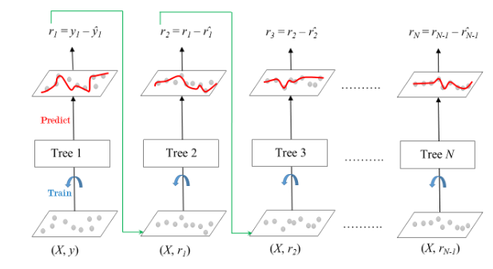

# **Gradient Boosting in ML**

Gradient Boosting is a ensemble learning method used for classification and regression tasks. It is a boosting algorithm which combine multiple weak learner to create a strong predictive model. It works by sequentially training models where each new model tries to correct the errors made by its predecessor.

In gradient boosting, each new model is trained to minimize the loss function such as *mean squared error* or *cross-entropy* of **the previous model** using *gradient descent*.

In each iteration, the algorithm computes the gradient of the loss function with respect to the predictions and then trains a new weak model to minimize this gradient. The predictions of the new model are then added to the ensemble and the process is repeated until a stopping criterion is met.

## **Shrinkage and Model complexity**

A key feature of Gradient Boosting is shrinkage which scales the contribution of each new model by a factor called the **learning rate** (denoted as $\eta$)

- **Smaller learning rates** - the contribution of each tree is smaller which reduces the risk of overfitting but requires more trees to achieve the same performance.

- **Larger learning rates** - each tree has a more significant impact but this can lead to overfitting.

There's a trade-off between the learning rate and the number of estimators (trees), a smaller learning rate usually means more trees are required to achieve optimal performance.

## **Working of Gradient Boosting**

### **1 _ Sequential Learning Process**

The ensemble consists of multiple trees. Each trained to correct the errors of the previous one.

In the first iteration, **Tree 1** is trained ont he original data $x$ and the true label $y$. It makes predictions which are used to compute the **residuals** (the difference between the actual and predicted values).

### **2 _ Residuals Calculation**

In the second iteration, **Tree 2** is trained using the feature matrix $x$ and the *residuals* from **Tree 1** as labels. This means Tree 2 is trained to predict the errors of Tree 1. This process continues for all the trees in the ensemble. Each subsequent tree is trained to predict the residual errors of the previous tree.

<center>



</center>

### **3 _ Shrinkage**

After each tree is trained, its predictions are **shrunk** by multiplying them with the learning rate $\eta$ (which ranges from 0 and 1). This prevents overfitting by ensuring each tree has as smaller impact on the final model.

Once all trees are trained, predictions are made by summing the contributions of all the trees. The final prediction is given by the formula:

$$y_{pred} = y_1 + \eta r_1 + \eta r_2 + ... + \eta r_N$$

where $r_1, r_2, ... , r_N$ are the residuals (errors) predicted by each tree.

## **Difference between AdaBoost and Gradient Boosting**

| **AdaBoost** | **Gradient Boosting** |
| --- | --- |
| During each iteration in AdaBoost, the weights of incorrectly classified samples are increased so that the next weak learner focuses more on these samples | Gradient Boosting updates the weights by computing the negative gradient of the loss function with respect to the predicted output |
| AdaBoost uses simple decision trees with one split known as the decision stumps of weak learner | Gradient Boosting can use a wide range of base learners such as decision trees and linear models |
| AdaBoost is more susceptible to noise and outliers in the data as it assigns high weights to misclassified samples | Gradient Boosting is generally more robust as it updates the weights based on gradient which are less sensitive to outliers |

## **Implementing Gradient Boosting for Classification and Regression**

Here are two examples to demonstrate how **Gradient Boosting** works for both classification and regression.

**Gradient Boosting** parameters include:

- `n_estimators` - specifies the number of trees (estimators) to be built. A higher value typically improves model performance but increases computation time.
- `learning_rate` - this is the **shrinkage parameter**. It scales the contribution of each tree.
- `random_state` - it ensures **reproducibility** of results. Setting a fixed value for `random_state` ensures that you get the same results every time you run the model.
- `max_features` - this parameter limits the number of features each tree can use for splitting. It helps prevent overfitting by limiting the complexity of each tree and promoting diversity in the model.

Building the models with **Gradient Boosting**

**Example 1: Classification**
Use **Gradient Boosting Classifier** to predict digits from the popular **Digits dataset**.

Steps:

1. Import the necessary libraries
2. Setting `seed` for reproducibility
3. Load the digit dataset and split it into train and test
4. Instantiate *Gradient Boosting classifier* and fit the model
5. Predict the test set and compute the accuracy score

```Python
from sklearn.ensemble import GradientBoostingClassifier
from sklearn.model_selection import train_test_split
from sklearn.metrics import accuracy_score
from sklearn.datasets import load_digits

SEED = 23

X, y = load_digits(return_X_y=True)

train_X, test_X, train_y, test_y = train_test_split(X, y, 
                                                    test_size = 0.25, 
                                                    random_state = SEED)

gbc = GradientBoostingClassifier(n_estimators=300,
                                 learning_rate=0.05,
                                 random_state=100,
                                 max_features=5 )
                                 
gbc.fit(train_X, train_y)

pred_y = gbc.predict(test_X)

acc = accuracy_score(test_y, pred_y)
print("Gradient Boosting Classifier accuracy is : {:.2f}".format(acc))

```

**Example 2: Regression**
Use *Gradient Boosting Regressor* on the *Diabetes dataset* to predict continuous values.

Steps:

1. Import the necessary libraries
2. Setting SEED for reproducibility
3. Load the diabetes dataset and split it into train and test.
4. Instantiate Gradient Boosting Regressor and fit the model.
5. Predict on the test set and compute RMSE.  


```Python

from sklearn.ensemble import GradientBoostingRegressor
from sklearn.model_selection import train_test_split
from sklearn.metrics import mean_squared_error
from sklearn.datasets import load_diabetes

SEED = 23

X, y = load_diabetes(return_X_y=True)

train_X, test_X, train_y, test_y = train_test_split(X, y, 
                                                    test_size = 0.25, 
                                                    random_state = SEED)

gbr = GradientBoostingRegressor(loss='absolute_error',
                                learning_rate=0.1,
                                n_estimators=300,
                                max_depth = 1, 
                                random_state = SEED,
                                max_features = 5)

gbr.fit(train_X, train_y)

pred_y = gbr.predict(test_X)

test_rmse = mean_squared_error(test_y, pred_y) ** (1 / 2)

print('Root mean Square error: {:.2f}'.format(test_rmse))

```

**Conclusion** - Gradient Boosting is an effective and widely-used machine learning technique for both classification and regression problems. It builds models sequentially focusing on correcting errors made by previous models which leads to improved performance. While it can be computationally expensive, tuning parameters like the learning rate and number of estimators can help optimize the model and prevent overfitting.