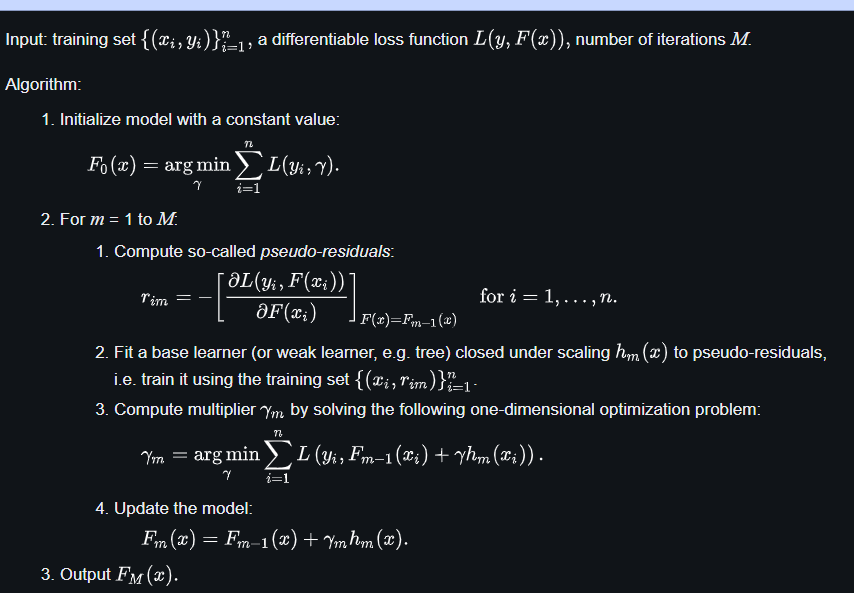

# **Gradient Boosting in ML**

Gradient Boosting is a ensemble learning method (ML technique) used for classification and regression tasks.

It is a boosting algorithm which combine (ensemble) multiple weak learner (i.e., models that make very few assumptions about the data) to create a strong predictive model and when a decision tree is the weak learner, the resulting algorithm is called *gradient-boosted trees* $\rightarrow$ it usually outperforms random forest. 

It works by sequentially training models where each new model tries to correct the errors made by its predecessor.

In gradient boosting, each new model is trained to minimize the arbitrary differentiable loss function such as *mean squared error* or *cross-entropy* of **the previous model** using *gradient descent*.

In each iteration, the algorithm computes the gradient of the loss function with respect to the predictions and then trains a new weak model to minimize this gradient. The predictions of the new model are then added to the ensemble and the process is repeated until a stopping criterion is met.

## **Informal Introduction** 

Like other boosting methods, gradient boosting combines weak learner into a single strong learner iteratively. 

It is easiest to explain in the **least-squares regression** setting where the goal is to teach a model $F$ to predict values of the form $\hat{y} = F(x)$ by minimizing the **mean squared error** $\frac{1}{n}\sum_i(\hat{y_i} - y_i)^2$ where $i$ indexes over some training set of size $n$ of the output variable $y$:

- $\hat{y_i} \rightarrow$ the predicted value $F(x_i)$
- $y_i \rightarrow$ the observed value
- $n \rightarrow$ the number of samples in $y$

If the algorithm has $M$ stages, at each stage $m$ ($1 \leq m \leq M$), suppose the imperfect model $F_m$ (for low $m$, this model may simply predict $\hat{y_i}$ to be $\bar{y}$, the mean of $y$).

In order to improve $F_m$, the algorithm should add some new estimator $h_m(x)$. Thus,

$$F_{m+1}(x_i) = F_m(x_i) + h_m(x_i) = y_i$$

or, equivalently,

$$h_m(x_i) = y_i - F_m(x_i)$$

Therefore, gradient boosting will fit $h_m$ to the *residual* $y_i - F_m(x_i)$.  

As in other boosting variants, each $F_{m+1}$ attempts to correct the error of its predecessor $F_m$.

A generalization of this idea to loss function other than squared error follows from the observation that residual $h_m(x_i)$ for a given model are proportional to the negative gradients of the mean squared error (MSE) loss function with respect ot $F(x_i)$

$$L_{MSE} = \frac{1}{n}\sum^n_{i=1}(y_i - F(x_i))^2$$

$$\Rightarrow - \frac{\partial L_{MSE}}{\partial F(x_i)} = \frac{2}{n}(y_i - F(x_i)) = \frac{2}{n}h_m(x_i)$$

So, gradient boosting could be generalized to a *gradient descent* algorithm by plugging in a different loss and its gradient.

## **Algorithm**

Many supervised learning problems involve an output variable $y$ and a vector of input variable $x$, related to each other with some probabilistic distribution.

The goal is to find some function $\hat{F}(x)$ that best approximates the output variable from the value of input variables.

This is formalized by introducing some *loss function* $L(y, F(x))$ and minimizing it in expectation:

$$\hat{F} = \argmin_F \mathbb{E}_{x, y}[L(y, F(x))]$$

The gradient boosting method assume a real-value $y$. It seeks an approximation $\hat{F}(x)$ in the form of a weighted sum of $M$ functions $h_m(x)$ from some class $\mathcal{H}$, called base or weak learner:

$$\hat{F}(x) = \sum^M_{m=1}\gamma_m h_m(x) + \operatorname{const}$$

We are usually given a training set $\{ (x_1, y_1),...,(x_n, y_n) \}$. In accordance with the empirical risk minimization principle, the method tries to find an approximation $\hat{F}(x)$ that minimizes the average value of the loss function on the training set, i.e., minimize the empirical risk.

It does so by starting with a model, consisting of a constant function $F_0(x)$ and incrementally expands it in a greedy fashion:

$$F_0(x) = \argmin_{h_m \in \mathcal{H}}\sum^n_{i=1}L(y_i, h_m(x_i))$$

$$F_m(x) = F_{m-1}(x) + \left( \argmin_{h_m \in \mathcal{H}} \left[ \sum_{i=1}^nL(y_i, F_{m-1}(x_i) + h_m(x_i)) \right] \right)(x)$$

for $m \geq 1$ where $h_m \in \mathcal{H}$ is a base learner function

Unfortunately, choosing the best function $h_m$
at each step for an arbitrary loss function L is a computationally infeasible optimization problem in general. Therefore, we restrict our approach to a simplified version of the problem. The idea is to apply a steepest descent step to this minimization problem (functional gradient descent).

The basic idea is to find a local minimum of the loss function by iterating on $F_{m-1}(x)$. In fact, the local maximum-descent direction of the loss function is the negative gradient. Hence, moving a small amount  $\gamma$ such that the linear approximation remains valid:

$$F_m(x) = F_{m-1}(x) - \gamma\sum^n_{i=1} \nabla_{F_{m-1}}L(y_i, F_{m-1}(x_i))$$

where $\gamma > 0$. For small $\gamma$, this implies that $L(y_i, F_m(x_i)) \leq L(y_i, F_{m-1}(x_i))$

Furthermore, we can optimize $\gamma$ by finding the $\gamma$ value for which the loss function has a minimum:

$$\gamma_m = \argmin_{\gamma} \sum^n_{i=1}L(y_i, F_m(x_i)) = \argmin_\gamma\sum^n_{i=1}L(y_i, F_{m-1}(x_i) - \gamma \nabla_{F_{m-1}}L(y_i, F_{m-1}(x_i))$$

IF we considered the continuous case, i.e., where $\mathcal {H}$ is the set of arbitrary differentiable functions on $\mathbb {R}$, we would update the model in accordance with the following equations

$$F_m(x) = F_{m-1}(x) - \gamma_m\sum^n_{i=1} \nabla_{F_{m-1}}L(y_i, F_{m-1}(x_i))$$

where $\gamma _{m}$ is the step length, defined as

$$\gamma_m  = \argmin_\gamma\sum^n_{i=1}L(y_i, F_{m-1}(x_i)) - \gamma \nabla_{F_{m-1}}L(y_i, F_{m-1}(x_i))$$

In the discrete case however, i.e. when the set $\mathcal {H}$ is finite, we choose the candidate function h closest to the gradient of $L$ for which the coefficient $\gamma$ may then be calculated with the aid of line search on the above equations. Note that this approach is a heuristic and therefore doesn't yield an exact solution to the given problem, but rather an approximation. In pseudocode, the generic gradient boosting method is:

<center>



</center>

## **Gradient tree boosting**

Gradient boosting is typically used with decision trees (especially CARTs) of a fixed size as base learners. For this special case, Friedman proposes a modification to gradient boosting method which improves the quality of fit of each base learner.

Generic gradient boosting at the m-th step would fit a decision tree $h_{m}(x)$ to pseudo-residuals.

Let $J_m$ be the number of its leaves. The tree partitions the input space into $J_m$ disjoint regions $R_{1m},...R_{J_m m}$ and predicts a constant value in each region. Using the indicator notation, the output of $h_{m}(x)$ for input $x$ can be written as the sum:

$$h_m(x) = \sum_{j=1}^{J_m} b_{jm}1_{R_{jm}}(x)$$

where $b_{jm}$ is the value predicted in the region $R_{jm}$

Then the coefficients $b_{jm}$ are multiplied by some value $\gamma _{m}$, chosen using line search so as to minimize the loss function, and the model is updated as follows:

$$F_m(x) = F_{m-1}(x) + \gamma_mh_m(x), \quad \gamma_m = \argmin_\gamma \sum^n_{i=1}L(y_i, F_{m-1}(x_i) + \gamma h_m(x_i))$$

Friedman proposes to modify this algorithm so that it chooses a separate optimal value $\gamma _{jm}$ for each of the tree's regions, instead of a single $\gamma _{m}$ for the whole tree. He calls the modified algorithm "TreeBoost". The coefficients $b_{jm}$ from the tree-fitting procedure can be then simply discarded and the model update rule becomes:

$$F_m(x) = F_{m-1}(x) + \sum^{J_m}_{j=1} \gamma_{jm}1_{R_{jm}}(x), \quad \gamma_{jm} = \argmin_\gamma \sum_{x_i \in R_{jm}}L(y_i, F_{m-1}(x_i) + \gamma)$$

When the loss $L(\cdot ,\cdot )$ is mean-squared error (MSE) the coefficients $\gamma _{jm}$ coincide with the coefficients of the tree-fitting procedure $b_{jm}$.

## **Tree Size**

The number $J$ of terminal nodes in the trees is a parameter which controls the maximum allowed level of interaction between variables in the model. With $J=2$ (decision stumps), no interaction between variables is allowed. With $J=3$ the model may include effects of the interaction between up to two variables, and so on. $J$ can be adjusted for a data set at hand.

Hastie et al.comment that typically $4\leq J\leq 8$ work well for boosting and results are fairly insensitive to the choice of $J$ in this range, $J=2$ is insufficient for many applications, and $J>10$ is unlikely to be required.

## **Regularization**

Fitting the training set too closely can lead to degradation of the model's generalization ability, that is, its performance on unseen examples. Several so-called **regularization** techniques **reduce this overfitting** effect by constraining the fitting procedure.

One natural regularization parameter is the number of gradient boosting iterations M (i.e. the number of base models). Increasing M reduces the error on training set, but increases risk of overfitting. An optimal value of M is often selected by monitoring prediction error on a separate validation data set.

Another regularization parameter for tree boosting is tree depth. The higher this value the more likely the model will overfit the training data.

### **Shrinkage and Model complexity**

An important part of gradient boosting is regularization by shrinkage which uses a modified update rule:

$$F_m(x) = F_{m-1}(x) + \nu \cdot \gamma_mh_m, \quad 0 < \nu \leq 1 $$

where parameter $\nu$ is called the **learning rate**

Empirically, it has been found that using small learning rates (such as $\nu <0.1$) yields dramatic improvements in models' generalization ability over gradient boosting without shrinking $\nu =1$.

However, it comes at the price of increasing computational time both during training and querying: lower learning rate requires more iterations or more trees to achieve optimal performance.

- **Smaller learning rates** - the contribution of each tree is smaller which reduces the risk of overfitting but requires more trees to achieve the same performance.

- **Larger learning rates** - each tree has a more significant impact but this can lead to overfitting.

### **Stochastic gradient boosting**

Soon after the introduction of gradient boosting, Friedman proposed a minor modification to the algorithm, motivated by *Breiman's bootstrap aggregation* ("bagging") method. Specifically, he proposed that at each iteration of the algorithm, a base learner should be fit on a subsample of the training set drawn at random without replacement. Friedman observed a substantial improvement in gradient boosting's accuracy with this modification.

Subsample size is some constant fraction $f$ of the size of the training set. When $f=1$, the algorithm is deterministic and identical to the one described above. Smaller values of $f$ introduce randomness into the algorithm and help prevent overfitting, acting as a kind of regularization. The algorithm also becomes faster, because regression trees have to be fit to smaller datasets at each iteration.

Friedman obtained that $0.5\leq f\leq 0.8$ leads to good results for small and moderate sized training sets. Therefore, $f$ is typically set to 0.5, meaning that one half of the training set is used to build each base learner.

Also, like in bagging, subsampling allows one to define an out-of-bag error of the prediction performance improvement by evaluating predictions on those observations which were not used in the building of the next base learner. Out-of-bag estimates help avoid the need for an independent validation dataset, but often underestimate actual performance improvement and the optimal number of iterations.

### **Number of observations in leaves**

Gradient tree boosting implementations often also use regularization by limiting the minimum number of observations in trees' terminal nodes. It is used in the tree building process by ignoring any splits that lead to nodes containing fewer than this number of training set instances.

Imposing this limit helps to reduce variance in predictions at leaves.

### **Complexity penalty**

Another useful regularization technique for gradient boosted model is to penalize its complexity. For gradient boosted trees, model complexity can be defined as the proportional number of leaves in the trees. The joint optimization of loss and model complexity corresponds to a post-pruning algorithm to remove branches that fail to reduce the loss by a threshold.

Other kinds of regularization such as an $\ell _{2}$ penalty on the leaf values can also be used to avoid overfitting.

## **Working of Gradient Boosting**

### **1 _ Sequential Learning Process**

The ensemble consists of multiple trees. Each trained to correct the errors of the previous one.

In the first iteration, **Tree 1** is trained ont he original data $x$ and the true label $y$. It makes predictions which are used to compute the **residuals** (the difference between the actual and predicted values).

### **2 _ Residuals Calculation**

In the second iteration, **Tree 2** is trained using the feature matrix $x$ and the *residuals* from **Tree 1** as labels. This means Tree 2 is trained to predict the errors of Tree 1. This process continues for all the trees in the ensemble. Each subsequent tree is trained to predict the residual errors of the previous tree.

<center>


</center>

### **3 _ Shrinkage**

After each tree is trained, its predictions are **shrunk** by multiplying them with the learning rate $\eta$ (which ranges from 0 and 1). This prevents overfitting by ensuring each tree has as smaller impact on the final model.

Once all trees are trained, predictions are made by summing the contributions of all the trees. The final prediction is given by the formula:

$$y_{pred} = y_1 + \eta r_1 + \eta r_2 + ... + \eta r_N$$

where $r_1, r_2, ... , r_N$ are the residuals (errors) predicted by each tree.

## **Difference between AdaBoost and Gradient Boosting**

| **AdaBoost** | **Gradient Boosting** |
| --- | --- |
| During each iteration in AdaBoost, the weights of incorrectly classified samples are increased so that the next weak learner focuses more on these samples | Gradient Boosting updates the weights by computing the negative gradient of the loss function with respect to the predicted output |
| AdaBoost uses simple decision trees with one split known as the decision stumps of weak learner | Gradient Boosting can use a wide range of base learners such as decision trees and linear models |
| AdaBoost is more susceptible to noise and outliers in the data as it assigns high weights to misclassified samples | Gradient Boosting is generally more robust as it updates the weights based on gradient which are less sensitive to outliers |

## **Implementing Gradient Boosting for Classification and Regression**

Here are two examples to demonstrate how **Gradient Boosting** works for both classification and regression.

**Gradient Boosting** parameters include:

- `n_estimators` - specifies the number of trees (estimators) to be built. A higher value typically improves model performance but increases computation time.
- `learning_rate` - this is the **shrinkage parameter**. It scales the contribution of each tree.
- `random_state` - it ensures **reproducibility** of results. Setting a fixed value for `random_state` ensures that you get the same results every time you run the model.
- `max_features` - this parameter limits the number of features each tree can use for splitting. It helps prevent overfitting by limiting the complexity of each tree and promoting diversity in the model.

Building the models with **Gradient Boosting**

**Example 1: Classification**

Use **Gradient Boosting Classifier** to predict digits from the popular **Digits dataset**.

Steps:

1. Import the necessary libraries
2. Setting `seed` for reproducibility
3. Load the digit dataset and split it into train and test
4. Instantiate *Gradient Boosting classifier* and fit the model
5. Predict the test set and compute the accuracy score

```Python
from sklearn.ensemble import GradientBoostingClassifier
from sklearn.model_selection import train_test_split
from sklearn.metrics import accuracy_score
from sklearn.datasets import load_digits

SEED = 23

X, y = load_digits(return_X_y=True)

train_X, test_X, train_y, test_y = train_test_split(X, y, 
                                                    test_size = 0.25, 
                                                    random_state = SEED)

gbc = GradientBoostingClassifier(n_estimators=300,
                                 learning_rate=0.05,
                                 random_state=100,
                                 max_features=5 )
                                 
gbc.fit(train_X, train_y)

pred_y = gbc.predict(test_X)

acc = accuracy_score(test_y, pred_y)
print("Gradient Boosting Classifier accuracy is : {:.2f}".format(acc))

```

**Example 2: Regression**

Use *Gradient Boosting Regressor* on the *Diabetes dataset* to predict continuous values.

Steps:

1. Import the necessary libraries
2. Setting SEED for reproducibility
3. Load the diabetes dataset and split it into train and test.
4. Instantiate Gradient Boosting Regressor and fit the model.
5. Predict on the test set and compute RMSE.  


```Python

from sklearn.ensemble import GradientBoostingRegressor
from sklearn.model_selection import train_test_split
from sklearn.metrics import mean_squared_error
from sklearn.datasets import load_diabetes

SEED = 23

X, y = load_diabetes(return_X_y=True)

train_X, test_X, train_y, test_y = train_test_split(X, y, 
                                                    test_size = 0.25, 
                                                    random_state = SEED)

gbr = GradientBoostingRegressor(loss='absolute_error',
                                learning_rate=0.1,
                                n_estimators=300,
                                max_depth = 1, 
                                random_state = SEED,
                                max_features = 5)

gbr.fit(train_X, train_y)

pred_y = gbr.predict(test_X)

test_rmse = mean_squared_error(test_y, pred_y) ** (1 / 2)

print('Root mean Square error: {:.2f}'.format(test_rmse))

```

**Conclusion** - Gradient Boosting is an effective and widely-used machine learning technique for both classification and regression problems. It builds models sequentially focusing on correcting errors made by previous models which leads to improved performance. While it can be computationally expensive, tuning parameters like the learning rate and number of estimators can help optimize the model and prevent overfitting.

## **Usage**

Gradient boosting can be used in the field of **learning to rank**. The commercial web search engines Yahoo and Yandex use variants of gradient boosting in their machine-learned ranking engines. 

Gradient boosting is also utilized in High Energy Physics in data analysis. At the Large Hadron Collider (LHC), variants of gradient boosting Deep Neural Networks (DNN) were successful in reproducing the results of non-machine learning methods of analysis on datasets used to discover the Higgs boson.

Gradient boosting decision tree was also applied in earth and geological studies – for example quality evaluation of sandstone reservoir.

## **Names**

The method goes by a variety of names.

- Friedman introduced his regression technique as a "Gradient Boosting Machine" (GBM).
- Mason, Baxter et al. described the generalized abstract class of algorithms as *functional gradient boosting*.
- Friedman et al. describe an advancement of gradient boosted models as *Multiple Additive Regression Trees (MART)*.
- Elith et al. describe that approach as *Boosted Regression Trees" (BRT)*.

## **Feature importance ranking**

Gradient boosting can be used for feature importance ranking, which is usually based on aggregating importance function of the base learners.

For example, if a gradient boosted trees algorithm is developed using entropy-based decision trees, the ensemble algorithm ranks the importance of features based on entropy as well with the caveat that it is averaged out over all base learners.

## **Disadvantages**

While boosting can increase the accuracy of a base learner, such as a decision tree or linear regression, it sacrifices **intelligibility** and **interpretability**.

For example, following the path that a decision tree takes to make its decision is trivial and self-explained, but following the paths of hundreds or thousands of trees is much harder.

To achieve both performance and interpretability, some model compression techniques allow transforming an XGBoost into a single "born-again" decision tree that approximates the same decision function. Furthermore, its implementation may be more difficult due to the higher computational demand.

