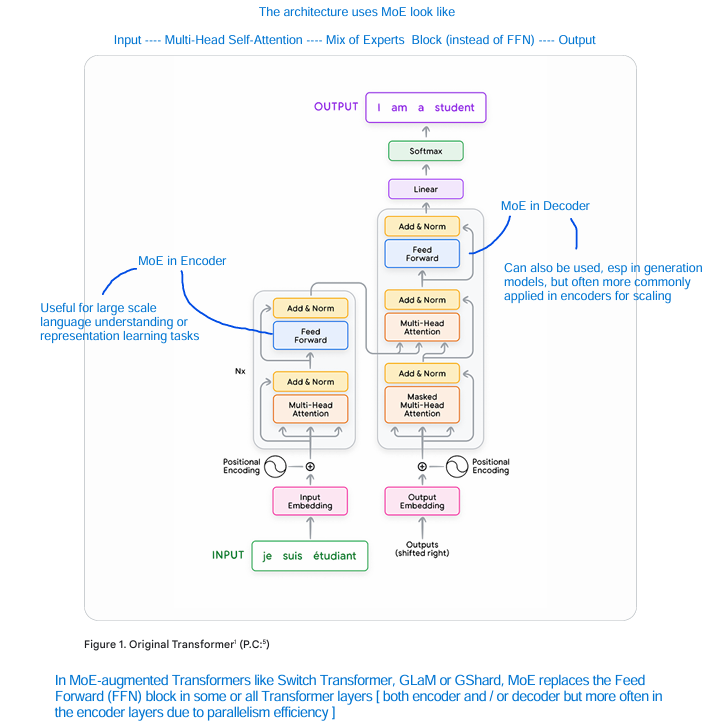
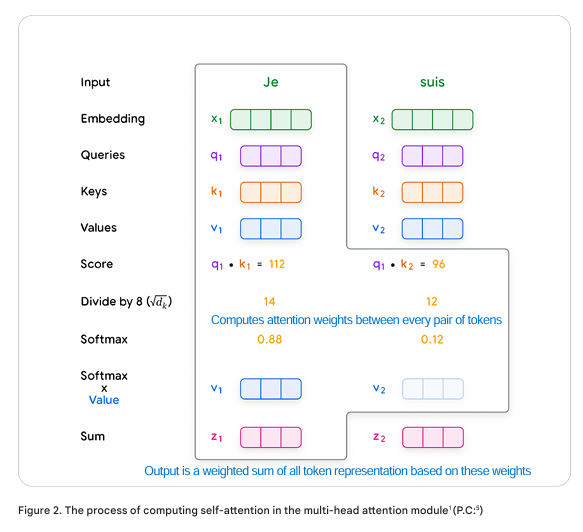
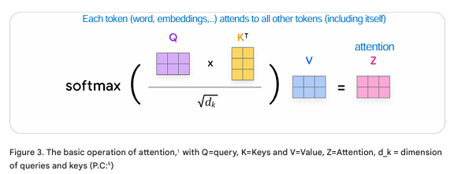
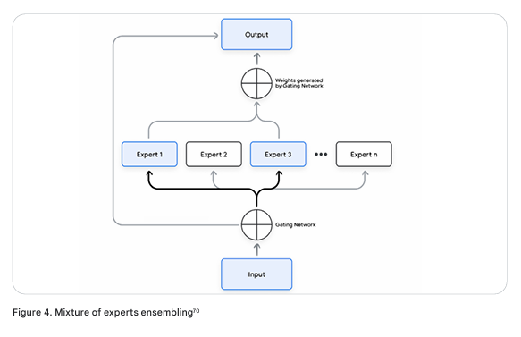
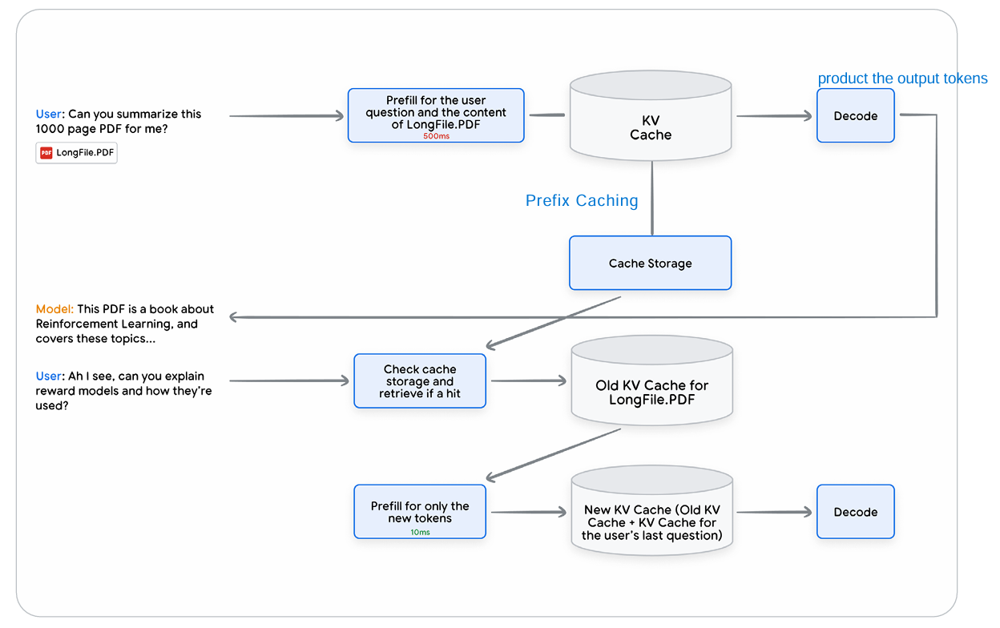
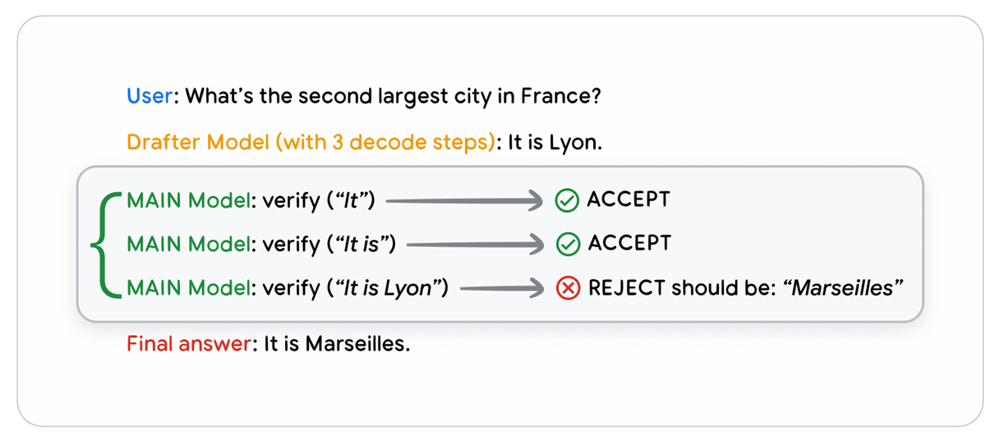

<h1 style="text-align: center">Large Language Model (LLM)</h1>

***NOTE***
- *MT* $\rightarrow$ machine translation
- *TU* $\rightarrow$ text understanding
- *E* $\rightarrow$ encoder
- *D* $\rightarrow$ decoder
- *T* $\rightarrow$ transformer
- *LLM* $\rightarrow$ large language model
- *S-A* $\rightarrow$ self-attention
- *Mh-A* $\rightarrow$ multi-head attention or *Mh-Sa* $\rightarrow$ multi-head self-attention
- *FFN* $\rightarrow$ feedforward neural network
- *RC* $\rightarrow$ residual connections
- *LN* $\rightarrow$ layer normalization
- *F-T* $\rightarrow$ fine-tuning
- *QA* $\rightarrow$ question-answering

# **Large Language Model (LLM)**

An advanced artificial intelligence system specializing in ***processing***, ***understanding*** and ***generating*** human-like text and implemented as a deep neural network trained on massive text datasets.

LLMs learn intricate/complex language patterns, enabling them to perform tasks like **translation**, **text generation**, **question-answering** and **summarization**. Their ability to understand user intent and generate coherent text marks a significant advancement in AI.

**Importance of LLMs**
- LLMs *outperform* previous NLP models in complex tasks requiring *reasoning* or *question-answering* $\rightarrow$ enabling new applications like code generation and text classification. 
- They exhibit emergent behaviors, performing tasks they weren't directly trained for and can be **fine-tuned** with less data for specific tasks.

# **Core concepts of language models**

**Language model**

A model that predicts the probability of sequence of words, often assigning probabilities to subsequent words given a prefix.

For example, given 'The most famous city in the US is ...', a language model might assign high probabilities to 'New York' or 'Los Angeles'. The basic models use *n-gram* tables which modern ones rely on neural networks like transformers.

**N-gram**

A sequence of *n* words used to model language probabilities in basic language models.

*N-grams* store probabilities of word sequences but are less effective for capturing long-range dependencies compared to neural models.

**Recurrent neural networks (RNNs)**

Neural networks that process sequences sequentially. Generating hidden states based on previous states and current input.

Variants like **Long Short-Term Memory (LSTM)** and **Gated Recurrent Unit (GRU)** were used before transformers but struggled with parallelization and long-term dependencies due to their sequential nature.

---

# **A comprehensive overview of Transformers**

The Transformer architecture, introduced in the seminal 2017 paper `Attention is All You Need` by Vaswani et al., is a landmark in natural language processing (NLP) and the cornerstone of modern Large Language Models (LLMs) such as `BERT`, `GPT`, `T5` and `PaLM`.

Designed for sequence-to-sequence tasks, it replaces the sequential token processing of *Recurrent Neural Networks (RNNs)* with a parallelized approach driven by **self-attention mechanisms**. This innovation enables efficient modeling of long-range dependencies, scalability to massive datasets and models, and adaptability across diverse applications beyond its initial use in machine translation, including text generation, summarization, question-answering, code synthesis, and multimodal processing (e.g., text, images, and audio).

<!-- **Why it matters**

- **Parallelization** - unlike **RNNs** (e.g., **LSTMs**, **GRUs**) which process tokens sequentially, Transformers *compute all token interactions simultaneously* and leveraging GPU parallelism for faster training.
- **Long-range dependencies** - *self-attention* captures relationships between distant tokens $\rightarrow$ overcoming RNN limitations like vanishing gradients.
- **Scalability** - transformers scale to billions of parameters and large datasets, driving performance improvements. -->

# **Transformer structure**

## **Encoder**

The **Encoder (E)** is a fundamental component of the Transformer architecture. It plays a critical role in processing input sequences to create rich, contextualized representations that capture relationships between tokens $\rightarrow$ make it essential for tasks like *MT*, *TU*, ...

### **What is the encoder?**

The *E* is one half of the *T* architecture (the other being the *D*). It processes an input sequence (e.g., a sentence like *The cat is sleeping*) and transforms it into a set of continuous representation - vectors that encode the meaning and context of each token relative to the entire sequence

These representations are then used by the *D* (in tasks like translation) or directly for downstream tasks (in encoder-only models like `BERT`)

### **Purpose**

**Contextualization** - the *E* captures relationships between all tokens $\rightarrow$ enabling the model to understand dependencies such as linking 'the cat' to 'is sleeping' or resolving **ambiguities** (e.g., *bank* as a *riverbank* vs a *financial institution*)

**Feature extraction** - it produces high-dimensional vectors that serve as a foundation for tasks *classification*, *translation* or *QA*

**Bidirectional understanding** - unlike the *D* which generates tokens sequentially, the *E* processes the entire input at once, allowing bidirectional context (i.e., each token attends to both *preceding* and *following* tokens)

### **Role in the Transformer**

In the original *T* for *MT*, the *E* processes the source language (French) and passes its output to the *D* which generates the target language (English)

In encoder-only models (e.g., *BERT*, *RoBERTa*), the *E*'s output is used directly for tasks requiring understanding like *sentiment analysis* or named *entity recognition*

### **Structure of the Encoder**

The *E* consists of a stack of **$N$ identical layers** (typically $N = 6$ in the original paper but modern models use $12-96$). Each layer is composed of **two primary sub-components** ( The first is a *Mh-Sa* mechanism and the second is a simple, positionwise fully connected feed-forward network ) connected with **residual connections** and **normalization**, designed to *process* and *refine* token representations iteratively

#### **Encoder layer components**

Each *E* layer includes

1/ **Multi-head Self-attetion** (Mh-Sa) computes relationships between all tokens in the input sequence $\rightarrow$ allowing each token to attend to others

2/ **Feedforward Neural Network** (FNN) applies a position-wise transformation to each token's representation, adding non-linearity and expressiveness

3/ **Residual Connections and Layer Normalization** (RC and LN) ensures stable training and preserves information across layers

### **Detailed mechanics of the Encoder**

How the *E* processes an input sequence, step-by-step, focusing on its components and their interactions

#### **Input preparation**

Before the *E* processes the sequence, the raw input (e.g., *text*) is preprocessed:

1/ **Tokenization**

The input is split into tokens (words, subwords or characters) using methods like **Byte-Pair encoding (BPE)** or **WordPiece**.

For example, *unhappiness* might become *un* and *##happiness*

Tokens are mapped to integer IDs from a vocabulary (e.g., 50000 tokens)

2/ **Embedding**

Each token ID is converted to a dense vector (e.g., 512 or 768 dimensions $\rightarrow d_{\text{model}}$ or embedding dimensions) via a learned embedding matrix. These vectors capture semantic relationships (e.g., *cat* and *kitten* are closer in vector space)

Mathematically, for a token $x_i$, the embedding is:

$$e_i = W_{\text{embed}}[x_i]$$

where 
- $W_{\text{embed}} \in \R^{|V| \times d_{\text{model}}}$
- $|V|$ $\rightarrow$ the vocabulary size
- $d_{\text{model}} \rightarrow$ the embedding dimension 

3/ **Positional encoding**

Since *S-A* is permutation-invariant (it does not inherently know token order), positional encodings are added to embeddings to indicate sequence position

The original paper uses *sinusoidal* encodings

$$\text{PE}(pos, 2i) = \sin \left( \frac{pos}{10000^{\frac{2i}{d_{\text{model}}}}}\right)$$

and

$$\text{PE}(pos, 2i + 1) = \cos \left( \frac{pos}{10000^{\frac{2i}{d_{\text{model}}}}}\right)$$

where
- $pos$ is the token's position
- $i$ is the dimension index

The input to the *E* will be

$$x_i = e_i + \text{PE}(pos_i)$$

Modern models like *BERT* may use learned positional embeddings which are fine-tuning during training

**Purpose**: These steps convert raw text into a numerical format that preserves both semantic meaning and sequential order *(ready for attention-based processing)*

#### **Multi-head Self-attention** 

*Self-attention* (S-A) is a mechanism where different positions of a single sequence are related to each other to compute a representation for that sequence and has become a cornerstone of many state-of-the-art deep learning models, particularly in the field of Natural Language Processing (NLP)

In simpler terms, S-A allows a model to focus on relevant parts of the input while processing a specific token, word or element in the sequence

S-A plays a crucial role in capturing dependencies between words that are far apart in a sentence. Instead of processing the sequence in order, S-A enables the model to *attend* to the entire sequence at once and prioritize important elements for the task at hand

*S-A* allows each token to attend to all others in the sequence, computing a new representation that incorporates contextual information. *Mh-A* runs several *S-A* mechanisms in parallel to capture diverse relationships

**Mechanics**

1/ **Single-head Self-attention**

For each token's input embedding $x_i \in \R^{d_{\text{model}}}$, compute **three** vectors:

$$Q_i = x_i W^Q, \quad \quad K_i = x_i W^K, \quad \quad V_i = x_i W^V$$

where 
- *Queries (Q)* - vectors asking which words are relevant | the token or word being processed
- *Keys (K)* - vectors labeling word relevance | other words in the sequence that the current word is compared against
- *Values (V)* - vectors holding word content | the vector representation of the corresponding words
- $W^Q, W^K, W^V \in \R^{d_{\text{model}} \times d_k} \rightarrow$ learned matrices
- $d_k \rightarrow = \frac{d_{\text{model}}}{h}$ dimensionality of the keys and used for scaling to prevent large dot product and  $\rightarrow$ if $d_{\text{model}} = 512$ and $h = \text{heads} = 8$ then  $d_k = 64$ 

Compute attention scores

$$\text{Scores} = Q \cdot K^\text{T} \in \R^{n \times n}$$

where 
- $n \rightarrow$ the sequence length

Scale to prevent large values

$$\text{Scaled Scores} = \frac{Q \cdot K^\text{T}}{\sqrt{d_k}}$$

Apply softmax to get weights

$$\text{Attention Weights} = \text{softmax} \left(  \frac{Q \cdot K^\text{T}}{\sqrt{d_k}} \right)$$

Compute the output

$$\text{Attention}(Q, K, V) = \text{softmax} \left(  \frac{Q \cdot K^\text{T}}{\sqrt{d_k}} \right)V$$

2/ **Multi-head attention**

Multi-head attention splits the *query*, *key* and *value* vectors into multiple smaller vectors and performs self-attention independently on each of them. The results from these heads are then concatenated and linearly transformed to produce the final output

Run $h$ attention heads (e.g., $h = 8$) in parallel, each with its own $W^Q, W^K, W^V$ and then **concatenate** head outputs and **project**

$$\text{MultiHead}(Q, K, V) = \text{Concat}(\text{head}_1, ..., \text{head}_h)W^O$$

where
- $\text{head}_i = \text{Attention}(QW_i^Q, KW_i^K, VW_i^V)$ are the learned weight matrices for each head

- The projections are parameter matrices $W_i^Q \in \R^{d_{\text{model} \times d_k}}$, $W_i^V \in \R^{d_{\text{model} \times d_k}}$, $W_i^V \in \R^{d_{\text{model} \times d_v}}$ and $W^O \in \R ^{h\cdot d_v \times d_{\text{model}}}$

## **Decoder**

A module that generates output sequences based on the encoder's representation, operating autoregressively.

In translation, the decoder generates English text token-by-token, using *masked self-attention* to prevent attending to future tokens and cross-attention to focus on the encoder's output.

**Decoder-only architecture**

A transformer variant that skips the encoder $\rightarrow$ directly generating output from input using *masked self-attention*.

Used in models like GPT, it simplifies the architecture for tasks where encoding and decoding can be merged like text generation.

**Input preparation**

The process of converting raw text into a format suitable for transformers and it includes
- **Normalization** - standardizing text (e.g., removing white space)
- **Tokenization** - converts raw text into tokens (words, subwords, or characters) using methods like *Byte-Pair Encoding (BPE)* or *WordPiece*. For example, `playing` might split into `play` and `##ing`
- **Embedding** - maps tokens to dense vectors (e.g., 512-dimensional) via a learned lookup table, capturing semantic relationships (e.g., “king” and “queen” are closer in vector space)
- **Positional encoding** - adds positional information about token to preserve sequence order because self-attention is permutation-invariant

The original paper uses *sinusoidal encodings*

$$\text{PE}(pos, 2i) = \sin(pos / 10000 ^{\frac{2i}{d_{model}}})$$

and

$$\text{PE}(pos, 2i + i) = \cos(pos / 10000 ^{\frac{2i}{d_{model}}})$$

where 
- $pos$ is the token position
- $i$ is the dimension and 
- $d_{model}$ is the embedding size (e.g., 512). 

Modern models like RoBERTa use learned position embeddings.

**Insight**: Research by *BERT* (Devlin et al., 2018) and *On the Role of Position Embeddings* (Wang et al., 2021) shows learned embeddings slightly outperform sinusoidal ones for tasks like Q&A, but sinusoidal encodings generalize better to unseen sequence lengths.

**Token**

A unit of text (word, subword or character) processed by the model.

Tokens are the basic building blocks LLMs operate on $\rightarrow$ derived during tokenization.

**Embedding**

A high-dimensional vector representing the meaning of a token.

Learned during training, embeddings capture semantic relationship $\rightarrow$ enabling the model to process text numerically.

**Self-Attention**

A mechanism allowing the model to ***focus on different parts of the input sequence*** when computing a representation for a token.

It computes relationships between tokens (e.g., linking 'the tiger' and 'it' in a sentence) through:
- **Queries (Q)** - vectors asking which words are relevant
- **Keys (K)** - vectors labeling word relevance
- **Values (V)** - vectors holding word content 
- **Score** - dot products of **Q** and **K**, normalized and weighted to produce *context-aware representations*

**Multi-head Attention**

Multiple self-attention mechanisms running in parallel, each ***focusing on different aspects of the input***.

Each head has its own **Q**, **K** and **V** matrices $\rightarrow$ capturing diverse relationships (e.g., *syntax* vs *semantics*). Outputs are concatenated for a richer representation.

**Layer normalization**

Normalizing *activations* in a layer by computing mean and variance to reduce covariate shift. 

Applied after multi-head attention and feedforward layers, it improves gradient flow and training stability.

**Residual connections**

Propagating inputs directly to layer outputs, adding them to the transformer output.

Help with optimization and prevents vanishing/exploding gradients, enhancing training of deep networks.

**Feedforward layer**

A position-wise transformation applied independently to each token's representation.

Consists of two linear transformations with a non-linear activation (ReLU and GeLU), adding non-linearity and representational power.

**Mixture of Experts (MoE)**

An architecture combining multiple specialized submodels (*experts*) with a *gating network* to route input.

Components include

- **Experts** - submodels handling specific data subsets
- **Gating network (router)** - assigns probabilities to experts based on input
- **Combination mechanism** - weights expert outputs for the final prediction

MoE improves efficiency via *sparse activation*, activating only a subset of experts as seen in models like *GLaM*.

**Auto-regressive**

Generating output token-by-token where each token depends on previous tokens.

Used in decoders to ensure sequential generation, preventing access to future tokens.

**Context length**

The number of previous tokens the model can consider when predicting the next token.

Longer contexts improve performance but increase computational demands, requiring a balance.

# **Training transformers**

**Training**

Modifying model parameters using a loss function and backpropagation to optimize performance.

Involves updating weights based on differences between predicted and target outputs.

**Inference**

Using a trained model to generate predictions without updating weights.

The model processes input to produce output as in real-world applications.

**Data preparation**

Cleaning and formatting data for training. Steps include:
- **Cleaning** - filtering, deduplication, normalization
- **Tokenization** - converting text to tokens (e.g.m *Byte-Pair encoding*, *Unigram*)
- **Splitting** - dividing data into training and test sets

**Byte-Pair encoding (BPE)**

A tokenization method merging frequent character pairs to form subwords.

Balances vocabulary size and coverage, used in many LLMs

**Unigram tokenization**

A tokenization method selecting subwords based on their likelihood in a unigram language model.

Complements BPE for efficient vocabulary creation.

**Vocabulary**

The set of unique tokens used by the LLMs.

Defines the model's language for processing text.

**Loss function**

A metric measuring the difference between predicted and target outputs.

Often uses **cross-entropy loss** for language modeling, guiding parameter updates.

**Cross-Entropy loss**

A loss function comparing predicted probabilities to true distributions.

Common in language modeling to optimize token predictions.

**Training loop**

The iterative process of sampling batchs, generating predictions, computing loss and updating paramaters.

Continues until convergence or a set number of tokens processed.

**Training approaches by architecture**

- **Decoder-only** - pre-trained on *language modeling*, predicting the next token (e.g., GPT)

- **Encoder-only** - pre-trained on *tasks* like *masked language modeling* (e.g., BERT)

- **Encoder-decoder** - trained on sequence-to-sequence tasks like translation or summarization

**Masked language modeling (MLM)**

A training task where random tokens are masked and the model predicts them.

Used in BERT to learn bidirectional context.

**Next sentence prediction (NSP)**

A BERT training task predicting whether one sentence follows another.

Enhances understanding of sentence relationships.

**Unsupervised pre-training**

Training on unlabeled data to learn general language patterns.

Reduces the need for labeled data, enabling models to generalize across tasks.

**Supervised fine-tuning**

Adjusting a pre-trained model with labeled data for specific tasks.

Enhances performance on targeted applications with less data.

**Zero-shot learning**

Generalizing to new tasks without explicit training, based on instructions. 

For example, GPT-2's ability to perform tasks like translation without task-specific training.

**Few-shot learning**

Performing tasks with minimal examples.

For example, GPT-3's ability to adapt to tasks with few prompts unlike GPT-2's reliance on fine-tuning.

**Sparse activation**

Activating only a subset of model parameters for each input

Enhances efficiency in MoE models like GLaM.

**Scaling laws**

Principles governing how model performance varies with size, data and compute.

Kaplan et al. favored model size increases wihile Chinchilla showed equal scaling of data and parameters is optimal.

**Multimodel**

Processing multiple data types (text, images, audio, video)

Gemini's ability to handle diverse inputs enhances applications like video comprehension.

**Multi-Query attention**

An attention mechanism sharing keys/values across queries for efficiency.

Used in Gemini to optimize inference.

# **Fine-tuning techniques**

**Fine-tuning**

Adapting a pre-trained LLM for specific tasks with additional training.

Requires less data than training from scratch, improving task-specific performance.

**Supervised fine-tuning (SFT)**

Training on labeled data for a specific task.

Captures task essence as seen in InstructGPT.

**Reinforcement learning from human feedback (RLHF)**

Fine-tuning using human preference to refine outputs.

Uses reward models to score outputs, improving coherence and truthfulness.

**Parameter-efficient fine-tuning (PEFT)**

Fine-tuning with minimal parameter updates.

Methods like LoRA and QLoRA reduce computational costs while maintaining performance.

**LoRA (Low-rank adaptation)**

A PEFT method updating low-rank matrices instead of full weights.

Efficiently adapts models with fewer resources.

**QLoRA**

LoRA applied to quantized models.

Combines quantization and low-rank updates for ultra-efficient fine-tuning.

**Instruction tuning**

Training to follow natural language instructions.

Enhances reasoning and task adaptability as in InstructGPT.

# **Prompt engineering and sampling**

**Prompt engineering**

Crafting prompts and parameters to elicit desired LLM responses.

An art and science to guide LLMs, critical for task performance.

**Chain-of-Thought (CoT) prompting**

Prompting the model to generate intermediate reasoning steps.

Improves complex task performance by breaking problems into sub-steps.

**Tree-of-Thoughts (ToT)**

Exploring multiple reasoning paths to find optimal solutions.

Useful for combinatorial problems, enhancing reasoning depth.

**Least-to-Most prompting**

Solving progressively complex subproblems, using prior outputs.

Builds reasoning incrementally for structured tasks.

**Sampling techniques**

Methods to select the next token during generation.

Influence output creativity and quality:
- **Greedy search** - picks the highest-probability token (predictable)
- **Random sampling** - samples based on probability distribution (creative)
- **Temperature sampling** - adjusts randomness via a temperature parameter
- **Top-K sampling** - samples from the top K probable tokens 
- **Top-P sampling (nucleus sampling)** - samples from tokens summing to probability P
- **Best-of-N sampling** - generates N response, selecting the best by a metric.

**Temperature**

A parameter controlling output randomness.

Higher values increase diversity, lower values favor certainty.

# **Inference optimization**

**Inference acceleration**

Techniques to reduce latency and cost of LLM predictions.

Critical for large-scale, low-latency use cases, balancing quality, latency and cost.

**Quality vs Latency/Cost tradeoff**

Accepting marginal quality drops for faster/cheaper inference.

Smaller or quantized models may suffice for simple tasks.

**Latency vs Cost tradeoff**

Balancing request speed against system throughput.

Prioritizes latency for chatbots, cost for bulk tasks.

## **Output-approximating methods**

**Quantization** 

Reducing numerical precision of weights/activations (e.g., 8-bit INT)

Lowers memory use and speeds computations with minimal quality loss.

**Quantization-aware training (QAT)** - training with quantization to recover quality.

**Distillation** 

Training a smaller 'student' model using a larger 'teacher' model. It includes:
- **Data distillation** - generating synthetic data with the teacher
- **Knowledge distillation** - aligning student output distributions to the teacher
- **On-policy distillation** - using teacher feedback in a reinforcement setup

## **Output-preserving methods** 

**Flash attention**

Optimizing attention by minimizing memory I/O.

Reduces latency (2-4x) without changing outputs.

**Prefix caching** 

Storing attention key/value (KV) caches for reuse.

Speeds up prefill for multi-turn or static-input tasks like chatbots.

**Speculative decoding** 

Using a smaller 'drafter' model to predict tokens, verified by the main model.

Parallelizes decoding, reducing latency without quality loss.

**Batching**

Running multiple requests simultaneously.

Improves throughput, esp in decode but requires memory management.

**Parallelization** 

Distributing computations across hardware.

Includes sequence, pipeline and tensor parallelism, balancing compute and communication costs.

**KV cache**

Stored attention key/value scores for input tokens.

Avoids recomputing attention during decoding, critical for efficiency.

**Prefill**

Computing initial attention scores for input tokens.

Compute-intensive phase, optimized by **prefix caching**.

# **Task-based evaluation**

**Evaluation framework**

A tailored system to validate LLM performance for specific applications which involves:
- **Evaluation data** - datasets mirroring production traffic
- **Development context** - assessing system components like **RAG** (Recurrent Augmented Generation)
- **Definition of Good** - metrics reflecting business outcomes, not just correctness

**Evaluation methods**

**Traditional evaluation** 

Quantitative metrics comparing outputs to references.

May penalize creative outputs.

**Human evaluation**

Human judgment for nuanced assessment.

Gold standard but resource-intensive.

**LLM-powered autoraters**

LLMs mimicking human judgment.

Scalable with calibration via meta-evaluation to align with human preferences.

**Retrieval-Augmented Generation (RAG)**

Enhancing prompts with external information retrieval.

Improves answer quality by grounding responses in relevant data.

**Meta evaluation**

Comparing autorater outputs to human judgments.

Ensures autoraters align with desired preferences.