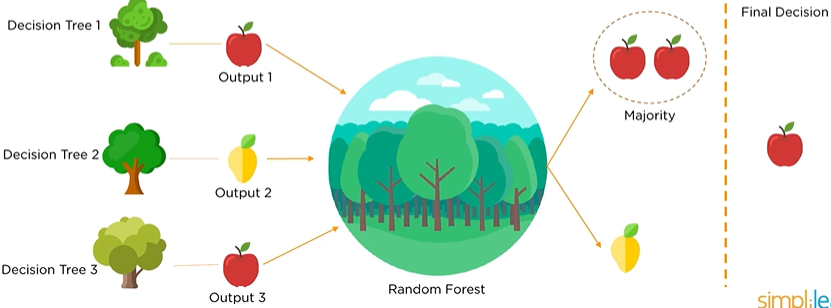

# **Random Forest**

*Random Forest* (RF) or *Random Decision Forest* is an ensemble learning method that constructs multiple Decision Trees during the training phase and combines their outputs to improve accuracy and stability. It’s widely used in both classification and regression tasks.

## **Applications of Random Forest**

1. **Remote Sensing**:  
   - Used in ETM (Enhanced Thematic Mapper) devices to acquire images of the Earth’s surface.  
   - Offers higher accuracy and faster training times compared to other methods.  
2. **Object Detection**:  
   - Excels in multiclass object detection, especially in complex environments.  
   - Provides robust detection performance.  
3. **Kinect**:  
   - Employed in the Kinect game console to track body movements and replicate them in games.  

**Related Algorithms**: *KNN*, *Naive Bayes*, *Decision Tree*, and *Random Forest* are common solutions for classification tasks.

## **Why Random Forest?**

- **No Overfitting**:  
   - Uses multiple trees to average out predictions, reducing the risk of overfitting inherent in single Decision Trees.  
   - Requires less training time compared to overly complex models.  
- **High Accuracy**:  
   - Runs efficiently on large datasets and produces highly accurate predictions.  
- **Handles Missing Data**:  
   - Maintains accuracy even when a significant portion of the data is missing by leveraging the collective power of multiple trees.

## **What is Random Forest?**

Random Forest is an ensemble method that builds multiple Decision Trees during training. For classification, it takes the majority vote from all trees as the final prediction. For regression, it averages the outputs. This approach leverages the diversity of trees to improve robustness and generalization.

<center>

</center>

## **How Does Random Forest Work?**

1. **Bootstrap Sampling (Bagging)**:  
   - Randomly selects subsets of the training data with replacement (bootstrap samples). Each tree is trained on a different subset, introducing diversity.  
2. **Feature Randomness**:  
   - At each node split, only a random subset of features is considered (e.g., \(\sqrt{\text{total features}}\) for classification). This reduces correlation between trees.  
3. **Tree Construction**:  
   - Builds multiple Decision Trees independently using the sampled data and features. Each tree is grown to its maximum depth (or constrained by hyperparameters).  
4. **Aggregation**:  
   - **Classification**: The final prediction is determined by a majority vote across all trees.  
   - **Regression**: The final prediction is the average of all tree outputs.  
5. **Out-of-Bag (OOB) Error**:  
   - Data not included in a tree’s bootstrap sample (out-of-bag data) is used to estimate the model’s performance without needing a separate validation set.

The combination of *bagging* (Bootstrap Aggregating) and *feature randomness* makes Random Forest more robust than a single Decision Tree.

## **Pros and Cons**

### **Advantages**
- **Reduces Overfitting**: Averaging multiple trees mitigates overfitting seen in individual Decision Trees.  
- **High Accuracy**: Effective on large, complex datasets with strong predictive performance.  
- **Robust to Noise and Missing Data**: Maintains accuracy with noisy or incomplete datasets.  
- **Feature Importance**: Provides estimates of feature importance, aiding in data exploration.  
- **Versatile**: Works for both classification and regression tasks.

### **Disadvantages**
- **Complexity**: More computationally intensive and harder to interpret than a single Decision Tree.  
- **Slower Predictions**: Requires evaluating multiple trees, increasing inference time.  
- **Less Intuitive**: The ensemble nature makes it less visually interpretable compared to a single tree.  
- **Hyperparameter Tuning**: Requires careful tuning (e.g., number of trees, max depth) for optimal performance.

## **Key Hyperparameters**
- **Number of Trees (`n_estimators`)**: More trees improve stability but increase computation time.  
- **Max Features**: Number of features considered at each split (e.g., \(\sqrt{\text{total features}}\) for classification, \(\text{total features}/3\) for regression).  
- **Max Depth**: Limits tree depth to prevent overfitting.  
- **Min Samples Split/Leaf**: Controls tree growth to avoid overly specific splits.  
- **Bootstrap**: Enables/disables bagging (default: True).

## **Sample Code (Python with scikit-learn)**

### **Classification with Random Forest**
```python
from sklearn.datasets import load_iris
from sklearn.ensemble import RandomForestClassifier
from sklearn.model_selection import train_test_split
from sklearn.metrics import accuracy_score

# Load dataset
iris = load_iris()
X, y = iris.data, iris.target

# Split data
X_train, X_test, y_train, y_test = train_test_split(X, y, test_size=0.3, random_state=42)

# Train model
rf_clf = RandomForestClassifier(n_estimators=100, max_depth=5, random_state=42)
rf_clf.fit(X_train, y_train)

# Predict and evaluate
y_pred = rf_clf.predict(X_test)
print(f"Accuracy: {accuracy_score(y_test, y_pred):.2f}")

# Feature importance
print("Feature Importances:", rf_clf.feature_importances_)
```

### **Regression with Random Forest**

```python
from sklearn.datasets import fetch_california_housing
from sklearn.ensemble import RandomForestRegressor
from sklearn.model_selection import train_test_split
from sklearn.metrics import mean_squared_error

# Load dataset
housing = fetch_california_housing()
X, y = housing.data, housing.target

# Split data
X_train, X_test, y_train, y_test = train_test_split(X, y, test_size=0.3, random_state=42)

# Train model
rf_reg = RandomForestRegressor(n_estimators=100, max_depth=5, random_state=42)
rf_reg.fit(X_train, y_train)

# Predict and evaluate
y_pred = rf_reg.predict(X_test)
print(f"MSE: {mean_squared_error(y_test, y_pred):.2f}")
```