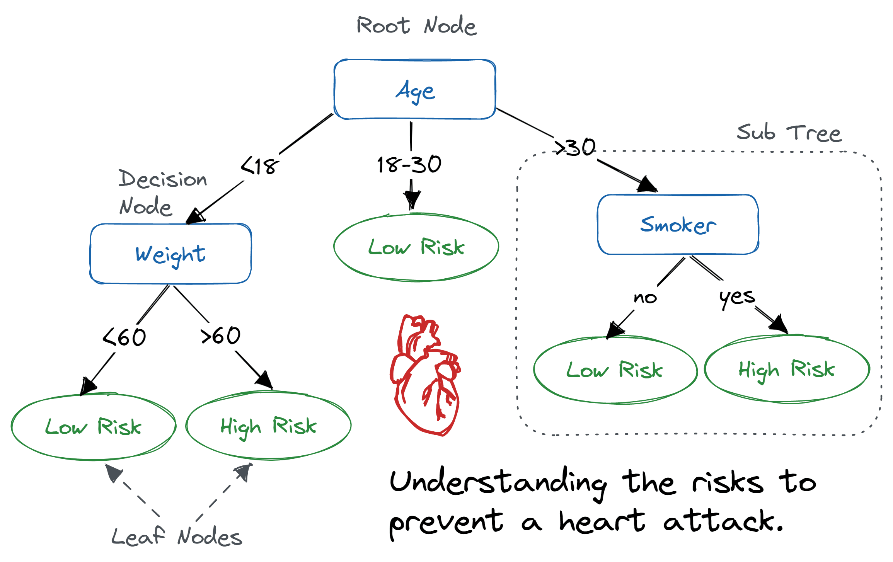

<h1 algin='center'>Tree</h1>

## **Decision Tree**

A **decision tree** is a tree-like structure used for classification or decision-making tasks. It represents decisions and their possible consequences, including chance event outcomes, costs, and utility. **Decision trees** are widely used in machine learning for tasks like classification and regression.

### **Key components of a decision tree**

<div align='center'>



</div>

**Nodes**

- **Root node** $\rightarrow$ the topmost node, representing **the entire dataset**, where the decision-making process begins

- **Internal nodes** $\rightarrow$ represent **tests on specific attributes** (features). Each internal node corresponds to **a decision based on an attribute**

- **Leaf nodes** $\rightarrow$ terminal nodes that represent the **final output**, such as a class label (*Play* or *Don't Play*) or a **probability distribution** over classes.

**Branches** $\rightarrow$ represent **the outcome of a test on an attribute** and leading to the next node or a leaf

**Attributes** $\rightarrow$ **features** or **variables** used to make decisions (e.g., *Outlook*, *Humidity*, *Wind*)

### **Building a decision tree**

The process of constructing a decision tree involves two main phases:

**1 _ Tree construction**
- Start with all training data at the root node
- Recursively split the data based on selected attribute to form branches and subtrees
- The attribute selection is based on a criterion like **Information Gain** or **Gain Ratio**

**2 _ Tree pruning**
- After constructing the tree, remove branches that contain outliers or noise to prevent overfitting and simplify the model
- Pruning improves generalization by reducing the complexity of the tree


**Example from the Document**

For the a dataset for deciding whether to play tennis based on weather conditions. The attributes are:

- **Outlook** (Sunny, Overcast, Rain)
- **Temperature** (numeric, in Celsius)
- **Humidity** (numeric, in percentage)
- **Wind** (Strong or Weak)
- **Outcome** (Play or Don't Play)

The goal is to build a decision tree that predicts whether to play tennis based on these attributes

## **ID3 Algorithm**

The **ID3 (Iterative Dichotomiser 3)** algorithm, developed by Ross Quinlan, is a greedy algorithm used to construct decision trees. It builds the tree top-down, selecting the best attribute at each node to split the dataset. It use of **Entropy** and **Information Gain** which are core components of ID3

### **Key concepts in ID3**

**1 _ Entropy**

**Entropy** measures the impurity or uncertainty in a dataset.

For a dataset $S$ with $c$ classes (e.g., *Play* and *Don't Play*), entropy is calculated as:

$$\text{Entropy}(S) = -\sum^{c}_{i=1} p_i \log_2p_i$$

where $p_i$ is the proportion of instances belonging to class $i$

**For example**

- The tennis dataset has 14 instances: 9 **Play** (9+) and 5 **Don't Play** (5-)

- Entropy is calculated as:

$$\text{Entropy}(S) = -\frac{9}{14} \log_2 \frac{9}{14} - \frac{5}{14} \log_2 \frac{5}{14} \approx 0.940$$

**Observations**
- If all instances **belong to one class** (e.g., all *Play*), $\text{entropy} = 0 \rightarrow$ no uncertainty
- If classes are **equally distributed** (e.g., 7 *Play* and 7 *Don't Play*), $\text{entropy} = 1 \rightarrow$ maximum uncertainty

**2 _ Information Gain**

**Information Gain** measures how much uncertainty is reduced by splitting the dataset on a specific attribute. It is calculated as:

$$\text{Gain}(S, A) = \text{Entropy}(S) - \sum_{v \in \text{Values}(A)} \frac{|S_v|}{|S|} \text{Entropy}(S_v)$$

where
- $A \rightarrow$ the attribute being consider
- $\text{Values}(A) \rightarrow$ the set of possible values for attribute $A$
- $S_v \rightarrow$ the subset of $S$ where attribute $A$ has value $v$
- $\frac{|S_v|}{|S|} \rightarrow$ the proportion of instances with value $v$

Example from the document for attribute *Wind*

- Values of *Wind* are $\{\text{Strong}, \text{Weak}\}$
- $S = [9+, 5-]$
- Subsets
    - $S_{Strong} = [2+, 3-]$
    - $S_{Weak} = [7+, 2-]$
- Entropy of subsets
    - $\text{Entropy}(S_{\text{Strong}}) = -\frac{2}{5} \log_2 \frac{2}{5} -\frac{3}{5} \log_2 \frac{3}{5} \approx 0.970$
    - $\text{Entropy}(S_{\text{Weak}}) = -\frac{7}{9} \log_2 \frac{7}{9} -\frac{2}{9} \log_2 \frac{2}{9} \approx 0.764$
- Information Gain

$$\text{Gain}(S, \text{Wind}) = 0.940 - \left( \frac{5}{14} \times 0.970 + \frac{9}{14} \times 0.764  \right) \approx 0.1024$$

**3 _ Attribute selections**

At each node, ID3 selects the attribute with **the highest Information Gain** to split the dataset

In the document, the attribute *Outlook* is chosen as **the root** because it has **the highest Information Gain** among all attributes (e.g., *Outlook*, *Temperature*, *Humidity*, *Wind*)

**4 _ Recursive splitting**

After splitting on **the best attribute**, ID3 **recursively** applies the same process to each subset (branch) until:
- All instances in a subset belong to the same class (left node)
- No attributes remain to split on
- No instances remain in the subset

The document shows how the tree is expanded by selecting *Humidity* as the next attribute for the *Sunny* branch based on **its high Information Gain**

### **ID3 algorithm steps**

1 _ **Input** $\rightarrow$ A dataset $S$ with attributes and class labels

2 _ **Base cases**
- If all instances in $S$ belong to the same class $\rightarrow$ create a leaf node with that class
- If no attributes remain $\rightarrow$ create a leaf node with the majority class in $S$
- If $S$ is empty $\rightarrow$ return a leaf node with the majority class of the parent node

3 _ **Main loop**
- For each attribute $A$, calculate the information gain $\text{Gain}(S, A)$
- Select the attribute $A$ with the highest information gain
- Create a decision node for $A$
- Split $S$ into subsets $S_v$ for each value $v$ of $A$
- Recursively apply the algorithm to each subset $S_v$

4 _ **Output** $\rightarrow$ a decision tree

### **Limitations of ID3**

- **Overfitting** $\rightarrow$ ID3 can create overly complex trees that fit noises in the training data
- **Continuous attributes** $\rightarrow$ ID3 handles continuous attributes (e.g., *Temperature*, *Humidity*) by discretizing them into binary splits (e.g., *Humidity* $\leq 75\% \text{ vs } > 75\%$)
- **Bias toward multi-valued attributes** $\rightarrow$ Attributes with many values (e.g., *Outlook* with **three values**) may yield higher Information Gain due to finer splits, even if less meaningful

## **Simplifying Decision Rules**

**CHAID (Chi-Squared Automatic Interaction Detection)** $\rightarrow$ selects attributes based on the Chi-Square test to assess independence between an attribute and the class label

The document describes a process for **simplifying decision rules** derived from a decision tree to make them more concise and generalizable. This process involves two main steps:

**Step 1 _ Removing unnecessary conditions (Antecedents)** $\rightarrow$ identify and eliminate redundant conditions in individual rules

To simplify rules, the document uses **statistical tests** to check whether a condition (antecedent) in a rule is necessary for the conclusion (class label)

This is done by testing the **independence** of the conclusion from each condition using **contingency tables** and statistical tests like Chi-Square, Yates, or Fisher

**Contingency tables**

A contingency table summarizes the relationship between a condition and the outcome.

For example, the document provides a table for the condition *Sunny* and the outcome *Play/Don't Play*

- **Rows** $\rightarrow$ condition states (e.g., *Sunny*, *Not Sunny*)
- **Columns** $\rightarrow$ outcome states (e.g., *Play*, *Don't Play*)
- **Cells** $\rightarrow$ frequency of each combination
- **Marginal totals** $\rightarrow$ row and column sums

<center>

| | Play | Don't Play | Row Total |
| --- | --- | --- | --- |
| **Sunny** | 8 | 12 | 20 |
| **Not Sunny** | 28 | 8 | 36 |
| **Column total** | 36 | 20 | 56 |

</center>

**Expected frequencies**

Expected frequencies are calculated assuming the condition and outcome are independent:

$$e_{ij} = \frac{\text{Row Total}_i . \text{Column Total}_j}{\text{Total}}$$

For the *Sunny* and *Play* cell:

$$e_{11} = \frac{20 . 36}{56} \approx 12.9 $$

and here is the expected frequencies table

<center>

| | Play | Don't Play | 
| --- | --- | --- |
| **Sunny** | 12.9 | 7.1 |
| **Not Sunny** | 23.1 | 12.9 |

</center>

**Statistical tests**

The document uses the following tests based on the maximum expected frequency ($m$):


**Chi-square test** ($m > 10$)

$$\chi^2 = \sum \frac{(o_i - e_i)^2}{e_i}$$

where
- $o_i \rightarrow$ the observed frequency
- $e_i \rightarrow$ the expected frequency

**Yates' correlation** ($5 < m < 10$)

$$\chi^2 = \sum \frac{(|o_i - e_i| - 0.5)^2}{e_i}$$

**Fisher's exact test** ($m < 5$) used for small sample sizes


**Decision rule**
- Calculate the **Chi-square statistic** ($\chi^2$)
- Determine the degree of freedom $df = (r - 1)(c - 1)$
    - $r \rightarrow$ the number of rows of the table
    - $c \rightarrow$ the number of columns of the table 
- Compare $\chi^2$ with the critical value $\chi^2_\alpha$ from the chi-square table at *significant level* $\alpha = 0.05$
    - If $\chi^2 > \chi^2_\alpha$, reject the null hypothesis (independence) and keep the condition (it affects the outcome)
    - If $\chi^2 \leq \chi^2_\alpha$, accept the null hypothesis (dependence) and remove the condition (it doesn't affects the outcome)

The initial rule set (before simplification) might look like:

1. If *Outlook = Sunny* AND *Humidity ≤ 75%*, then *Play*
2. If *Outlook = Sunny* AND *Humidity > 75%*, then *Don't Play*
3. If *Outlook = Overcast*, then *Play*
4. If *Outlook = Rain* AND *Wind = Strong*, then *Don't Play* 
5. If *Outlook = Rain* AND *Wind = Weak*, then *Play*

Consider **2 conditions** in **rule 1**: *Sunny* and *Normal Humidity*

(*Sunny* condition)

**Observed table**

<center>

| | Play | Don't Play | Row Total |
| --- | --- | --- | --- |
| **Sunny** | 8 | 12 | 20 |
| **Not Sunny** | 28 | 8 | 36 |
| **Column total** | 36 | 20 | 56 |

</center>

**Expected table**

<center>

| | Play | Don't Play | 
| --- | --- | --- |
| **Sunny** | 12.9 | 7.1 |
| **Not Sunny** | 23.1 | 12.9 |

</center>

Because maximum expected frequency ($m=23.1$) so use Chi-square test

- $\chi^2 = 2 \times \frac{(8 - 12.9)^2}{12.9} + \frac{(12- 7.1)^2}{7.1} + \frac{(28 - 23.1)^2}{23.1} = 7.99$
- Degrees of freedom $df = (2-1)(2-1) = 1$
- Critical value at $\alpha = 0.05 \rightarrow \chi^2_\alpha = 3.84$

$\Rightarrow$ Since $7.99 > 3.84$, the condition *Sunny* is kept because it *significantly* affects the outcome

(*Humidity* condition)

**Observed table**

<center>

| | Play | Don't Play | Row Total |
| --- | --- | --- | --- |
| **Normal Humidity** | 20 | 4 | 24 |
| **Not Normal Sunny** | 16 | 16 | 32 |
| **Column total** | 36 | 20 | 56 |

</center>

**Expected table**

<center>

| | Play | Don't Play | 
| --- | --- | --- |
| **Normal Humidity** | 15.4 | 8.6 |
| **Not Normal Humidity** | 20.6 | 11.4 |

</center>

Because maximum expected frequency ($m=20.6$) so use Chi-square test
- $\chi^2 = \frac{(20-15.4^2)}{15.4} + \frac{(4-8.6)^2}{8.6} + \frac{(16-20.6)^2}{20.6} + \frac{(16-11.4)^2}{11.4} = 6.64$
- Degrees of freedom $df = (2-1)(2-1) = 1$
- Critical value at $\alpha = 0.05 \rightarrow \chi^2_\alpha = 3.84$

$\Rightarrow$ Since $6.64 > 3.84$, the condition *Humidity* is kept because it *significantly* affects the outcome

Consider **2 conditions** in **rule 4**: *Rainy* and *Strong Wind*

(*Rain* condition)

**Observed table**

<center>

| | Play | Don't Play | Row Total |
| --- | --- | --- | --- |
| **Rainy** | 12 | 8 | 20 |
| **Not Rainy** | 24 | 12 | 36 |
| **Column total** | 36 | 20 | 56 |

</center>

**Expected table**

<center>

| | Play | Don't Play | 
| --- | --- | --- |
| **Rainy** | 12.9 | 7.1 |
| **Not Rainy** | 32.1 | 12.9 |

</center>

- $\chi^2=\frac{(12 - 12.9)^2}{12.9} + \frac{(8-7.1)^2}{7.1} + \frac{(24-32.1)^2}{32.1} + \frac{(12 - 12.9)^2}{12.9^2} = 0.25$

$\Rightarrow$ Since $0.25 < 3.84$, the condition *Rain* is removed because it does not significantly affect the outcome

(*Strong Wind* condition)

<center>

| | Play | Don't Play | Row Total |
| --- | --- | --- | --- |
| **Strong Wind** | 8 | 12 | 20 |
| **Not Strong Wind** | 28 | 18 | 36 |
| **Column total** | 36 | 20 | 56 |

</center>

**Expected table**

<center>

| | Play | Don't Play | 
| --- | --- | --- |
| **Strong Wind** | 12.9 | 7.1 |
| **Not Strong Wind** | 23.1 | 12.9 |

</center>

Because maximum expected frequency ($m=23.1$) so use Chi-square test

- $\chi^2 = 2 \times \frac{(8 - 12.9)^2}{12.9} + \frac{(12- 7.1)^2}{7.1} + \frac{(28 - 23.1)^2}{23.1} = 7.99$
- Degrees of freedom $df = (2-1)(2-1) = 1$
- Critical value at $\alpha = 0.05 \rightarrow \chi^2_\alpha = 3.84$

$\Rightarrow$ Since $7.99 > 3.84$, the condition *Strong Wind* is kept because it *significantly* affects the outcome

The simplified rule set after removing the *Rain* condition from rules 4 and 5:

<center>

| Rule | Condition | Conclusion | 
| --- | --- | ---
| 1  | Sunny AND Normal Humidity | Play |
| 2 | Sunny AND High Humidity | Don't Play |
| 3 | Overcast | Play |
| 4 | Strong Wind | Don't Play |
| 5 | Weak Wind | Play |

</center>

**2_ Removing unnecessary rules** $\rightarrow$ eliminate entire rules that are redundant or can be replaced by a default rule

After **simplifying individual rules** by **removing redundant conditions**, the next step is to eliminate unnecessary rules from the rule set. This is done by:
- **Identifying redundant rules** $\rightarrow$ rules that can be covered by other rules or default rule
- **Introducing a default rule** $\rightarrow$ replace multiple rules with the same conclusion with a single default rule applied when no other rule matches

**Example**

The simplified rule set after removing the *Rain* condition from rules 4 and 5:

<center>

| Rule | Condition | Conclusion | 
| --- | --- | ---
| 1  | Sunny AND Normal Humidity | Play |
| 2 | Sunny AND High Humidity | Don't Play |
| 3 | Overcast | Play |
| 4 | Strong Wind | Don't Play |
| 5 | Weak Wind | Play |

</center>

No entire rules were removed in this case but the rule set was simplified by eliminating the *Rain* condition

## **C4.5 Algorithm (extension of ID3)**

The document briefly mentions the C4.5 algorithm, an extension of ID3 developed by Quinlan in 1993. C4.5 addresses some of ID3's limitations and introduces new features

### **Key improvements in C4.5**

**1 _ Gain ratio**

ID3's Information Gain favors attributes with many values. C4.5 uses **Gain Ratio** to normalize **Information Gain**

$$\text{GainRatio}(S, A) = \frac{\text{Gain}(S, A)}{\text{SplitInformation}(S, A)}$$

where

$$\text{SplitInformation}(S, A) = - \sum^c_{i=1}\frac{|S_i|}{|S|} \log_2 \frac{|S_i|}{|S|}$$

- *SplitInformation* measures the entropy of the attribute's value distribution
- Gain Ratio penalizes attributes with many values to ensure fairer attribute selection

**2 _ Handling continuous attributes**

C4.5 dynamically creates binary splits for continuous attributes (e.g., *Humidity* ≤ 75% vs > 75%) by evaluating all possible thresholds

**3 _ Handling missing values**

C4.5 can handle missing attribute values by assigning probabilities to possible values or ignoring instances with missing data during gain calculations

**4 _ Pruning**

C4.5 includes post-pruning to remove branches that do not improve accuracy on a validation set, reducing overfitting 

**5 _ Depth-First Strategy**

C4.5 builds the tree using a depth-first approach, expanding one branch fully before moving to the next

### **C4.5 vs ID3**
- **ID3** uses Information Gain, struggles with continuous attributes, no pruning and no handling of missing value

- **C4.5** uses Gain Ratio, handles continuous attributes and missing values, including pruning and is more robust for real-world datasets

## **Practical Example: Tennis dataset**

The tennis dataset example to illustrate how the ID3 algorithm and rule simplification work


**Dataset**

| Day | Outlook | Temperature | Humidity | Wind | Play? |
| --- | --- | --- | --- | --- | --- |
| N1 | Sunny | 24 | 70 | Weak | Play |
| N2 | Sunny | 27 | 90 | Strong | Don't Play |
| N3 | Sunny | 30 | 85 | Weak | Don't Play |
| N4 | Sunny | 22 | 95 | Weak | Don't Play |
| N5 | Sunny | 20 | 70 | Weak | Play | 
| N6 | Overcast | 22 | 90 | Strong | Play |
| N7 | Overcast | 28 | 75 | Weak | Play |
| N8 | Overcast | 18 | 65 | Strong | Play |
| N9 | Overcast | 28 | 75 | Weak | Play |
| N10 | Rain | 21 | 80 | Strong | Don't Play |
| N11 | Rain | 18 | 70 | Strong | Don't Play |
| N12 | Rain | 24 | 80 | Weak | Play |
| N13 | Rain | 20 | 80 | Weak | Play |
| N14 | Rain | 21 | 96 | Weak | Play |

### **Building initial entropy**

**1 _ Calculate initial entropy**

*Total instance* $14 \space \space (9+, 5-)$

$$\text{Entropy}(S) = -\frac{9}{14}\log_2\frac{9}{14} - \frac{5}{14} \log_2 \frac{5}{14} \approx 0.940$$

**2 _ Calculate information gain for each attribute**

*Outlook (Sunny, Overcast, Rain)*

- Sunny $(2+, 3-) \rightarrow$ entropy = 0.970
- Overcast $(4+, 0-)$ $\rightarrow$ entropy = 0
- Rain $(3+, 2-) \rightarrow$ entropy = 0.970

$\Rightarrow \text{Gain}(S, \text{Outlook}) = 0.940 - \left(    \frac{5}{14} \times 0.970 + \frac{4}{14} \times 0 + \frac{5}{14} \times 0.970 \right) \approx 0.247$

*Wind (Strong, Weak)*

- Strong $(2+, 3-) \rightarrow$ entropy = 0.970
- Weak $(7+, 2-) \rightarrow$ entropy = 0.764

$\Rightarrow \text{Gain}(S, \text{Wind}) = 0.940 - \left(    \frac{5}{14} \times 0.970 + \frac{9}{14} \times 0.764 \right) \approx 0.1024$

*Humidity* and *Temperature* $\rightarrow$ similar calculations and yield lower gains

$\Rightarrow$ Result: Outlook has the highest information gain (0.247) so it becomes the root node

**3 _ Split on *Outlook***

**Sunny branch** $(2+, 3-)$

- Calculate information gain for remaining attributes (*Temperature*, *Humidity*, *Wind*)
- *Humidity* (e.g., ≤ 75% vs. > 75%) has the highest gain (0.970)

$\Rightarrow$ Split on *Humidity*

**Overcast branch** $(4+, 0-)$ 
- All instances are *Play* so create a left node labeled *Play*

**Rain branch** $(3+, 2-)$
- Calculate information gain, *Wind* has the highest gain

$\Rightarrow$ Split on *Wind*

**4 _ Continue recursively**

- The process continues until all nodes are pure (single class) or no attribute remain

**Final (resulting) decision tree**

```
Outlook
├── Sunny
│   ├── Humidity ≤ 75% → Play
│   └── Humidity > 75% → Don't Play
├── Overcast → Play
└── Rain
    ├── Strong Wind → Don't Play
    └── Weak Wind → Play

```

**Simplifying rules**

The initial rule set (before simplification) might look like:

1. If *Outlook = Sunny* AND *Humidity ≤ 75%*, then *Play*
2. If *Outlook = Sunny* AND *Humidity > 75%*, then *Don't Play*
3. If *Outlook = Overcast*, then *Play*
4. If *Outlook = Rain* AND *Wind = Strong*, then *Don't Play* 
5. If *Outlook = Rain* AND *Wind = Weak*, then *Play*

After applying the Chi-square test:
- The condition *Rain* is found to be independent of the outcome $\chi^2 = 0.25 < 3.84$
- Remove *Rain* from rules 4 and 5, resulting in
    - Rule 4: If *Wind = Strong*, then *Don't Play*
    - Rule 5: If *Wind = Weak*, then *Play*

Final simplified rule set:

1. If *Outlook = Sunny* AND *Humidity ≤ 75%*, then *Play*
2. If *Outlook = Sunny* AND *Humidity > 75%*, then *Don't Play*
3. If *Outlook = Overcast*, then *Play*
4. If *Wind = Strong*, then *Don't Play* 
5. If *Wind = Weak*, then *Play*

## **Additional insights and best practices**

- **Pruning** $\rightarrow$ pruning can be pre-pruning (stopping tree growth early) or post-pruning (removing branches after construction). C4.5 uses post-pruning, which is more effective for complex datasets

- **Handling Overfitting** $\rightarrow$ uses techniques like cross-validation or a validation set to ensure the tree generalizes well

- **Scalability** $\rightarrow$ decision trees are computationally efficient for small to medium datasets but may struggle with very large datasets unless optimized

- **Real-world application** $\rightarrow$ decision trees rae used in medical diagnosis, credit scoring and customer segmentation due to their interpretability

## **Summary**
- **Decision Trees** $\rightarrow$ A tree-like model for classification, with nodes representing tests on attributes and leaves representing class labels
- **ID3 Algorithm** $\rightarrow$ Builds decision trees using Information Gain to select the best attribute at each node. It’s simple but limited by overfitting and handling of continuous attributes
- **C4.5 Algorithm** $\rightarrow$ An improved version of ID3 that uses Gain Ratio, handles continuous attributes, and includes pruning
- **Simplifying Decision Rules** $\rightarrow$ Uses statistical tests (e.g., Chi-Square) to remove redundant conditions and rules, resulting in a concise and interpretable rule set

--- 

The $\chi^2_\alpha$, the critical value from the Chi-Square distribution used in statistical tests, is the value represents the threshold at which  decide whether to reject the null hypothesis in a Chi-Square test, given a significance level $\alpha$ (e.g., 0.05) and the degrees of freedom $df$

It is typically looked up in a Chi-Square distribution table or computed using statistical software or functions

## **Understand $\chi^2_\alpha$**

**Purpose** $\rightarrow$ In the *Chi-Square test*, $\chi^2_\alpha$ is the critical value that determines whether the calculated Chi-Square statistic $\chi^2$ indicates a statistically significant dependency between a condition and the outcome

- If $\chi^2 > \chi^2_\alpha$, reject the null hypothesis (e.g., independence) and conclude that the condition affects the outcome

- If $\chi^2 \leq \chi^2_\alpha$, fail to reject the null hypothesis, suggesting the condition is independent of the outcome

**Parameters**

- **Significance level** $\alpha$ The probability of rejecting the null hypothesis when it is true (Type I error). Common values are 0.05 (5%) or 0.01 (1%)
- Degrees of freedom $df$ Determined by the structure of the contingency table. For a table with $r$ rows and $c$ columns, $df=(r−1)(c−1)$

The document uses $\chi^2_\alpha$ to evaluate whether conditions (e.g., *Sunny* or *Rain*) in decision rules are statistically significant

For a 2x2 contingency table, $df=(2−1)(2−1)=1$ and with $α=0.05$, the critical value is $\chi^2_\alpha = 3.84$


Can look up $\chi^2_\alpha$ in Chi-square table

A Chi-Square distribution table lists critical values for different $df$ and $α$. These tables are widely available in statistics textbooks or online

Example table snippet:

| $df$ | $\alpha=0.10$ | $\alpha=0.05$ | $\alpha=0.01$ |
| --- | --- | --- | --- |
| 1 | 2.71 | 3.84 | 6.63 |
| 2 | 4.61 | 5.99 | 9.21 |
| 3 | 6.25 | 7.81 | 11.34 |

---

## **Naïve Bayes algorithm**

The Naive Bayes algorithm is a simple yet powerful probabilistic classifier used in data mining and machine learning, particularly for classification tasks

It is based on *Bayes' Theorem* and makes a *naive* assumption that all features (attributes) are conditionally independent given the class label

Despite this simplifying assumption, *Naive Bayes* often performs surprisingly well in practice, especially for text classification (e.g., spam detection, sentiment analysis) and datasets with categorical or numerical features

## **Overview of Naive Bayes** 

### **What is Naive Bayes?**

Naive Bayes is the **supervised learning algorithm** that predicts the class of a new instance by calculating the probability of each class and selecting the class with the highest probability of the given the instance's features 

It leverages *Bayes's Theorem* to compute these probabilities and assumes feature independence to simplify calculations

**Key Characteristics**

- **Probabilistic** $\rightarrow$ Outputs probabilities for each class, allowing for confidence scores
- **Fast and Scalable** $\rightarrow$ Computationally efficient, suitable for large datasets
- **Handles both Categorical and Numerical data** $\rightarrow$ With appropriate modeling (e.g., Gaussian Naïve Bayes for numerical data)
- **Robust to irrelevant features** $\rightarrow$ Due to the independence assumption, irrelevant features have less impact

**Applications**
- **Text classification **(spam filtering, document categorization)
- **Medical diagnosis** (predicting disease based on symptoms)
- **Sentiment analysis**

**Naive Assumption**

The algorithm assumes that all features are **conditionally independent** given the class label

This means the presence or value of one feature does not affect the others within the same class.

While this assumption is often unrealistic (e.g., in text, words like *machine* and *learning* are correlated). Naive Bayes still performs **well** in many scenarios due to its robustness and the balancing effect of probabilities

### **Bayes' theorem**

Naive Bayes is grounded in **Bayes's theorem**, which relates conditional probabilities. For a class $C$ and a feature vector $\text{X} = (x_1, x_2, ... , x_n)$. Bayes' theorem is 

$$P(C | \text{X}) = \frac{P(C) . P(\text{X} | C)}{P(\text{X})}$$

where
- $P(C | \text{X}) \rightarrow$ posterior probability of class $C$ given feature $\text{X}$
- $P(C) \rightarrow$ prior probability of class $C$, estimated from the training data
- $P(\text{X} | C) \rightarrow$ likelihood of observing feature $\text{X}$ given class $C$
- $P(\text{X}) \rightarrow$ evidence (normalizing constant), the probability of features $\text{X}$

**Naive assumption in practice**

The likelihood $P(\text{X} | C)$ is the joint probability of all features given the class:

$$P(\text{X} | C) = P(x_1, x_2, ... x_n | C)$$

Computing this directly is complex due to feature dependencies and high dimensionality. The naive assumption simplifies it by assuming independence:

$$P(\text{X} | C) = P(x_1 |C ) \cdot P(x_2 | C) \cdot ... \cdot P(x_n | C) = \prod^n_{i=1}P(x_i | C)$$

Thus, the posterior becomes

$$P(C | \text{X})  = \frac{P(C) \cdot \prod^n_{i=1}P(x_i | C)}{P(\text{X})}$$

Since $P(\text{X})$ is constant across all classes $\rightarrow$ ignore it for classification and compare the **unnormalized posterior**

$$P(C | \text{X}) \propto P(C) \cdot \prod^n_{i=1}P(x_i | C)$$

The classifier assigns the class $C$ that maximizes this expression:

$$\hat{C} = \argmax_C P(C) \cdot \prod^n_{i=1}P(x_i | C)$$

### **Steps of the Naive Bayes algorithm**

The Naive Bayes algorithm involves two phases: **training** and **prediction**

**Training Phase**

**1 _ Collecting training data** $\rightarrow$ a dataset with $n$ features and class labels 

**2 _ Estimate prior probability**

For each class $C_i$, compute

$$P(C_i) = \frac{\text{\# of instances of class } C_i}{\text{Total \# of instances}}$$

**3 _ Estimate conditional probabilities**

- For each feature $x_i$ and class $C$, compute $P(x_i | C)$
- **Categorical features** $\rightarrow$ use frequency counts
- **Numerical features** $\rightarrow$ assume a distribution (e.g., Gaussian) and estimate parameters (mean, variance)

**4 _ Handle zero probabilities (smoothing)**

If **a feature value never appears in class**, $P(x_i | C) = 0$, which makes the entire product zero

$\Rightarrow$ Use **Laplace Smoothing**

$$P(x_i  | C) = \frac{\text{Count}(x_i, C) + 1}{\text{Count}(C) + k}$$

where
- $k \rightarrow$ the number of possible values for feature $x_i$ 

**Prediction phase**

**1 _ Input new instance** $\rightarrow$ a feature vector $\text{X} = (x_1, x_2, ..., x_n)$

**2 _ Compute posterior for each class**

Calculate $P(C) \cdot \prod^n_{i=1}P(x_i | C)$ for each class $C$

**3 _ Select class**

Choose the class with the highest posterior probability

$$\hat{C} = \argmax_C P(C) \cdot \prod^n_{i=1}P(x_i | C)$$

**4 _ Optional** 

Output probabilities for ranking or confidence

### **Types of Naive Bayes classifiers**

The choice of Naive Bayes variant depends on the feature type

**1 _ Multinomial Naive Bayes**

Used for discrete data, esp. word counts in text classification

$P(x_i | C)$ is the probability of feature $x_i$ (e.g., a word) occurring in class $C$, often normalized by the total counts in the class

Common in spam filtering, document classification

**2 _ Bernoulli Naive Bayes**

Used for binary/boolean features (e.g., word presence/absence in a document)

$P(x_i | C)$ is the probability of feature $x_i$ being 1 (presence) or 0 (absent) in class $C$

**3 _ Gaussian Naive Bayes**

Used for continuous features, assuming they allow a Gaussian (normal) distribution

For feature $x_i$, compute

$$P(x_i | C) = \frac{1}{\sqrt{2 \pi \sigma^2_C}} \exp \left( - \frac{(x_i - \mu_C)^2}{2\sigma^2_C}\right)$$

where $\mu_C$ and $\sigma_C^2$ are the mean and variance of feature $x_i$ in class $C$

## **Example Buys_Computer dataset**

Let's apply the Naive Bayes to the *buys_computer* dataset to illustrate the process

### **Dataset**

<center>

| age | income | student | credit_rating | buys_computer |
| --- | --- | --- | --- | --- | 
| <=30 | high | no | fair | no |
| <=30 | high | no | excellent | no |
| 31...40 | high | no | fair | yes |
| >40 | medium | no | fair | yes |
| >40 | low | yes | fair | yes |
| >40 | low |yes | excellent | no |
| 31...40 | low | yes | excellent | yes |
| <=30 | medium | no | fair | no |
| <=30 | low | yes | fair | yes |
| >40 | medium | yes | fair | yes |
| <=30 | medium | yes | excellent | yes |
| 31...40 | medium | no | excellent	|yes |
| 31...40 | high | yes | fair | yes |
| >40 | medium | no | excellent | no |

</center>

**Classes** 

$\rightarrow$ buys_computer = {yes no}

**Features** 

$\rightarrow$ age { $\leq$ 30, 31 ... 40, $>$ 40 }

$\rightarrow$ income { low medium high }

$\rightarrow$ student { yes no }

$\rightarrow$ credit_rating { fair excellent }


**Counts**

Total 14 tuples
Yes 9 tuples
Nos 5 tuples

### **Training phase**

**1 _ Prior probabilities**

$$P(\text{yes}) = \frac{9}{14} \approx 0.643, \quad P(\text{no}) = \frac{5}{14} \approx 0.357$$

**2 _ Conditional probabilities (with Laplace smoothing)**

For **age** { $\leq$ 30, 31 ... 40, $>$ 40 } $\rightarrow k =3$

Exampel: $P(\text{age} \leq 30 \space | \space \text{yes})$

Count 2 yes for $\leq 30$


$$\Rightarrow P(\text{age} \leq 30 \space | \space \text{yes}) = \frac{2 + 1}{9 + 3} = \frac{3}{12} = 0.25$$

Similarity for others and here is the table of probabilities (with Laplace Smoothing)


| Feature | Value | P(. \| yes) | P(. \| no) |
| --- | --- | --- | --- |
| age | $\leq$ 30 | $\frac{2 + 1}{9 + 3} = 0.25$ | $\frac{3 + 1}{5 + 3} = 0.5$| 
|  .  | 31 .. 40 | $\frac{ 4 + 1}{9 + 3} = 0.417$ | $\frac{0 + 1}{5 + 3} = 0.125$ |
| . | $>$ 40 | $\frac{3+ 1}{9 + 3} = 0.333$ | $\frac{2 + 1}{5 + 3} = 0.375$ | 
| income | high | $\frac{2 + 1}{9 + 3} = 0.417$ | $\frac{2 + 1}{5 + 3} = 0.375$ |
| . | medium | $\frac{4 + 1}{12} = 0.417$ | $\frac{2 + 1}{5 + 3} = 0.375$ |
| . | low | $\frac{3 + 1}{9 + 3} = 0.333$ | $\frac{1 + 1}{5 + 3} = 0.25$ |
| student | yes | $\frac{5 + 1}{9 + 2} = 0.545$ | $\frac{1 + 1}{5 + 2} = 0.286$ |
| . | no | $\frac{4 + 1}{9 + 2} = 0.455$ | $\frac{4 + 1}{5 + 2} = 0.714$ |
| credit_rating | fair | $\frac{6 + 1}{9 + 2} = 0.636$ | $\frac{3 + 1}{5 + 2} = 0.571$ |
| . | excellent | $\frac{3 + 1}{9 + 2} = 0.364$ | $\frac{2 + 1}{5 + 2} = 0.429$ |

**Prediction phase**

**New instance** $\text{X}$ = (age $\leq$ 30, income = medium, student = yes, credit_rating = fair)

1 _ Compute for class *Yes*

$$P(\text{yes}) \cdot P(\text{X} | \text{yes}) = 0.643 \cdot (0.25 \cdot 0.417 \cdot 0.545 \cdot 0.636) = 0.00149$$

2 _ Compute for class *No*

$$P(\text{no}) \cdot P(\text{X} | \text{no}) = 0.357 \cdot (0.5 \cdot 0.375 \cdot 0.286 \cdot 0.571) = 0.00109$$

3 _ Classify

$0.00149 > 0.00109$ so predict **buys_computer = yes**

Note: For numerical stability, use $\log$ probabilities in practice to avoid underflow

$$\log P(C | \text{X}) \propto \log P(X) + \sum^n_{i=1} \log P(x_i | C)$$

---

## **ILA algorithm**

The **Inductive Learning Algorithm (ILA)** is an iterative, rule-based machine learning algorithm designed to extract **IF-THEN classification** rules from a set of training examples

Unlike decision tree-based algorithms like **ID3** or **C4.5**, which generate hierarchical structures, ILA produces a list of ordered rules directly from the data, making it more general and less prone to overfitting

It operates in a **general-to-specific manner**, iteratively generating rules that cover examples of a single class, marking covered examples, and appending rules to a rule set. The algorithm is particularly effective for datasets with categorical attributes and has been shown to produce simpler, more general rules compared to algorithms like ID3 and AQ, as noted in research

### **What is ILA?**

ILA is an **inductive learning algorithm** that generates **production rules (IF-THEN rules)** to classify examples based on their attributes. Each rule maps a combination of attribute values to a class label. The algorithm is designed to:

- **Extract minimal rules** $\rightarrow$ produce the smallest number of rules that cover all training examples
- **Ensure generality** $\rightarrow$ avoid unnecessary or irrelevant conditions, improving performance on unseen data
- **Handle categorical data** $\rightarrow$ work with discrete attribute values (numerical attributes require preprocessing)

### **Key characteristics**
- **Iterative** $\rightarrow$ generates one rule per iteration, covering examples of a single class
- **General-to-Specific** $\rightarrow$ starts with the most general rule (few attributes) and adds conditions as needed
- **Rule-based** $\rightarrow$ produces ordered IF-THEN rules, not a decision tree, making rules easier to interpret and modify
- **Robustness** $\rightarrow$ outperforms ID3 and AQ in many cases by avoiding overfitting and producing fewer, simpler rules
- **Applications** $\rightarrow$ used in domains like object classification, weather prediction, student specialization selection and handling missing data (ILA-4)

### **Comparison with other algorithms**

**ID3/C4.5 (Decision Trees)** $\rightarrow$ ID3 uses Information Gain to build trees, which can overfit due to specific splits. ILA avoids ID3's overfitting by generating general rules rather than specific trees

**Naive Bayes** $\rightarrow$ probabilistic, assumes feature independence while ILA is deterministic, rule-based and does not assume independence. ILA's rules are more interpretable than Naive Bayes's probabilities but many require more computation for complex datasets

**AQ/CN2** $\rightarrow$ similar rule-based algorithm, but ILA often generates fewer rules with comparable accuracy

**CHAID (Chi-Square)** $\rightarrow$ uses Chi-square tests for split. ILA does not use Chi-Square directly. Can apply Chi-Square tests (as in CHAID or the rule simplification question) to evalutate rule significant, ensuring only statistically significant conditions are kept

### **ILA Algorithm: Step-by-Step Explanation**

**Initial setup**

- **Training data**
    - A table with $m$ examples (rows), each with $k$ attributes and a class attribute with $n$ possible values
    - Example: The object classification dataset has $m=7$, $k=3$ (size, color, shape) and $n=2$ (yes, no)
- **Rule set** $\rightarrow$ initialize an empty rule set $R = \empty$
- **Marking** $\rightarrow$ all examples are initially **unmarked** (not covered by any rule)

- **Notation**
    - $T \rightarrow$ the full training table
    - $t_i \rightarrow$ **sub**-table for class $i$ where $i = 1, 2, .. n$ 
    - $j \rightarrow$ number of attributes in a combination (starts at 1)

**Algorithm steps**

**Step 1** - Split into sub-tables

Divide the training data $T$ into $n$ sub-tables $t_1, t_2, ... , t_n$ one for each CLASS value

Example
- $t_1 \rightarrow$ examples with Decision = Yes (4 examples)
- $t_2 \rightarrow$ examples with Decision = No (3 examples)

**Step 2** - Initialize attribute combination count

Set $j=1$ (start with single-attribute combinations)

**Step 3** - Generate attribute combinations

For the current sub-table $t_i$, create a list of all possible combination of $j$ distinct attributes

Example with $j=1, t=1$
- Combinations {[size]}, {[color]}, {[shape]}

**Step 4** - Evaluate combinations

For each combination, count the number of unmarked examples in $t_i$, where the attribute values match the combination and do not appear with the same values in other sub-tables (to ensure specificity)

Select the combination with the highest count, called **max_combination**

Example
- For [size]:
    - *medium* appears only in $t_1$, not in $t_2$. Count = 1
    - *small* and *large* appear in both $t_1$ and $t_2$. Count = 0

- For [color]:
    - *green* appears 2 times in $t_1$, not in $t_2$. Count = 2
    - *blue* appears 1 times in $t_1$, nto in $t_1$. Count = 1

- For [shape]:
    - *sphere* appears 2 times in $t_1$, not in $t_2$. Count = 2
    - *box* appears 1 times in $t_1$, not in $t_2$. Count = 1

$\Rightarrow$ **max_combination** is *green* for [color] (*chosen as the first of tied counts*)

**Step 5** - Check **max_combination**

If **max_combination** count = 0 (no valid combination), increment $j =  j + 1$ and return to Step 3

Else, proceed to Step 6

**Step 6** - Mark covered examples

Mark (*lock*) all unmarked examples in $t_i$ that match the **max_combination** values

Example - mark examples 3 and 4 in $t_1$ ([color] = *green*)

**Step 7** - Add rule to set

Create a rule: **IF** (attribute-value pairs of **max_combination**, joined by AND) **THEN** (class = value of $t_i$)

Add the rule to $R$

Example - **Rule 1**: IF [color] = *green* THEN Decision = YES

**Step 8** - Check termination

If all example in $t_i$ are marked:
- If there are more sub-tables, move to the next sub-table and return to Step 2
- Else terminate the algorithm

If unmarked examples remain in $t_i$, return to **Step 4**

### **Illustrative example: Object classification**

**Dataset**

<center>

| Example No. | Size | Color | Shape | Decision |
| --- | --- | --- | --- | --- |
| 1 | Medium | Blue | Box | Yes |
| 2 | Small | Red | Cone | No |
| 3 | Small | Red | Sphere | Yes |
| 4 | Large | Red | Cone | No |
| 5 | Large | Green | Cylinder | Yes |
| 6 | Large | Red | Cylinder | No |
| 7 | Large | Green | Sphere | Yes |

</center>

$m = 7, k = 3, n = 2$

Attributes: [size] {*small* *medium* *large*}, [color] {*green*, *red*, *blue*}, [shape] {*box* *cone* *sphere* *cylinder*}

Class {yes no}

**Execution** 

**Step 1 - Split into sub-tables**

$t_1 \rightarrow$ Yes

<center>

| Example No. | Size | Color | Shape | Decision |
| --- | --- | --- | --- | --- |
| 1 | Medium | Blue | Box | Yes |
| 3 | Small | Red | Sphere | Yes |
| 5 | Large | Green | Cylinder | Yes |
| 7 | Large | Green | Sphere | Yes |

</center>

$t_2 \rightarrow$ No

<center>

| Example No. | Size | Color | Shape | Decision |
| --- | --- | --- | --- | --- |
| 2 | Small | Red | Cone | No |
| 4 | Large | Red | Cone | No |
| 6 | Large | Red | Cylinder | No |

</center>

For $t_1$

**Step 2** $j=1$

**Step 3** Combinations: {[size]}, {[color]}, {[shape]}

**Step 4**
- [color] = *green* has count = 2 *(5, 7)*, not in $t_2$
- [shape] = *sphere* has count = 2 *(3, 7)*, not in $t_2$

$\Rightarrow$ [color] = *green* selected (first tie) for **max_combination**

**Step 5** Count $\neq$ 0, proceed to step 6

**Step 6** Mark examples *(5, 7)*

**Step 7** Add **Rule 1** to set $\rightarrow$ IF [color] = *green* THEN Decision = YES

**Step 8** Unmarked example (1, 3) remain, return to step 4

**Repeat** 
- [size] = *medium* *(1)*, count = 1 $\rightarrow$ add **Rule 2** to set $\rightarrow$ IF [size] = *medium* THEN Decision = YES - mark example 1
- [shape] = *sphere* *(3)*, count = 1 $\rightarrow$ add **Rule 3** to set $\rightarrow$ IF [shape] = *sphere* THEN Decision YES - mark example 3

$\Rightarrow$ All examples in $t_1$ marked, move to $t_2$


For $t_2$

- [shape] = *cone* has count = 2 *(2, 4)* $\rightarrow$ add **Rule 4** to set $\rightarrow$ IF [shape] = *cone* THEN Decision = NO - mark examples 2, 4

For the example **6**, no single attribute works with $j=1 \Rightarrow$ increment $j=2$

So now, the combination are [size, color], [size, shape], [color, shape]. And with the combination [size, color] = *large red* is unique to $t_2$ 

$\Rightarrow$ Add **rule 5**: IF [size] = *large* AND [color] = *red* THEN Decision = NO - mark example 6

**Step 8** $\rightarrow$ all examples marked -- terminate


**Final rule set**

1. IF [color] = *green* THEN Decision = YES
2. IF [size] = *medium* THEN Decision = YES
3. IF [shape] = *sphere* THEN Decision = YES
4. IF [shape] = *cone* THEN Decision = NO
5. IF [size] = *large* AND [color] = *red* THEN Decision = NO

### **Advantages and limitations**

**Advantages**

- **Simplicity** $\rightarrow$ rules are easy to interpret and apply
- **Generality** $\rightarrow$ avoids unnecessary conditions, improving generalization to unseen data
- **Ordered Rules** $\rightarrow$ allows focusing on specific classes or rules independently
- **Efficiency** $\rightarrow$ fewer rules than ID3/AQ, with comparable or better accuracy
- **Scalability** $\rightarrow$ variants like ILA-2 and ILA-3 improve performance on large datasets

**Limitations**

- **Categorical Data** $\rightarrow$ requires preprocessing for continuous attributes
- **Complexity with Large $j$** $\rightarrow$ generating combinations for large $j$ can be computationally expensive
- **Missing Values** $\rightarrow$ basic ILA doesn’t handle missing data (addressed by **ILA-4**)
- **Order Dependency** $\rightarrow$ rule order may affect interpretability

### **Variants and enhancements**

- **ILA-2** handles uncertainty with a new evaluation metric and faster pass criteria
- **ILA-3** incorporates feature selection to improve efficiency on large datasets
- **ILA-4** designed for datasets with missing values, comparable to Naïve Bayes and Random Forest
- **I-ILA** incremental version for **dynamic environments** where **data arrives frequently**