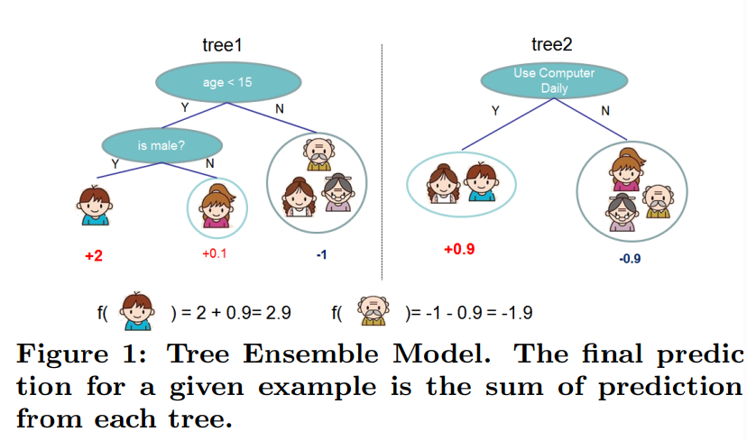
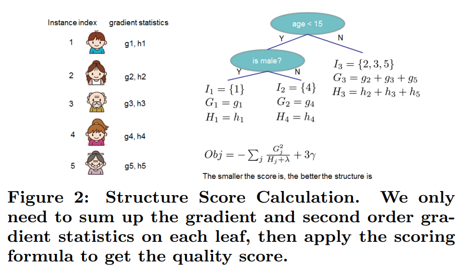
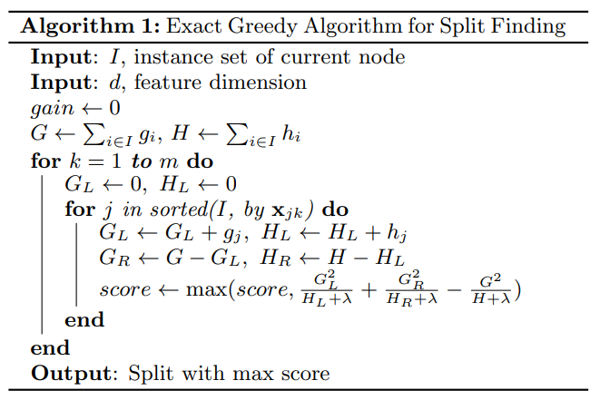
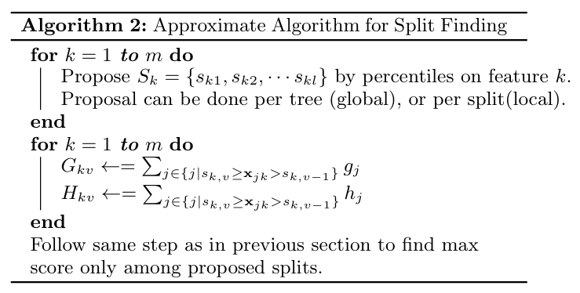
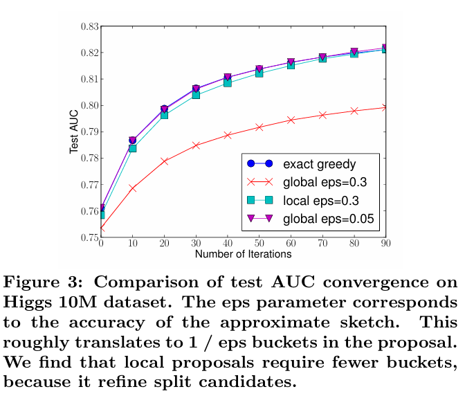

# **XGBoost - A Scalable Tree Boosting System**

*XGBoost*, introduced by Tianqu Chen, Carlos Guestrin in 2014, is a highly optimized, scalable implementation of gradient boosting.

Tree boosting is a highly effective and widely used machine learning method and *a scalable tree boosting system* or *a scalable machine learning system for tree boosting* called XGBoost, which is used by data scientists to achieve state-of-the-art results on many machine learning challenges.

Propose a novel sparsity-aware algorithm for sparse data and weighted quantile sketch for approximate tree learning.

More important, it provide insights on cache access patterns, data compression and sharding to build a scalable tree boosting system.

By combining these insights, XGBoost scales beyond billions of examples using far fewer resources than existing systems.

# **1 _ Introduction**

Among the machine learning methods used in practice, gradient tree boosting (is also known as gradient boosting machine (GBM) or gradient boosted regression tree (GBRT)) is one technique that shines in many applications.

Tree boosting has been shown to give state-of-the-art results on many standard classification benchmarks. *LambdaMART*, a variant of tree boosting for ranking - achieves state-of-the-art result for ranking problems.

Besides being used as a stand-alone predictor, it is also incorporated into real-world production pipelines for ad click through rate prediction.

Finally, it is the de-facto choice of ensemble method and is used in challenges such as Netflix prize.

The impact of the system has been widely recognized in a number of machine learning and data mining challenges.

> Take the challenges hosted by the machine learning competition site Kaggle for example. Among the 29 challenges winning solutions published at Kaggle's blog during 2015, 17 solutions used XGBoost. Among these solutions, 8 used XGBoost to train the model, while most others combined XGBoost with neural nets in ensembles.
> For comparison, the second most popular method, deep neural nets, was used in 11 solutions.
> The success of the system was also witnessed in KDDCup 2015 where XGBoost was used by every winning team in the top-10. Moreover, the winning teams reported that ensemble methods outperform a well-configured XGBoost by only a small amount.

$\Rightarrow$ This system gives state-of-the-art result on a wide range of problems.

Examples of the problems in these winning solutions include:

- Store sales prediction
- High energy physics event classification
- Web text classification
- Customer behavior prediction
- Motion detection
- Ad click through rate prediction
- Malware classification
- Product categorization
- Hazard risk prediction
- Massive online course dropout rate prediction

While domain dependent data analysis and feature engineering play an important role in these solutions, the fact that XGBoost is the consensus choice of learner shows the impact and importance of this system and tree boosting.

The most important factor is its scalability in all scenarios. The system runs more than ten times faster than existing popular solutions on a single machine and scales to billions of examples in distributed or memory-limited setting. The scalability of XGBoost is due to several important systems and algorithmic optimizations. These innovations includes:

- A novel tree learning algorithm is for handling sparse data.
- A theoretically justified weighted quantile sketch procedure enables handling instance weights in approximate tree learning.

Parallel and distributed computing makes learning faster which enables quicker model exploration. More importantly, XGBoost exploits out-of-core computation and enables data scientists to process hundred millions of examples on a desktop.

Finally, it is even more exciting to combine these techniques to make an end-to-end system that scales to even larger data with the least amount of cluster resources.

The major contributions:

- Design and build a highly scalable end-to-end tree boosting system.
- Propose a theoretically justified weighted quantile sketch for efficient proposal calculation.
- Introduce a novel sparsity-aware algorithm for parallel tree learning.
- Propose an effective cache-aware block structure fr out-of-core tree learning.

An end-to-end system that combines all of these aspects gives a novel solution for real-world use-cases $\rightarrow$ enables DS as well as researcher to build powerful variants of tree boosting algorithms.

**Section 1** - Review tree boosting
**Section 2** - Introduce a regularized objective
**Section 3** - Split finding methods
**Section 4** - The system design including experimental results when relevant to provide quantitative support for each optimization

## 2 _ Tree Boosting in a NutShell

### 2.1 _ Regularized Learning Objective

For a given dataset with $n$ examples and $m$ features $\mathcal{D} = \{(x_i, y_i)\} (| \mathcal{D}| = n, x_i \in R^m, y_i \in R)$, a tree ensemble model (shown in Fig. 1) use $K$  additive functions to predict the output

[1] 

$$\hat{y}\_i = \phi(x_i) = \sum^K_{k=1}f_k(x_i), \quad f_k \in \mathcal{F}$$

where

- $\mathcal{F} = \{f(x) = w_{q(x)} \} (q : \R^m \to T, w \in \R^T)$ is the space of regression trees (also known as CART).
- $q$ represents the structure of each tree that maps an example to corresponding leaf index.
- $T$ is the number of leaves in the tree.

Each $f_k$ corresponds to an independent tree structure $q$ with $T$ leaves and leaf weights $w$. Unlike decision trees, each regression tree contain a continuous score on each of the leaf and use $w_i$ to represent score on $i$-th leaf.

For a given example, use the decision rules in the trees (given by $q$) to classify it into the leaves and calculate the final prediction by summing up the score in the corresponding leaves (given by $w$). To learn the set of functions used in the model $\rightarrow$ minimize the following regularized objective.

[2]

$$\mathcal{L}(\phi) = \sum_il(\hat{y_i}, y_i) + \sum_k \Omega(f_k)$$

where

- $\Omega(f) = \gamma T + \frac{1}{2}\lambda \| w \|^2$

here

- $l$ is the differentiable convex loss function that measures the difference between the prediction $\hat{y_i}$ and target $y_i$.

- The second term $\Omega$ penalizes the complexity of the model (i.e., the regression tree functions). The additional regularization term helps to smooth the final learnt weights to avoid over-fitting $\rightarrow$ The regularized objective will tend to select a model employing simple and predictive functions. A similar regularization technique has been used in **Regularized greedy forest (RGF)** model. Our objective and the corresponding learning algorithm is simpler than RGF and easier to parallelize. When the regularization parameter is set to zero, the objective falls back to the traditional gradient tree boosting.

### 2.2 _ **Gradient Tree Boosting**

The tree ensemble model in Eq. (2) includes functions as parameters and cannot be optimized using traditional optimization methods in Euclidean space.

Instead, the model is trained in an additive manner. Formally, let $\hat{y_i}^{(t)}$ be the prediction of the $i$-th instance at the $t$-th iteration $\rightarrow$ need to add $f_t$ to minimize the following objective.

$$\mathcal{L}^{(t)} = \sum^n_{i=1}l(y_i, \hat{y_i}^{(t-1) } + f_t(x_i)) + \Omega(f_t)$$

This means we greedily add the $f_t$ that most improves our model according to Eq. (2).

Second-order approximation can be used to quickly optimize the objective in the general setting.

$$\mathcal{L}^{(t)} \simeq \sum^n_{i=1} \left[ l(y_i, \hat{y}^{(t-1)}) + g_if_t(x_i) + \frac{1}{2}h_if_t^2(x_i)  \right] + \Omega(f_t)$$

where

- $g_i = \partial_{\hat{y}^{(t-1)}}l(y_i, \hat{y}^{(t-1)})$ - the first order gradient statistics on the loss function.
- $h_i = \partial^2_{\hat{y}^{(t-1)}}l(y_i, \hat{y}^{(t-1)})$ - the second order gradient statistics on the loss function.

Can remove the constant terms to obtain the following simplified objective at step $t$.

[3]

$$\tilde{\mathcal{L}}^{(t)} \simeq \sum^n_{i=1} \left[ g_if_t(x_i) + \frac{1}{2}h_if_t^2(x_i)  \right] + \Omega(f_t)$$

Define $I_j = \{i | q(x_i) = j\}$ as the instance set of leaf $j$. We can rewrite Eq (e) by expanding $\Omega$ as follows

[4]

$$\tilde{\mathcal{L}}^{(t)} = \sum^n_{i=1} \left[ g_if_t(x_i) + \frac{1}{2}h_if_t^2(x_i)  \right] + \gamma T + \frac{1}{2}\lambda \sum^T_{j=1}w_j^2$$

$$=\sum^{T}\_{j=1}\left[\left( \sum_{i \in I_j}g_i        \right)w_j + \frac{1}{2}\left( \sum_{i \in I_j} h_i + \lambda \right)w_j^2  \right] \gamma T$$

For a fixed structure $q(x)$, we can compute the optimal weight $w^*_j$ of leaf $j$ by

[5]

$$w^{*}\_j = -\frac{\sum_{i \in I_j}g_i}{\sum_{i \in I_j}h_i + \lambda}$$

and calculate the corresponding optimal value by

[6]

$$\tilde{\mathcal{L}}^{(t)}(q) = -\frac{1}{2} \sum^T_{j=1}\frac{(\sum_{i \in I_j} g_i)^2}{\sum_{i \in I_j} h_i + \lambda} + \gamma T  $$

Eq (6) can be used as a scoring function to measure the quality of a tree structure $q$. This score is like the impurity score for evaluating decision trees, except that it is derived from a wider range of objective functions. Fig. 2 illustrates how this score can be calculated.

  

Normally it is impossible to enumerate all the possible tree structures $q$. A greedy algorithm that starts from a single leaf and iteratively adds branches to the tree is used instead.

Assume that $I_L$ and $I_R$ are the instance sets of left and right nodes after the split. Letting $I = I_L \cup I_R$ then the loss reduction after the split is given by

[7]

$$
\mathcal{L}\_{split} = \frac{1}{2} \left[ 
\frac{(\sum_{i \in I_L} g_i)^2}{\sum_{i \in I_L} h_i + \lambda} + 
\frac{(\sum_{i \in I_R} g_i)^2}{\sum_{i \in I_R} h_i + \lambda} - 
\frac{(\sum_{i \in I} g_i)^2}{\sum_{i \in I} h_i + \lambda} 
\right] - \gamma
$$

This formula is usually used in pratice for evaluating the split candidates.

### 2.3 _ Shrinkage and Column Subsampling

Twp additional techniques are used to further prevent overfitting.

1. Shrinkage introduced by **Friedman** - Shrinkage scales newly added weights by a factor $\eta$ after each step of tree boosting. Similar to a learning rate in stochastic optimization, shrinkage reduces the influence of each individual tree and leaves space for future trees to improve the model.

2. Column (feature) subsampling - this technique is used in **RandomForest**, it is implemented in a commercial software TreeNet for gradient boosting but is not implemented in existing open-source packages. According to user feedback, using column subsampling prevents overfitting even more so than the traditional row subsampling. The usage of column subsampling also speed up computations of the parallel algorithm.

## 3 _ Split finding algorithms

### 3.1 _ Basic Exact Greedy Algorithm

One of the key problems in tree learning is to find **the best split** as indicated by Eq (7).

To do so, a split finding algorithm enumerates over all the possible splits on all features $\rightarrow$ called this the *exact greedy algorithm*.

Most existing single machine tree boosting implementations, such as scikit-learn, R’s gbm as well as the single machine version of XGBoost support the exact greedy algorithm. The exact greedy algorithm is shown in Alg. 1.

  

### 3.2 _ Approximate algorithm

The exact greedy algorithm is very powerful since it enumerates over all possible splitting points greedily. However, it is impossible to efficiently do so when the data does not fit entirely into memory. Same problem also arises in the distributed setting $\rightarrow$ To support effective gradient tree boosting in these two settings, an approximate algorithm is needed.

We summarize an approximate framework which resembles the ideas proposed in past literatures, in Alg. 2.

To summarize, the algorithm first proposes candidate splitting points according to percentiles of feature distribution.

The algorithm then maps the continuous features into buckets split by these candidate points, aggregates the statistics and find the best solution among proposals based on the aggregated statistics.

 ------- 

There are two variants of the algorithm, depending on when the proposal is given.

The global variant proposes all the candidate splits during the initial phase of tree construction and uses the same proposals for split finding at all levels.

The local variant re-proposed after each split.

$\rightarrow$ The global method requires less proposal steps than the local method.  However, usually more candidate points are needed for the global proposal because candidates are not refined after each split.

$\rightarrow$ The local proposal refines the candidate after splits and can potentially be more approximate for deeper trees.

A comparison of different algorithms on a Higgs bonson dataset.

We find that the local proposal indeed requires fewer candidates. The global proposal can be as accurate as the local one given enough candidates.

Most existing approximate algorithms for distributed tree learning also follow this framework. Notably, it is also possible to directly construct approximate histograms of gradient statistics. It is also possible to use other variants of binning strategies instead on quantile.

Quantile strategy benefit from being distributed and recomputable.

From Fig. 3, find that the quantile strategy can get the same accuracy as exact greedy given reasonable approximation level.

The system efficiently supports exact greedy for the single machine setting as well as approximate algorithm with both local and global proposal methods for all settings.

Users can freely choose between the methods according to their needs.

### 3.3 _ Weighted Quantile Sketch

The important step in the approximate algorithm is to propose candidate split points. Usually percentiles of a feature are used to make candidates distribute evenly on the data.

Formally, let multi-set $\mathcal{D}\_k = \{ (x_{1k}, h_1), (x_{2k}, h_2), ... , (x_{nk}, h_n)\}$ represent the $k$-th feature values and second order gradient statistics of each training instances. We can define a rank functions $r_k : \R \to [0, +\infty]$ as

[8]

$$r_k(z) = \frac{1}{sum_{(x, h) \in \mathcal{D_k}}h} \sum_{(x,h) \in \mathcal{D_k}, x < z} h$$

which represents the **proportion of instances whose feature value $k$ is smaller than $z$**. The goal is to find candidate split points $\{s_{k1}, s_{k2}, ..., s_{kl}\}$ such that

[9]

$$| r_k(s_{k, j}) - r_k(s_{k, j + 1})| < \epsilon, \quad s_{k1} = \min_i x_{ik}, s_{kl} = \max_i x_{ik} $$

Here $\epsilon$ is an approximation factor. Intuitively, this means that there is roughly $\frac{1}{\epsilon}$ candidate points. Here each data point is weighted by $h_i$. To see why $h_i$ represents the weight, we can rewrite Eq (3) as

$$\sum^n_{i=1} \frac{1}{2}h_i(f_t(x_i) - \frac{g_i}{h_i})^2 + \Omega(f_t) + constant$$

which is exactly **weighted squared loss** with labels $\frac{g_i}{h_i}$ and weights $h_i$.

For large datasets, it is non-trivial to find candidates splits that satisfy the criteria. When every instance has equal weights, an existing algorithm called **quantile sketch** solves the problem.

However, there is no existing **quantile sketch** for the weighted datasets. Therefore, most existing approximate algorithms either resorted to sorting on a random subset of data which have a change of failure or heuristics that do not have theoretical guarantee.

To solve this problem, we introduced *a novel distributed weighted quantile sketch algorithm* that can handle weighted data with a *provable theoretical guarantee*. The general idea is to propose a data structure that supports *merge* and *prune* operations, with each operation proven to maintain a certain accuracy level.

The main component of these algorithms is a data structure called *quantile summary*, that is able to answer quantile queries with relative accuracy of $\epsilon$. Two operations are defined for a quantile summary:

- A *merge* operation that combines two summaries with approximation error $\epsilon_1$ and $\epsilon_2$ together and create a merged summary with approximation error $\max(\epsilon_1, \epsilon_2)$
- A *prune* operation that reduces the number of elements in the summary to $b+1$ and changes approximation error from $\epsilon$ to $\epsilon + \frac{1}{b}$

A quantile summary with merge and prune operations forms basic building block of distributed and streaming quantile computing algorithms.

In order to use quantile computation for approximate tree boosting, we need to find quantile on weighted data. This more general problem is not supported by any of the existing algorithm $\rightarrow$ use weighted quantile summary structure to solve this problem. Importantly, the new algorithm contains merge and prune operations with the *same guarantee* as GK summary.

This allows our summary to be plugged into all the framework used GK summary as building block and answer quantile queries over weighted data efficiently.

**A.1 Formalization and Definitions**

Given an input multi-set $\mathcal{D} = \{ (x_1, w_1), (x_2, w_2), ... , (x_n, w_n)\}$ such that $w_i \in [0, +\infty], x_i \in \mathcal{X}$.

Each $x_i$ corresponds to a position of the point and $w_i$ is the weight of the point.

Assume we have a total order < defined on $\mathcal{X}$. Let us define two rank function $r_{\mathcal{D}}^{+}, r_{\mathcal{D}}^{-} : \mathcal{X} \to [0, +\infty]$

[10]

$$r_{\mathcal{D}}^{-}(y) = \sum_{(x, w) \in \mathcal{D}, x < y} w$$

[11]

$$r_{\mathcal{D}}^{+}(y) = \sum_{(x, w) \in \mathcal{D}, x \leq y} w$$

Since $\mathcal{D}$ is defined to be a *multiset* of the points. It can contain multiple record with exactly same position $x$ and weight $w$. We also define another weight function $w_{\mathcal{D}} : \mathcal{X} \to [0, +\infty]$

[12]

$$w_{\mathcal{D}}(y) = r_{\mathcal{D}}^{+}(y) - r_{\mathcal{D}}^{-}(y) = \sum_{(x, w) \in \mathcal{D}, x = y} w$$

Finally, we also define the weight of multi-set $\mathcal{D}$ to be the sum of weights all the points in the set

[13]

$$w(\mathcal{D}) = \sum_{(x, w) \in \mathcal{D}}w$$

Our task is given a series of input $\mathcal{D}$, to estimate $r^+(y)$ and $r^-(y)$ for $y \in \mathcal{X}$ as well as finding points with specific rank. Given these notations, we define quantile summary of weighted examples as follows:

**Definition A.1.** *Quantile Summary of Weighted Data*

A *quantile summary* for $\mathcal{D}$ is defined to be tuple $Q(\mathcal{D}) = (S, \tilde{r}^+\_{\mathcal{D}}, \tilde{r}^-\_{\mathcal{D}}, \tilde{w}\_{\mathcal{D}})$

where $S = \{x_1, x_2, ... , x_n\}$ is selected form the points in $\mathcal{D}$ (i.e. $x_i \in \{ x | (x, w) \in \mathcal{D} \}$) with the following properties:

1 _ $x_i < x_{i + 1}$ for all $i$ and $x_1$ and $x_k$ are minimum and maximum point in $\mathcal{D}$:
$$x_1 = \min_{(x, w) \in \mathcal{D}}x, \quad x_k = \max_{(x, w) \in \mathcal{D}} x$$

2 _ $\tilde{r}^+\_{\mathcal{D}}, \tilde{r}^-\_{\mathcal{D}}$ and $\tilde{w}\_{\mathcal{D}}$ are functions in $S \to [0, +\infty]$ that satisfies

[14]

$$\tilde{r}^-\_{\mathcal{D}}(x_i) \leq r^-_{\mathcal{D}}(x_i)$$  

$$\tilde{r}^+\_{\mathcal{D}}(x_i) \geq r^+_{\mathcal{D}}(x_i)$$

$$ \tilde{w}\_{\mathcal{D}}(x_i) \leq w_{\mathcal{D}}(x_i)$$

The equality sign holds for maximum and minimum point

$$\tilde{r}^-\_{\mathcal{D}}(x_i) = r^-\_{\mathcal{D}}(x_i), \quad \tilde{r}^+\_{\mathcal{D}}(x_i) = r^+\_{\mathcal{D}}(x_i) \text{ and } \tilde{w}\_{\mathcal{D}}(x_i) =  w\_{\mathcal{D}}(x_i) \text{ for } i \in \{1, k\}$$

Finally, the function value must also satisfy the following constraints

[15]

$$\tilde{r}\_{\mathcal{D}}^{-}(x_i) + \tilde{w}\_{\mathcal{D}}(x_i) \leq \tilde{r}\_{\mathcal{D}}^{-}(x_{i + 1}), \quad \tilde{r}\_{\mathcal{D}}^{+}(x_i) \leq \tilde{r}\_{\mathcal{D}}^{-}(x_{i + 1}) - \tilde{w}\_{\mathcal{D}}(x_i)$$

Since these functions are only defined on $S$, it is suffice to use $4k$ record to store the summary. Specifically, we need to remember each $x_i$ and the corresponding function values of each $x_i$.

---

### **How does it work?**

- **Tree construction** - XGBoost grows trees **level-wise** (also called depth-wise). It builds a tree by splitting all nodes at a given depth before moving to the next level. This balanced growth ensures robustness but can be computationally expensive.

- **Regularization** - it includes L1 (Lasso) and L2 (Ridge) penalties on the weights of the leaves, reducing overfitting - a feature not found in traditional gradient boosting.

- **Splitting** - XGBoost use a **pre-sorted algorithm** to find the best split points for each feature by sorting all values and evaluating potential splits. It also supports a **histogram-based method** which bins continuous features into discrete buckets to speed things up.

- **Missing values** - It handles missing data natively by learning the best direction (left or right child) to send missing values during training.

- **Parallelization** - It parallelizes tree construction across features $\rightarrow$ make it faster than older gradient boosting methods.

### **Strengths**

- High accuracy due to regularization and careful split optimization.

- Versatile - works for regression, classification, ranking and more.

- Large community and extensive documentation due to its maturity.

### **Weaknesses**

- Slower training on large datasets compared to newer alternatives because of its exact split-finding approach.

- Requires manual preprocessing for categorical features (e.g., one-hot encoding).

XGBoost paper - XGBoost: A Scalable Tree Boosting System.
